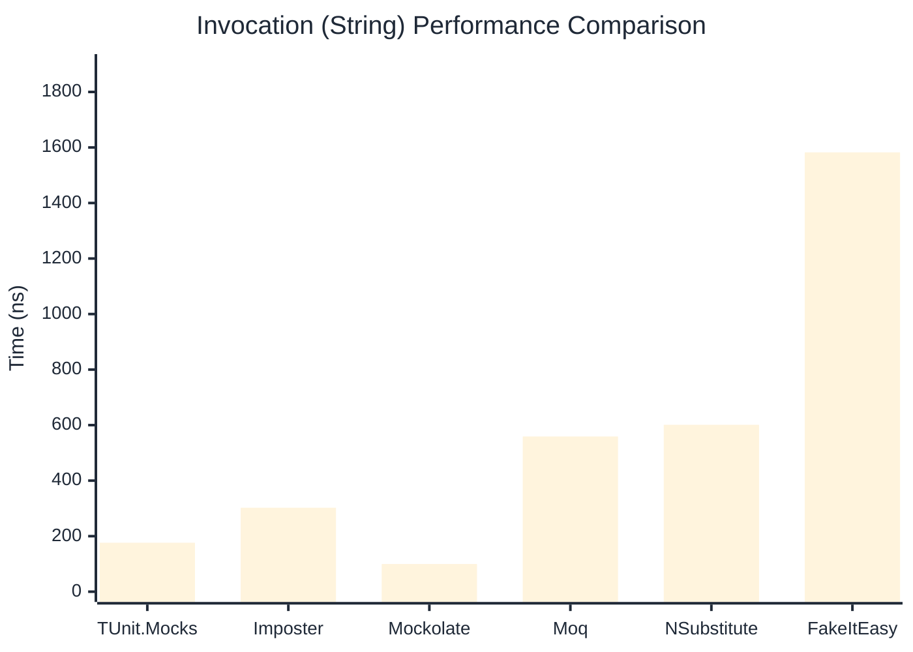

# Invocation Benchmark

> Calling methods on mock objects — comparing **TUnit.Mocks** (source-generated) against runtime proxy-based mocking libraries.

:::info Last Updated
This benchmark was automatically generated on **2026-10-06** from the latest CI run.

**Environment:** Ubuntu Latest • .NET SDK 10.0.401
:::

## 📊 Results

Calling methods on mock objects:

| Library | Mean | Error | StdDev | Allocated |
|---------|------|-------|--------|-----------|
| **TUnit.Mocks** | 269.40 ns | 77.83 ns | 4.266 ns | 128 B |
| Imposter | 306.52 ns | 89.73 ns | 4.918 ns | 168 B |
| Mockolate | 108.22 ns | 12.77 ns | 0.700 ns | 84 B |
| Moq | 811.63 ns | 121.45 ns | 6.657 ns | 376 B |
| NSubstitute | 739.87 ns | 285.05 ns | 15.624 ns | 304 B |
| FakeItEasy | 1,745.67 ns | 279.03 ns | 15.295 ns | 944 B |

```mermaid
%%{init: {
  'theme':'base',
  'themeVariables': {
    'primaryColor': '#2563eb',
    'primaryTextColor': '#1f2937',
    'primaryBorderColor': '#1e40af',
    'lineColor': '#6b7280',
    'secondaryColor': '#7c3aed',
    'tertiaryColor': '#dc2626',
    'background': '#ffffff',
    'pie1': '#2563eb',
    'pie2': '#7c3aed',
    'pie3': '#dc2626',
    'pie4': '#f59e0b',
    'pie5': '#10b981',
    'pie6': '#06b6d4',
    'pie7': '#ec4899',
    'pie8': '#6366f1'
  }
}}%%
xychart-beta
  title "Invocation Performance Comparison"
  x-axis ["TUnit.Mocks", "Imposter", "Mockolate", "Moq", "NSubstitute", "FakeItEasy"]
  y-axis "Time (ns)" 0 --> 2095
  bar [269.4, 306.52, 108.22, 811.63, 739.87, 1745.67]
```

---

### String

| Library | Mean | Error | StdDev | Allocated |
|---------|------|-------|--------|-----------|
| **TUnit.Mocks** | 176.34 ns | 53.14 ns | 2.913 ns | 96 B |
| Imposter | 302.40 ns | 81.22 ns | 4.452 ns | 168 B |
| Mockolate | 99.66 ns | 62.84 ns | 3.444 ns | 60 B |
| Moq | 559.03 ns | 104.99 ns | 5.755 ns | 296 B |
| NSubstitute | 601.16 ns | 258.65 ns | 14.177 ns | 272 B |
| FakeItEasy | 1,582.41 ns | 371.95 ns | 20.388 ns | 776 B |

```mermaid
%%{init: {
  'theme':'base',
  'themeVariables': {
    'primaryColor': '#2563eb',
    'primaryTextColor': '#1f2937',
    'primaryBorderColor': '#1e40af',
    'lineColor': '#6b7280',
    'secondaryColor': '#7c3aed',
    'tertiaryColor': '#dc2626',
    'background': '#ffffff',
    'pie1': '#2563eb',
    'pie2': '#7c3aed',
    'pie3': '#dc2626',
    'pie4': '#f59e0b',
    'pie5': '#10b981',
    'pie6': '#06b6d4',
    'pie7': '#ec4899',
    'pie8': '#6366f1'
  }
}}%%
xychart-beta
  title "Invocation (String) Performance Comparison"
  x-axis ["TUnit.Mocks", "Imposter", "Mockolate", "Moq", "NSubstitute", "FakeItEasy"]
  y-axis "Time (ns)" 0 --> 1899
  bar [176.34, 302.4, 99.66, 559.03, 601.16, 1582.41]
```

---

### 100 calls

| Library | Mean | Error | StdDev | Allocated |
|---------|------|-------|--------|-----------|
| **TUnit.Mocks** | 26,871.91 ns | 9,007.70 ns | 493.742 ns | 12736 B |
| Imposter | 29,637.33 ns | 10,412.52 ns | 570.745 ns | 16800 B |
| Mockolate | 11,274.40 ns | 5,853.27 ns | 320.838 ns | 8400 B |
| Moq | 78,956.34 ns | 23,198.11 ns | 1,271.567 ns | 37600 B |
| NSubstitute | 75,918.48 ns | 11,102.50 ns | 608.566 ns | 36448 B |
| FakeItEasy | 184,769.97 ns | 57,164.35 ns | 3,133.371 ns | 94400 B |

```mermaid
%%{init: {
  'theme':'base',
  'themeVariables': {
    'primaryColor': '#2563eb',
    'primaryTextColor': '#1f2937',
    'primaryBorderColor': '#1e40af',
    'lineColor': '#6b7280',
    'secondaryColor': '#7c3aed',
    'tertiaryColor': '#dc2626',
    'background': '#ffffff',
    'pie1': '#2563eb',
    'pie2': '#7c3aed',
    'pie3': '#dc2626',
    'pie4': '#f59e0b',
    'pie5': '#10b981',
    'pie6': '#06b6d4',
    'pie7': '#ec4899',
    'pie8': '#6366f1'
  }
}}%%
xychart-beta
  title "Invocation (100 calls) Performance Comparison"
  x-axis ["TUnit.Mocks", "Imposter", "Mockolate", "Moq", "NSubstitute", "FakeItEasy"]
  y-axis "Time (ns)" 0 --> 221724
  bar [26871.91, 29637.33, 11274.4, 78956.34, 75918.48, 184769.97]
```

## 🎯 Key Insights

This benchmark compares **TUnit.Mocks** (source-generated) against runtime proxy-based mocking libraries for calling methods on mock objects.

---

:::note Methodology
View the [mock benchmarks overview](/docs/benchmarks/mocks) for methodology details and environment information.
:::

*Last generated: 2026-10-06T02:37:20.591Z*
