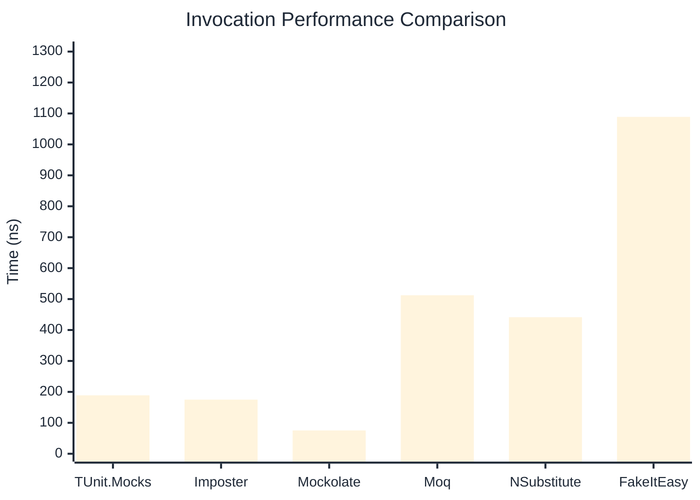
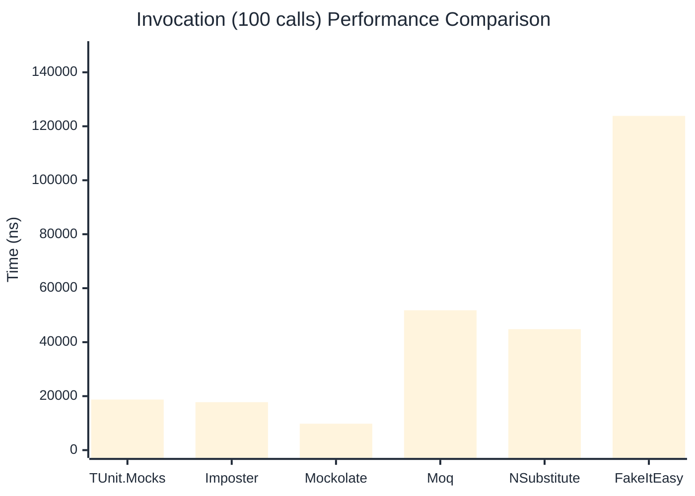

# Invocation Benchmark

> Calling methods on mock objects — comparing **TUnit.Mocks** (source-generated) against runtime proxy-based mocking libraries.

:::info Last Updated
This benchmark was automatically generated on **2026-10-02** from the latest CI run.

**Environment:** Ubuntu Latest • .NET SDK 10.0.401
:::

## 📊 Results

Calling methods on mock objects:

| Library | Mean | Error | StdDev | Allocated |
|---------|------|-------|--------|-----------|
| **TUnit.Mocks** | 188.96 ns | 103.06 ns | 5.649 ns | 128 B |
| Imposter | 174.94 ns | 32.26 ns | 1.768 ns | 168 B |
| Mockolate | 75.42 ns | 23.71 ns | 1.300 ns | 84 B |
| Moq | 512.41 ns | 694.10 ns | 38.046 ns | 376 B |
| NSubstitute | 441.39 ns | 261.21 ns | 14.318 ns | 304 B |
| FakeItEasy | 1,089.02 ns | 366.10 ns | 20.067 ns | 944 B |

```mermaid
%%{init: {
  'theme':'base',
  'themeVariables': {
    'primaryColor': '#2563eb',
    'primaryTextColor': '#1f2937',
    'primaryBorderColor': '#1e40af',
    'lineColor': '#6b7280',
    'secondaryColor': '#7c3aed',
    'tertiaryColor': '#dc2626',
    'background': '#ffffff',
    'pie1': '#2563eb',
    'pie2': '#7c3aed',
    'pie3': '#dc2626',
    'pie4': '#f59e0b',
    'pie5': '#10b981',
    'pie6': '#06b6d4',
    'pie7': '#ec4899',
    'pie8': '#6366f1'
  }
}}%%
xychart-beta
  title "Invocation Performance Comparison"
  x-axis ["TUnit.Mocks", "Imposter", "Mockolate", "Moq", "NSubstitute", "FakeItEasy"]
  y-axis "Time (ns)" 0 --> 1307
  bar [188.96, 174.94, 75.42, 512.41, 441.39, 1089.02]
```

---

### String

| Library | Mean | Error | StdDev | Allocated |
|---------|------|-------|--------|-----------|
| **TUnit.Mocks** | 123.01 ns | 34.04 ns | 1.866 ns | 96 B |
| Imposter | 177.30 ns | 111.80 ns | 6.128 ns | 168 B |
| Mockolate | 67.89 ns | 29.64 ns | 1.625 ns | 60 B |
| Moq | 358.24 ns | 341.26 ns | 18.706 ns | 296 B |
| NSubstitute | 396.85 ns | 168.54 ns | 9.238 ns | 328 B |
| FakeItEasy | 1,047.97 ns | 495.66 ns | 27.169 ns | 776 B |

```mermaid
%%{init: {
  'theme':'base',
  'themeVariables': {
    'primaryColor': '#2563eb',
    'primaryTextColor': '#1f2937',
    'primaryBorderColor': '#1e40af',
    'lineColor': '#6b7280',
    'secondaryColor': '#7c3aed',
    'tertiaryColor': '#dc2626',
    'background': '#ffffff',
    'pie1': '#2563eb',
    'pie2': '#7c3aed',
    'pie3': '#dc2626',
    'pie4': '#f59e0b',
    'pie5': '#10b981',
    'pie6': '#06b6d4',
    'pie7': '#ec4899',
    'pie8': '#6366f1'
  }
}}%%
xychart-beta
  title "Invocation (String) Performance Comparison"
  x-axis ["TUnit.Mocks", "Imposter", "Mockolate", "Moq", "NSubstitute", "FakeItEasy"]
  y-axis "Time (ns)" 0 --> 1258
  bar [123.01, 177.3, 67.89, 358.24, 396.85, 1047.97]
```

---

### 100 calls

| Library | Mean | Error | StdDev | Allocated |
|---------|------|-------|--------|-----------|
| **TUnit.Mocks** | 18,744.32 ns | 5,732.58 ns | 314.222 ns | 12736 B |
| Imposter | 17,770.50 ns | 2,643.14 ns | 144.879 ns | 16800 B |
| Mockolate | 9,793.09 ns | 9,439.72 ns | 517.423 ns | 8400 B |
| Moq | 51,821.78 ns | 31,598.95 ns | 1,732.045 ns | 37600 B |
| NSubstitute | 44,821.58 ns | 32,098.80 ns | 1,759.444 ns | 30848 B |
| FakeItEasy | 123,851.14 ns | 175,171.68 ns | 9,601.751 ns | 94400 B |

```mermaid
%%{init: {
  'theme':'base',
  'themeVariables': {
    'primaryColor': '#2563eb',
    'primaryTextColor': '#1f2937',
    'primaryBorderColor': '#1e40af',
    'lineColor': '#6b7280',
    'secondaryColor': '#7c3aed',
    'tertiaryColor': '#dc2626',
    'background': '#ffffff',
    'pie1': '#2563eb',
    'pie2': '#7c3aed',
    'pie3': '#dc2626',
    'pie4': '#f59e0b',
    'pie5': '#10b981',
    'pie6': '#06b6d4',
    'pie7': '#ec4899',
    'pie8': '#6366f1'
  }
}}%%
xychart-beta
  title "Invocation (100 calls) Performance Comparison"
  x-axis ["TUnit.Mocks", "Imposter", "Mockolate", "Moq", "NSubstitute", "FakeItEasy"]
  y-axis "Time (ns)" 0 --> 148622
  bar [18744.32, 17770.5, 9793.09, 51821.78, 44821.58, 123851.14]
```

## 🎯 Key Insights

This benchmark compares **TUnit.Mocks** (source-generated) against runtime proxy-based mocking libraries for calling methods on mock objects.

---

:::note Methodology
View the [mock benchmarks overview](/docs/benchmarks/mocks) for methodology details and environment information.
:::

*Last generated: 2026-10-02T02:44:13.542Z*
