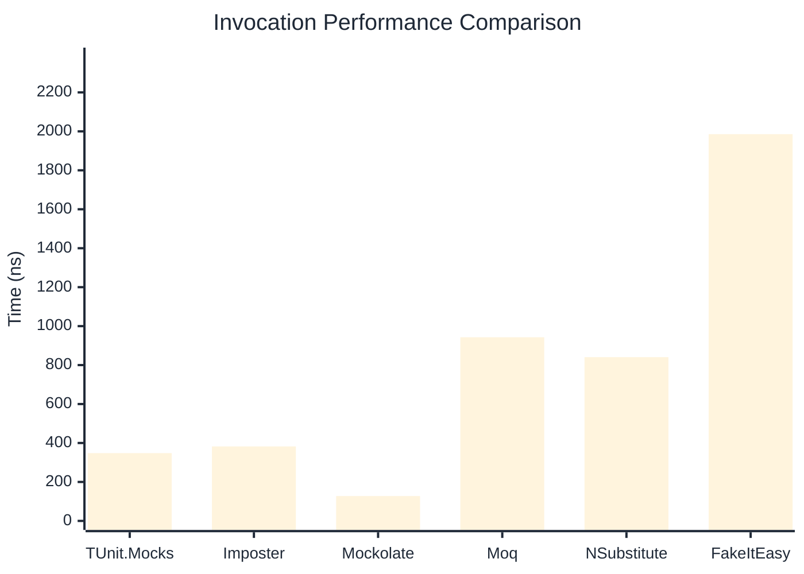
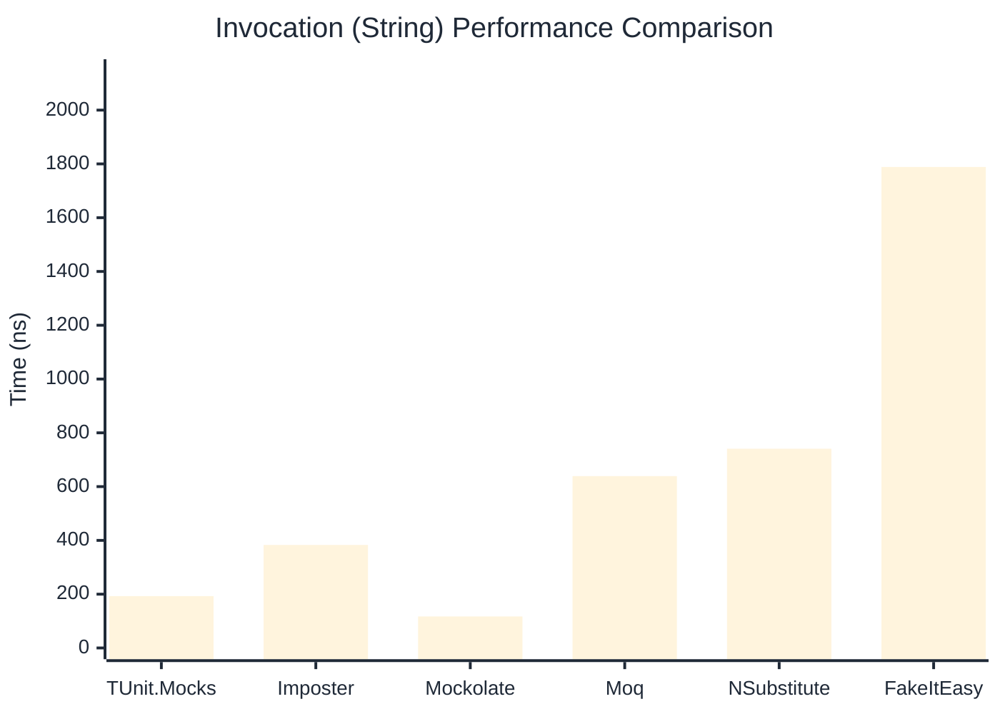

# Invocation Benchmark

> Calling methods on mock objects — comparing **TUnit.Mocks** (source-generated) against runtime proxy-based mocking libraries.

:::info Last Updated
This benchmark was automatically generated on **2026-10-08** from the latest CI run.

**Environment:** Ubuntu Latest • .NET SDK 10.0.401
:::

## 📊 Results

Calling methods on mock objects:

| Library | Mean | Error | StdDev | Allocated |
|---------|------|-------|--------|-----------|
| **TUnit.Mocks** | 348.0 ns | 121.16 ns | 6.64 ns | 128 B |
| Imposter | 382.4 ns | 131.35 ns | 7.20 ns | 168 B |
| Mockolate | 127.6 ns | 87.33 ns | 4.79 ns | 84 B |
| Moq | 942.9 ns | 145.66 ns | 7.98 ns | 376 B |
| NSubstitute | 840.7 ns | 77.82 ns | 4.27 ns | 304 B |
| FakeItEasy | 1,985.5 ns | 379.55 ns | 20.80 ns | 944 B |

```mermaid
%%{init: {
  'theme':'base',
  'themeVariables': {
    'primaryColor': '#2563eb',
    'primaryTextColor': '#1f2937',
    'primaryBorderColor': '#1e40af',
    'lineColor': '#6b7280',
    'secondaryColor': '#7c3aed',
    'tertiaryColor': '#dc2626',
    'background': '#ffffff',
    'pie1': '#2563eb',
    'pie2': '#7c3aed',
    'pie3': '#dc2626',
    'pie4': '#f59e0b',
    'pie5': '#10b981',
    'pie6': '#06b6d4',
    'pie7': '#ec4899',
    'pie8': '#6366f1'
  }
}}%%
xychart-beta
  title "Invocation Performance Comparison"
  x-axis ["TUnit.Mocks", "Imposter", "Mockolate", "Moq", "NSubstitute", "FakeItEasy"]
  y-axis "Time (ns)" 0 --> 2383
  bar [348, 382.4, 127.6, 942.9, 840.7, 1985.5]
```

---

### String

| Library | Mean | Error | StdDev | Allocated |
|---------|------|-------|--------|-----------|
| **TUnit.Mocks** | 192.8 ns | 165.76 ns | 9.09 ns | 96 B |
| Imposter | 383.0 ns | 176.35 ns | 9.67 ns | 168 B |
| Mockolate | 117.1 ns | 67.66 ns | 3.71 ns | 60 B |
| Moq | 639.0 ns | 71.38 ns | 3.91 ns | 296 B |
| NSubstitute | 740.8 ns | 299.10 ns | 16.39 ns | 272 B |
| FakeItEasy | 1,788.6 ns | 492.90 ns | 27.02 ns | 776 B |

```mermaid
%%{init: {
  'theme':'base',
  'themeVariables': {
    'primaryColor': '#2563eb',
    'primaryTextColor': '#1f2937',
    'primaryBorderColor': '#1e40af',
    'lineColor': '#6b7280',
    'secondaryColor': '#7c3aed',
    'tertiaryColor': '#dc2626',
    'background': '#ffffff',
    'pie1': '#2563eb',
    'pie2': '#7c3aed',
    'pie3': '#dc2626',
    'pie4': '#f59e0b',
    'pie5': '#10b981',
    'pie6': '#06b6d4',
    'pie7': '#ec4899',
    'pie8': '#6366f1'
  }
}}%%
xychart-beta
  title "Invocation (String) Performance Comparison"
  x-axis ["TUnit.Mocks", "Imposter", "Mockolate", "Moq", "NSubstitute", "FakeItEasy"]
  y-axis "Time (ns)" 0 --> 2147
  bar [192.8, 383, 117.1, 639, 740.8, 1788.6]
```

---

### 100 calls

| Library | Mean | Error | StdDev | Allocated |
|---------|------|-------|--------|-----------|
| **TUnit.Mocks** | 34,402.6 ns | 23,492.11 ns | 1,287.68 ns | 13248 B |
| Imposter | 37,140.5 ns | 2,648.66 ns | 145.18 ns | 16800 B |
| Mockolate | 12,722.5 ns | 2,559.57 ns | 140.30 ns | 8400 B |
| Moq | 92,729.7 ns | 41,164.16 ns | 2,256.35 ns | 37600 B |
| NSubstitute | 86,422.2 ns | 6,082.26 ns | 333.39 ns | 36448 B |
| FakeItEasy | 215,733.2 ns | 41,637.93 ns | 2,282.32 ns | 94400 B |

```mermaid
%%{init: {
  'theme':'base',
  'themeVariables': {
    'primaryColor': '#2563eb',
    'primaryTextColor': '#1f2937',
    'primaryBorderColor': '#1e40af',
    'lineColor': '#6b7280',
    'secondaryColor': '#7c3aed',
    'tertiaryColor': '#dc2626',
    'background': '#ffffff',
    'pie1': '#2563eb',
    'pie2': '#7c3aed',
    'pie3': '#dc2626',
    'pie4': '#f59e0b',
    'pie5': '#10b981',
    'pie6': '#06b6d4',
    'pie7': '#ec4899',
    'pie8': '#6366f1'
  }
}}%%
xychart-beta
  title "Invocation (100 calls) Performance Comparison"
  x-axis ["TUnit.Mocks", "Imposter", "Mockolate", "Moq", "NSubstitute", "FakeItEasy"]
  y-axis "Time (ns)" 0 --> 258880
  bar [34402.6, 37140.5, 12722.5, 92729.7, 86422.2, 215733.2]
```

## 🎯 Key Insights

This benchmark compares **TUnit.Mocks** (source-generated) against runtime proxy-based mocking libraries for calling methods on mock objects.

---

:::note Methodology
View the [mock benchmarks overview](/docs/benchmarks/mocks) for methodology details and environment information.
:::

*Last generated: 2026-10-08T02:41:51.713Z*
