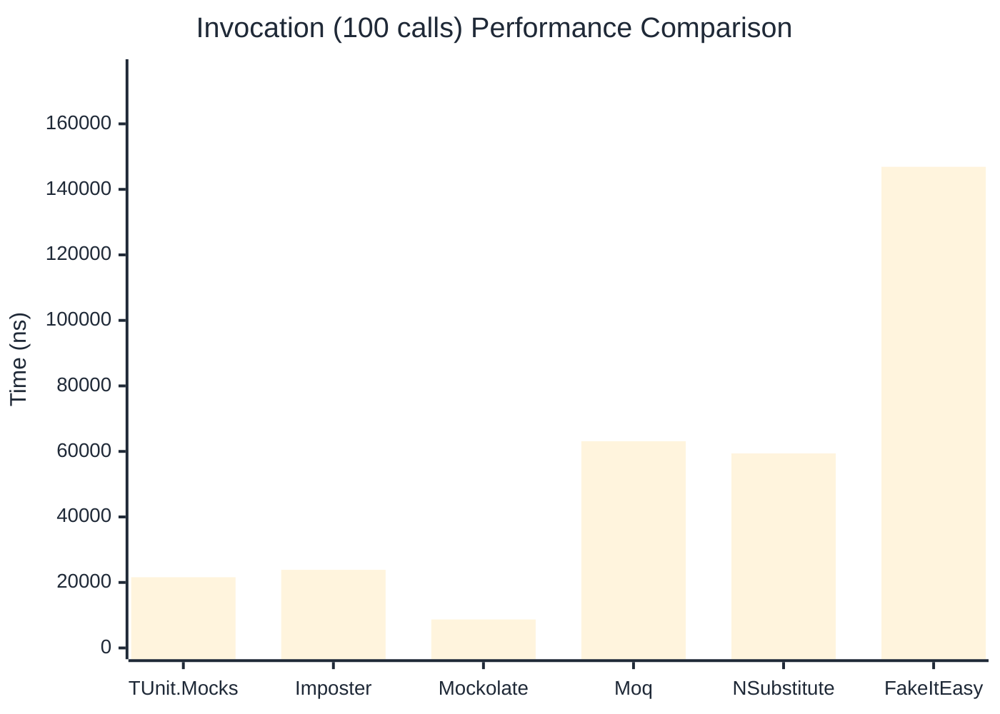

# Invocation Benchmark

> Calling methods on mock objects — comparing **TUnit.Mocks** (source-generated) against runtime proxy-based mocking libraries.

:::info Last Updated
This benchmark was automatically generated on **2026-09-29** from the latest CI run.

**Environment:** Ubuntu Latest • .NET SDK 10.0.401
:::

## 📊 Results

Calling methods on mock objects:

| Library | Mean | Error | StdDev | Allocated |
|---------|------|-------|--------|-----------|
| **TUnit.Mocks** | 214.65 ns | 68.557 ns | 3.758 ns | 128 B |
| Imposter | 237.29 ns | 22.503 ns | 1.233 ns | 168 B |
| Mockolate | 85.35 ns | 6.266 ns | 0.343 ns | 84 B |
| Moq | 626.15 ns | 70.595 ns | 3.870 ns | 376 B |
| NSubstitute | 591.03 ns | 233.239 ns | 12.785 ns | 304 B |
| FakeItEasy | 1,419.22 ns | 689.870 ns | 37.814 ns | 944 B |

```mermaid
%%{init: {
  'theme':'base',
  'themeVariables': {
    'primaryColor': '#2563eb',
    'primaryTextColor': '#1f2937',
    'primaryBorderColor': '#1e40af',
    'lineColor': '#6b7280',
    'secondaryColor': '#7c3aed',
    'tertiaryColor': '#dc2626',
    'background': '#ffffff',
    'pie1': '#2563eb',
    'pie2': '#7c3aed',
    'pie3': '#dc2626',
    'pie4': '#f59e0b',
    'pie5': '#10b981',
    'pie6': '#06b6d4',
    'pie7': '#ec4899',
    'pie8': '#6366f1'
  }
}}%%
xychart-beta
  title "Invocation Performance Comparison"
  x-axis ["TUnit.Mocks", "Imposter", "Mockolate", "Moq", "NSubstitute", "FakeItEasy"]
  y-axis "Time (ns)" 0 --> 1704
  bar [214.65, 237.29, 85.35, 626.15, 591.03, 1419.22]
```

---

### String

| Library | Mean | Error | StdDev | Allocated |
|---------|------|-------|--------|-----------|
| **TUnit.Mocks** | 134.95 ns | 54.465 ns | 2.985 ns | 96 B |
| Imposter | 236.79 ns | 30.083 ns | 1.649 ns | 168 B |
| Mockolate | 79.97 ns | 30.265 ns | 1.659 ns | 60 B |
| Moq | 421.07 ns | 85.914 ns | 4.709 ns | 296 B |
| NSubstitute | 487.39 ns | 160.821 ns | 8.815 ns | 272 B |
| FakeItEasy | 1,283.19 ns | 338.116 ns | 18.533 ns | 776 B |

```mermaid
%%{init: {
  'theme':'base',
  'themeVariables': {
    'primaryColor': '#2563eb',
    'primaryTextColor': '#1f2937',
    'primaryBorderColor': '#1e40af',
    'lineColor': '#6b7280',
    'secondaryColor': '#7c3aed',
    'tertiaryColor': '#dc2626',
    'background': '#ffffff',
    'pie1': '#2563eb',
    'pie2': '#7c3aed',
    'pie3': '#dc2626',
    'pie4': '#f59e0b',
    'pie5': '#10b981',
    'pie6': '#06b6d4',
    'pie7': '#ec4899',
    'pie8': '#6366f1'
  }
}}%%
xychart-beta
  title "Invocation (String) Performance Comparison"
  x-axis ["TUnit.Mocks", "Imposter", "Mockolate", "Moq", "NSubstitute", "FakeItEasy"]
  y-axis "Time (ns)" 0 --> 1540
  bar [134.95, 236.79, 79.97, 421.07, 487.39, 1283.19]
```

---

### 100 calls

| Library | Mean | Error | StdDev | Allocated |
|---------|------|-------|--------|-----------|
| **TUnit.Mocks** | 21,591.31 ns | 7,869.140 ns | 431.334 ns | 12736 B |
| Imposter | 23,854.40 ns | 4,453.298 ns | 244.100 ns | 16800 B |
| Mockolate | 8,698.77 ns | 5,538.064 ns | 303.560 ns | 8400 B |
| Moq | 63,104.89 ns | 8,584.154 ns | 470.526 ns | 37600 B |
| NSubstitute | 59,385.23 ns | 974.606 ns | 53.421 ns | 30848 B |
| FakeItEasy | 146,882.68 ns | 42,067.696 ns | 2,305.872 ns | 94400 B |

```mermaid
%%{init: {
  'theme':'base',
  'themeVariables': {
    'primaryColor': '#2563eb',
    'primaryTextColor': '#1f2937',
    'primaryBorderColor': '#1e40af',
    'lineColor': '#6b7280',
    'secondaryColor': '#7c3aed',
    'tertiaryColor': '#dc2626',
    'background': '#ffffff',
    'pie1': '#2563eb',
    'pie2': '#7c3aed',
    'pie3': '#dc2626',
    'pie4': '#f59e0b',
    'pie5': '#10b981',
    'pie6': '#06b6d4',
    'pie7': '#ec4899',
    'pie8': '#6366f1'
  }
}}%%
xychart-beta
  title "Invocation (100 calls) Performance Comparison"
  x-axis ["TUnit.Mocks", "Imposter", "Mockolate", "Moq", "NSubstitute", "FakeItEasy"]
  y-axis "Time (ns)" 0 --> 176260
  bar [21591.31, 23854.4, 8698.77, 63104.89, 59385.23, 146882.68]
```

## 🎯 Key Insights

This benchmark compares **TUnit.Mocks** (source-generated) against runtime proxy-based mocking libraries for calling methods on mock objects.

---

:::note Methodology
View the [mock benchmarks overview](/docs/benchmarks/mocks) for methodology details and environment information.
:::

*Last generated: 2026-09-29T02:35:19.410Z*
