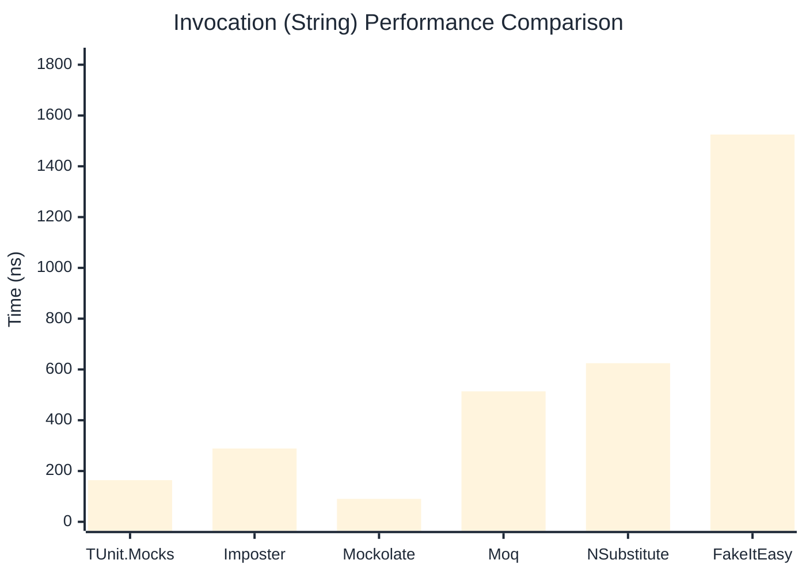

# Invocation Benchmark

> Calling methods on mock objects — comparing **TUnit.Mocks** (source-generated) against runtime proxy-based mocking libraries.

:::info Last Updated
This benchmark was automatically generated on **2026-10-03** from the latest CI run.

**Environment:** Ubuntu Latest • .NET SDK 10.0.401
:::

## 📊 Results

Calling methods on mock objects:

| Library | Mean | Error | StdDev | Allocated |
|---------|------|-------|--------|-----------|
| **TUnit.Mocks** | 268.85 ns | 73.46 ns | 4.026 ns | 128 B |
| Imposter | 296.74 ns | 43.32 ns | 2.375 ns | 168 B |
| Mockolate | 99.43 ns | 33.98 ns | 1.863 ns | 84 B |
| Moq | 801.02 ns | 132.10 ns | 7.241 ns | 376 B |
| NSubstitute | 697.21 ns | 192.81 ns | 10.569 ns | 304 B |
| FakeItEasy | 1,688.37 ns | 186.87 ns | 10.243 ns | 944 B |

```mermaid
%%{init: {
  'theme':'base',
  'themeVariables': {
    'primaryColor': '#2563eb',
    'primaryTextColor': '#1f2937',
    'primaryBorderColor': '#1e40af',
    'lineColor': '#6b7280',
    'secondaryColor': '#7c3aed',
    'tertiaryColor': '#dc2626',
    'background': '#ffffff',
    'pie1': '#2563eb',
    'pie2': '#7c3aed',
    'pie3': '#dc2626',
    'pie4': '#f59e0b',
    'pie5': '#10b981',
    'pie6': '#06b6d4',
    'pie7': '#ec4899',
    'pie8': '#6366f1'
  }
}}%%
xychart-beta
  title "Invocation Performance Comparison"
  x-axis ["TUnit.Mocks", "Imposter", "Mockolate", "Moq", "NSubstitute", "FakeItEasy"]
  y-axis "Time (ns)" 0 --> 2027
  bar [268.85, 296.74, 99.43, 801.02, 697.21, 1688.37]
```

---

### String

| Library | Mean | Error | StdDev | Allocated |
|---------|------|-------|--------|-----------|
| **TUnit.Mocks** | 164.06 ns | 67.38 ns | 3.693 ns | 96 B |
| Imposter | 288.77 ns | 64.58 ns | 3.540 ns | 168 B |
| Mockolate | 90.43 ns | 27.21 ns | 1.492 ns | 60 B |
| Moq | 513.89 ns | 106.44 ns | 5.834 ns | 296 B |
| NSubstitute | 624.63 ns | 207.32 ns | 11.364 ns | 328 B |
| FakeItEasy | 1,525.07 ns | 546.34 ns | 29.947 ns | 776 B |

```mermaid
%%{init: {
  'theme':'base',
  'themeVariables': {
    'primaryColor': '#2563eb',
    'primaryTextColor': '#1f2937',
    'primaryBorderColor': '#1e40af',
    'lineColor': '#6b7280',
    'secondaryColor': '#7c3aed',
    'tertiaryColor': '#dc2626',
    'background': '#ffffff',
    'pie1': '#2563eb',
    'pie2': '#7c3aed',
    'pie3': '#dc2626',
    'pie4': '#f59e0b',
    'pie5': '#10b981',
    'pie6': '#06b6d4',
    'pie7': '#ec4899',
    'pie8': '#6366f1'
  }
}}%%
xychart-beta
  title "Invocation (String) Performance Comparison"
  x-axis ["TUnit.Mocks", "Imposter", "Mockolate", "Moq", "NSubstitute", "FakeItEasy"]
  y-axis "Time (ns)" 0 --> 1831
  bar [164.06, 288.77, 90.43, 513.89, 624.63, 1525.07]
```

---

### 100 calls

| Library | Mean | Error | StdDev | Allocated |
|---------|------|-------|--------|-----------|
| **TUnit.Mocks** | 27,033.41 ns | 7,886.06 ns | 432.262 ns | 12736 B |
| Imposter | 28,935.37 ns | 8,663.00 ns | 474.848 ns | 16800 B |
| Mockolate | 9,907.57 ns | 3,768.14 ns | 206.544 ns | 8400 B |
| Moq | 80,503.83 ns | 2,979.52 ns | 163.318 ns | 37600 B |
| NSubstitute | 71,779.31 ns | 11,812.53 ns | 647.485 ns | 30848 B |
| FakeItEasy | 173,009.47 ns | 174,967.90 ns | 9,590.581 ns | 94400 B |

```mermaid
%%{init: {
  'theme':'base',
  'themeVariables': {
    'primaryColor': '#2563eb',
    'primaryTextColor': '#1f2937',
    'primaryBorderColor': '#1e40af',
    'lineColor': '#6b7280',
    'secondaryColor': '#7c3aed',
    'tertiaryColor': '#dc2626',
    'background': '#ffffff',
    'pie1': '#2563eb',
    'pie2': '#7c3aed',
    'pie3': '#dc2626',
    'pie4': '#f59e0b',
    'pie5': '#10b981',
    'pie6': '#06b6d4',
    'pie7': '#ec4899',
    'pie8': '#6366f1'
  }
}}%%
xychart-beta
  title "Invocation (100 calls) Performance Comparison"
  x-axis ["TUnit.Mocks", "Imposter", "Mockolate", "Moq", "NSubstitute", "FakeItEasy"]
  y-axis "Time (ns)" 0 --> 207612
  bar [27033.41, 28935.37, 9907.57, 80503.83, 71779.31, 173009.47]
```

## 🎯 Key Insights

This benchmark compares **TUnit.Mocks** (source-generated) against runtime proxy-based mocking libraries for calling methods on mock objects.

---

:::note Methodology
View the [mock benchmarks overview](/docs/benchmarks/mocks) for methodology details and environment information.
:::

*Last generated: 2026-10-03T02:34:47.768Z*
