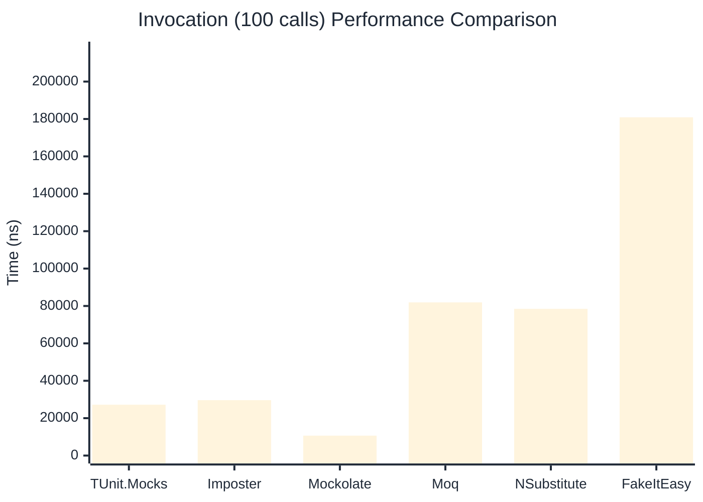

# Invocation Benchmark

> Calling methods on mock objects — comparing **TUnit.Mocks** (source-generated) against runtime proxy-based mocking libraries.

:::info Last Updated
This benchmark was automatically generated on **2026-10-09** from the latest CI run.

**Environment:** Ubuntu Latest • .NET SDK 10.0.401
:::

## 📊 Results

Calling methods on mock objects:

| Library | Mean | Error | StdDev | Allocated |
|---------|------|-------|--------|-----------|
| **TUnit.Mocks** | 273.17 ns | 77.14 ns | 4.228 ns | 128 B |
| Imposter | 301.29 ns | 64.77 ns | 3.550 ns | 168 B |
| Mockolate | 108.89 ns | 41.52 ns | 2.276 ns | 84 B |
| Moq | 811.05 ns | 123.17 ns | 6.751 ns | 376 B |
| NSubstitute | 727.65 ns | 189.90 ns | 10.409 ns | 304 B |
| FakeItEasy | 1,803.96 ns | 519.22 ns | 28.460 ns | 944 B |

```mermaid
%%{init: {
  'theme':'base',
  'themeVariables': {
    'primaryColor': '#2563eb',
    'primaryTextColor': '#1f2937',
    'primaryBorderColor': '#1e40af',
    'lineColor': '#6b7280',
    'secondaryColor': '#7c3aed',
    'tertiaryColor': '#dc2626',
    'background': '#ffffff',
    'pie1': '#2563eb',
    'pie2': '#7c3aed',
    'pie3': '#dc2626',
    'pie4': '#f59e0b',
    'pie5': '#10b981',
    'pie6': '#06b6d4',
    'pie7': '#ec4899',
    'pie8': '#6366f1'
  }
}}%%
xychart-beta
  title "Invocation Performance Comparison"
  x-axis ["TUnit.Mocks", "Imposter", "Mockolate", "Moq", "NSubstitute", "FakeItEasy"]
  y-axis "Time (ns)" 0 --> 2165
  bar [273.17, 301.29, 108.89, 811.05, 727.65, 1803.96]
```

---

### String

| Library | Mean | Error | StdDev | Allocated |
|---------|------|-------|--------|-----------|
| **TUnit.Mocks** | 172.37 ns | 68.51 ns | 3.755 ns | 96 B |
| Imposter | 301.87 ns | 158.79 ns | 8.704 ns | 168 B |
| Mockolate | 96.16 ns | 40.77 ns | 2.235 ns | 60 B |
| Moq | 549.31 ns | 221.58 ns | 12.146 ns | 296 B |
| NSubstitute | 671.23 ns | 158.95 ns | 8.713 ns | 328 B |
| FakeItEasy | 1,585.87 ns | 298.35 ns | 16.354 ns | 776 B |

```mermaid
%%{init: {
  'theme':'base',
  'themeVariables': {
    'primaryColor': '#2563eb',
    'primaryTextColor': '#1f2937',
    'primaryBorderColor': '#1e40af',
    'lineColor': '#6b7280',
    'secondaryColor': '#7c3aed',
    'tertiaryColor': '#dc2626',
    'background': '#ffffff',
    'pie1': '#2563eb',
    'pie2': '#7c3aed',
    'pie3': '#dc2626',
    'pie4': '#f59e0b',
    'pie5': '#10b981',
    'pie6': '#06b6d4',
    'pie7': '#ec4899',
    'pie8': '#6366f1'
  }
}}%%
xychart-beta
  title "Invocation (String) Performance Comparison"
  x-axis ["TUnit.Mocks", "Imposter", "Mockolate", "Moq", "NSubstitute", "FakeItEasy"]
  y-axis "Time (ns)" 0 --> 1904
  bar [172.37, 301.87, 96.16, 549.31, 671.23, 1585.87]
```

---

### 100 calls

| Library | Mean | Error | StdDev | Allocated |
|---------|------|-------|--------|-----------|
| **TUnit.Mocks** | 27,197.04 ns | 13,034.71 ns | 714.477 ns | 12736 B |
| Imposter | 29,626.24 ns | 6,083.02 ns | 333.431 ns | 16800 B |
| Mockolate | 10,650.13 ns | 7,477.19 ns | 409.850 ns | 8400 B |
| Moq | 81,925.87 ns | 4,163.16 ns | 228.197 ns | 37600 B |
| NSubstitute | 78,467.19 ns | 7,824.08 ns | 428.864 ns | 30848 B |
| FakeItEasy | 180,909.77 ns | 36,011.74 ns | 1,973.925 ns | 94400 B |

```mermaid
%%{init: {
  'theme':'base',
  'themeVariables': {
    'primaryColor': '#2563eb',
    'primaryTextColor': '#1f2937',
    'primaryBorderColor': '#1e40af',
    'lineColor': '#6b7280',
    'secondaryColor': '#7c3aed',
    'tertiaryColor': '#dc2626',
    'background': '#ffffff',
    'pie1': '#2563eb',
    'pie2': '#7c3aed',
    'pie3': '#dc2626',
    'pie4': '#f59e0b',
    'pie5': '#10b981',
    'pie6': '#06b6d4',
    'pie7': '#ec4899',
    'pie8': '#6366f1'
  }
}}%%
xychart-beta
  title "Invocation (100 calls) Performance Comparison"
  x-axis ["TUnit.Mocks", "Imposter", "Mockolate", "Moq", "NSubstitute", "FakeItEasy"]
  y-axis "Time (ns)" 0 --> 217092
  bar [27197.04, 29626.24, 10650.13, 81925.87, 78467.19, 180909.77]
```

## 🎯 Key Insights

This benchmark compares **TUnit.Mocks** (source-generated) against runtime proxy-based mocking libraries for calling methods on mock objects.

---

:::note Methodology
View the [mock benchmarks overview](/docs/benchmarks/mocks) for methodology details and environment information.
:::

*Last generated: 2026-10-09T02:42:26.464Z*
