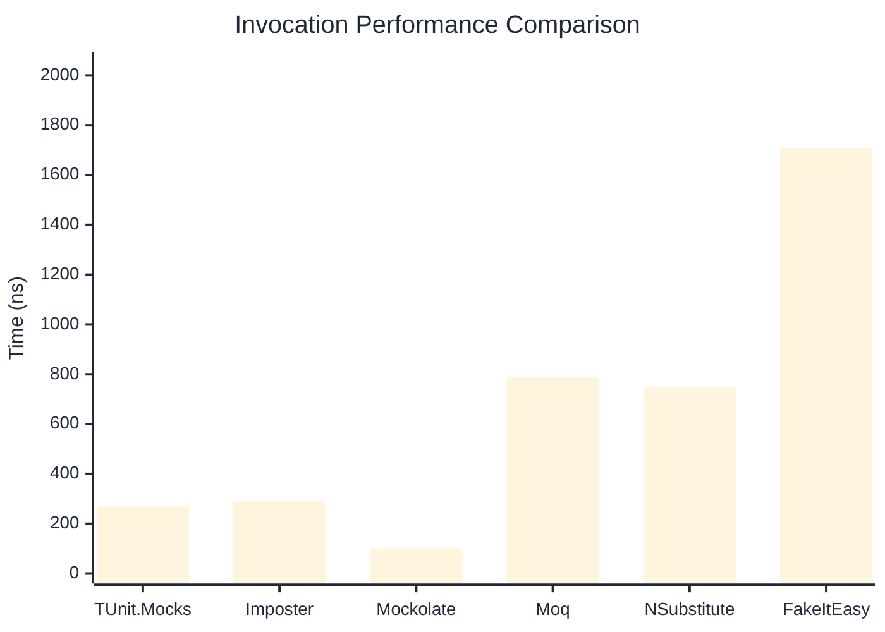
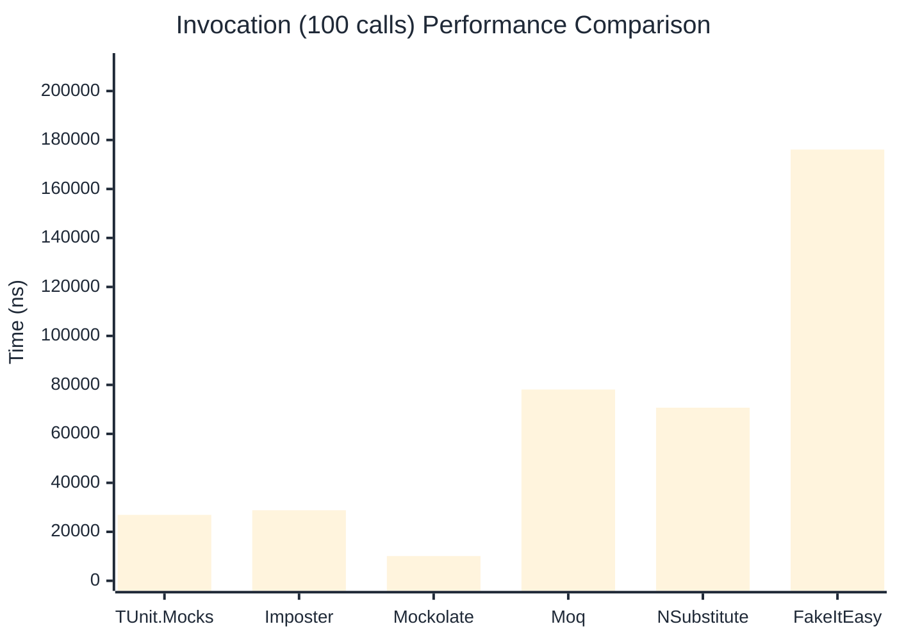

# Invocation Benchmark

> Calling methods on mock objects — comparing **TUnit.Mocks** (source-generated) against runtime proxy-based mocking libraries.

:::info Last Updated
This benchmark was automatically generated on **2026-10-05** from the latest CI run.

**Environment:** Ubuntu Latest • .NET SDK 10.0.401
:::

## 📊 Results

Calling methods on mock objects:

| Library | Mean | Error | StdDev | Allocated |
|---------|------|-------|--------|-----------|
| **TUnit.Mocks** | 268.85 ns | 56.28 ns | 3.085 ns | 128 B |
| Imposter | 292.85 ns | 81.19 ns | 4.450 ns | 168 B |
| Mockolate | 101.62 ns | 28.27 ns | 1.550 ns | 84 B |
| Moq | 790.46 ns | 85.40 ns | 4.681 ns | 376 B |
| NSubstitute | 749.79 ns | 57.05 ns | 3.127 ns | 360 B |
| FakeItEasy | 1,709.31 ns | 413.65 ns | 22.674 ns | 944 B |

```mermaid
%%{init: {
  'theme':'base',
  'themeVariables': {
    'primaryColor': '#2563eb',
    'primaryTextColor': '#1f2937',
    'primaryBorderColor': '#1e40af',
    'lineColor': '#6b7280',
    'secondaryColor': '#7c3aed',
    'tertiaryColor': '#dc2626',
    'background': '#ffffff',
    'pie1': '#2563eb',
    'pie2': '#7c3aed',
    'pie3': '#dc2626',
    'pie4': '#f59e0b',
    'pie5': '#10b981',
    'pie6': '#06b6d4',
    'pie7': '#ec4899',
    'pie8': '#6366f1'
  }
}}%%
xychart-beta
  title "Invocation Performance Comparison"
  x-axis ["TUnit.Mocks", "Imposter", "Mockolate", "Moq", "NSubstitute", "FakeItEasy"]
  y-axis "Time (ns)" 0 --> 2052
  bar [268.85, 292.85, 101.62, 790.46, 749.79, 1709.31]
```

---

### String

| Library | Mean | Error | StdDev | Allocated |
|---------|------|-------|--------|-----------|
| **TUnit.Mocks** | 164.54 ns | 68.14 ns | 3.735 ns | 96 B |
| Imposter | 293.66 ns | 82.55 ns | 4.525 ns | 168 B |
| Mockolate | 92.57 ns | 32.96 ns | 1.807 ns | 60 B |
| Moq | 526.72 ns | 34.44 ns | 1.888 ns | 296 B |
| NSubstitute | 595.15 ns | 190.45 ns | 10.439 ns | 272 B |
| FakeItEasy | 1,528.14 ns | 503.25 ns | 27.585 ns | 776 B |

```mermaid
%%{init: {
  'theme':'base',
  'themeVariables': {
    'primaryColor': '#2563eb',
    'primaryTextColor': '#1f2937',
    'primaryBorderColor': '#1e40af',
    'lineColor': '#6b7280',
    'secondaryColor': '#7c3aed',
    'tertiaryColor': '#dc2626',
    'background': '#ffffff',
    'pie1': '#2563eb',
    'pie2': '#7c3aed',
    'pie3': '#dc2626',
    'pie4': '#f59e0b',
    'pie5': '#10b981',
    'pie6': '#06b6d4',
    'pie7': '#ec4899',
    'pie8': '#6366f1'
  }
}}%%
xychart-beta
  title "Invocation (String) Performance Comparison"
  x-axis ["TUnit.Mocks", "Imposter", "Mockolate", "Moq", "NSubstitute", "FakeItEasy"]
  y-axis "Time (ns)" 0 --> 1834
  bar [164.54, 293.66, 92.57, 526.72, 595.15, 1528.14]
```

---

### 100 calls

| Library | Mean | Error | StdDev | Allocated |
|---------|------|-------|--------|-----------|
| **TUnit.Mocks** | 26,924.76 ns | 9,098.74 ns | 498.733 ns | 12736 B |
| Imposter | 28,815.71 ns | 8,581.51 ns | 470.381 ns | 16800 B |
| Mockolate | 10,124.68 ns | 1,415.00 ns | 77.561 ns | 8400 B |
| Moq | 78,114.89 ns | 17,066.40 ns | 935.467 ns | 37600 B |
| NSubstitute | 70,692.68 ns | 11,277.80 ns | 618.174 ns | 30848 B |
| FakeItEasy | 176,108.82 ns | 98,248.36 ns | 5,385.324 ns | 94400 B |

```mermaid
%%{init: {
  'theme':'base',
  'themeVariables': {
    'primaryColor': '#2563eb',
    'primaryTextColor': '#1f2937',
    'primaryBorderColor': '#1e40af',
    'lineColor': '#6b7280',
    'secondaryColor': '#7c3aed',
    'tertiaryColor': '#dc2626',
    'background': '#ffffff',
    'pie1': '#2563eb',
    'pie2': '#7c3aed',
    'pie3': '#dc2626',
    'pie4': '#f59e0b',
    'pie5': '#10b981',
    'pie6': '#06b6d4',
    'pie7': '#ec4899',
    'pie8': '#6366f1'
  }
}}%%
xychart-beta
  title "Invocation (100 calls) Performance Comparison"
  x-axis ["TUnit.Mocks", "Imposter", "Mockolate", "Moq", "NSubstitute", "FakeItEasy"]
  y-axis "Time (ns)" 0 --> 211331
  bar [26924.76, 28815.71, 10124.68, 78114.89, 70692.68, 176108.82]
```

## 🎯 Key Insights

This benchmark compares **TUnit.Mocks** (source-generated) against runtime proxy-based mocking libraries for calling methods on mock objects.

---

:::note Methodology
View the [mock benchmarks overview](/docs/benchmarks/mocks) for methodology details and environment information.
:::

*Last generated: 2026-10-05T02:45:14.260Z*
