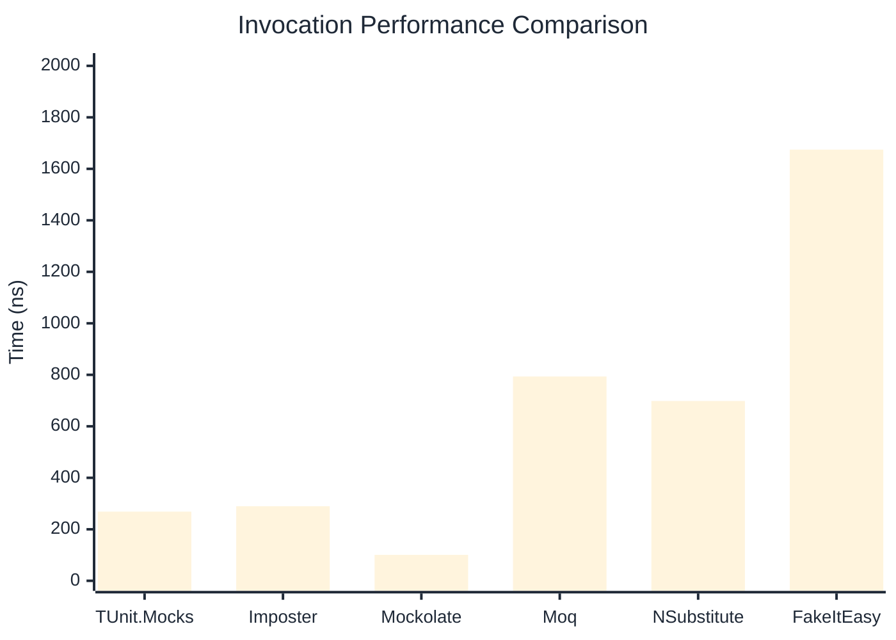

# Invocation Benchmark

> Calling methods on mock objects — comparing **TUnit.Mocks** (source-generated) against runtime proxy-based mocking libraries.

:::info Last Updated
This benchmark was automatically generated on **2026-10-07** from the latest CI run.

**Environment:** Ubuntu Latest • .NET SDK 10.0.401
:::

## 📊 Results

Calling methods on mock objects:

| Library | Mean | Error | StdDev | Allocated |
|---------|------|-------|--------|-----------|
| **TUnit.Mocks** | 268.63 ns | 89.87 ns | 4.926 ns | 128 B |
| Imposter | 289.53 ns | 56.67 ns | 3.106 ns | 168 B |
| Mockolate | 100.83 ns | 37.02 ns | 2.029 ns | 84 B |
| Moq | 793.58 ns | 358.66 ns | 19.659 ns | 376 B |
| NSubstitute | 698.44 ns | 369.10 ns | 20.232 ns | 304 B |
| FakeItEasy | 1,674.65 ns | 987.19 ns | 54.111 ns | 944 B |

```mermaid
%%{init: {
  'theme':'base',
  'themeVariables': {
    'primaryColor': '#2563eb',
    'primaryTextColor': '#1f2937',
    'primaryBorderColor': '#1e40af',
    'lineColor': '#6b7280',
    'secondaryColor': '#7c3aed',
    'tertiaryColor': '#dc2626',
    'background': '#ffffff',
    'pie1': '#2563eb',
    'pie2': '#7c3aed',
    'pie3': '#dc2626',
    'pie4': '#f59e0b',
    'pie5': '#10b981',
    'pie6': '#06b6d4',
    'pie7': '#ec4899',
    'pie8': '#6366f1'
  }
}}%%
xychart-beta
  title "Invocation Performance Comparison"
  x-axis ["TUnit.Mocks", "Imposter", "Mockolate", "Moq", "NSubstitute", "FakeItEasy"]
  y-axis "Time (ns)" 0 --> 2010
  bar [268.63, 289.53, 100.83, 793.58, 698.44, 1674.65]
```

---

### String

| Library | Mean | Error | StdDev | Allocated |
|---------|------|-------|--------|-----------|
| **TUnit.Mocks** | 166.79 ns | 68.31 ns | 3.744 ns | 96 B |
| Imposter | 294.32 ns | 59.90 ns | 3.284 ns | 168 B |
| Mockolate | 90.34 ns | 25.12 ns | 1.377 ns | 60 B |
| Moq | 514.41 ns | 136.64 ns | 7.490 ns | 296 B |
| NSubstitute | 584.87 ns | 202.37 ns | 11.093 ns | 272 B |
| FakeItEasy | 1,484.43 ns | 188.57 ns | 10.336 ns | 776 B |

```mermaid
%%{init: {
  'theme':'base',
  'themeVariables': {
    'primaryColor': '#2563eb',
    'primaryTextColor': '#1f2937',
    'primaryBorderColor': '#1e40af',
    'lineColor': '#6b7280',
    'secondaryColor': '#7c3aed',
    'tertiaryColor': '#dc2626',
    'background': '#ffffff',
    'pie1': '#2563eb',
    'pie2': '#7c3aed',
    'pie3': '#dc2626',
    'pie4': '#f59e0b',
    'pie5': '#10b981',
    'pie6': '#06b6d4',
    'pie7': '#ec4899',
    'pie8': '#6366f1'
  }
}}%%
xychart-beta
  title "Invocation (String) Performance Comparison"
  x-axis ["TUnit.Mocks", "Imposter", "Mockolate", "Moq", "NSubstitute", "FakeItEasy"]
  y-axis "Time (ns)" 0 --> 1782
  bar [166.79, 294.32, 90.34, 514.41, 584.87, 1484.43]
```

---

### 100 calls

| Library | Mean | Error | StdDev | Allocated |
|---------|------|-------|--------|-----------|
| **TUnit.Mocks** | 26,620.33 ns | 8,722.95 ns | 478.134 ns | 12736 B |
| Imposter | 28,642.89 ns | 7,796.67 ns | 427.362 ns | 16800 B |
| Mockolate | 9,829.62 ns | 4,125.43 ns | 226.129 ns | 8400 B |
| Moq | 78,446.11 ns | 18,098.78 ns | 992.055 ns | 37600 B |
| NSubstitute | 69,253.19 ns | 13,126.60 ns | 719.513 ns | 30848 B |
| FakeItEasy | 177,016.10 ns | 98,970.69 ns | 5,424.917 ns | 94400 B |

```mermaid
%%{init: {
  'theme':'base',
  'themeVariables': {
    'primaryColor': '#2563eb',
    'primaryTextColor': '#1f2937',
    'primaryBorderColor': '#1e40af',
    'lineColor': '#6b7280',
    'secondaryColor': '#7c3aed',
    'tertiaryColor': '#dc2626',
    'background': '#ffffff',
    'pie1': '#2563eb',
    'pie2': '#7c3aed',
    'pie3': '#dc2626',
    'pie4': '#f59e0b',
    'pie5': '#10b981',
    'pie6': '#06b6d4',
    'pie7': '#ec4899',
    'pie8': '#6366f1'
  }
}}%%
xychart-beta
  title "Invocation (100 calls) Performance Comparison"
  x-axis ["TUnit.Mocks", "Imposter", "Mockolate", "Moq", "NSubstitute", "FakeItEasy"]
  y-axis "Time (ns)" 0 --> 212420
  bar [26620.33, 28642.89, 9829.62, 78446.11, 69253.19, 177016.1]
```

## 🎯 Key Insights

This benchmark compares **TUnit.Mocks** (source-generated) against runtime proxy-based mocking libraries for calling methods on mock objects.

---

:::note Methodology
View the [mock benchmarks overview](/docs/benchmarks/mocks) for methodology details and environment information.
:::

*Last generated: 2026-10-07T02:41:59.908Z*
