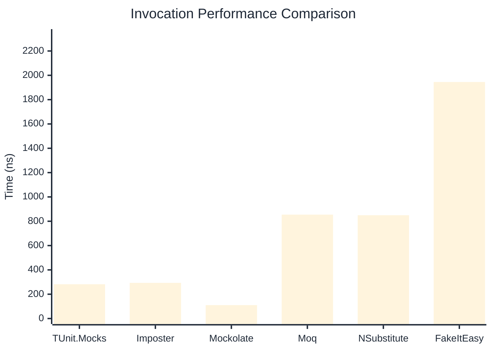
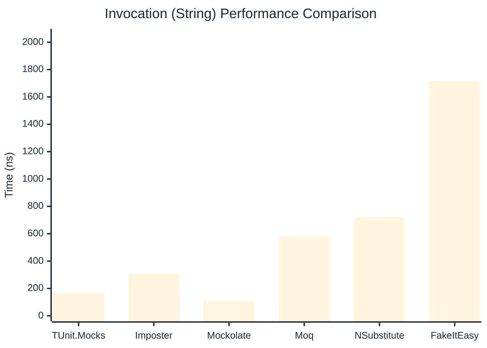

# Invocation Benchmark

> Calling methods on mock objects — comparing **TUnit.Mocks** (source-generated) against runtime proxy-based mocking libraries.

:::info Last Updated
This benchmark was automatically generated on **2026-10-10** from the latest CI run.

**Environment:** Ubuntu Latest • .NET SDK 10.0.401
:::

## 📊 Results

Calling methods on mock objects:

| Library | Mean | Error | StdDev | Allocated |
|---------|------|-------|--------|-----------|
| **TUnit.Mocks** | 282.1 ns | 106.78 ns | 5.85 ns | 128 B |
| Imposter | 293.5 ns | 100.06 ns | 5.48 ns | 168 B |
| Mockolate | 110.4 ns | 51.51 ns | 2.82 ns | 84 B |
| Moq | 854.5 ns | 45.18 ns | 2.48 ns | 376 B |
| NSubstitute | 849.5 ns | 391.99 ns | 21.49 ns | 360 B |
| FakeItEasy | 1,945.0 ns | 706.33 ns | 38.72 ns | 944 B |

```mermaid
%%{init: {
  'theme':'base',
  'themeVariables': {
    'primaryColor': '#2563eb',
    'primaryTextColor': '#1f2937',
    'primaryBorderColor': '#1e40af',
    'lineColor': '#6b7280',
    'secondaryColor': '#7c3aed',
    'tertiaryColor': '#dc2626',
    'background': '#ffffff',
    'pie1': '#2563eb',
    'pie2': '#7c3aed',
    'pie3': '#dc2626',
    'pie4': '#f59e0b',
    'pie5': '#10b981',
    'pie6': '#06b6d4',
    'pie7': '#ec4899',
    'pie8': '#6366f1'
  }
}}%%
xychart-beta
  title "Invocation Performance Comparison"
  x-axis ["TUnit.Mocks", "Imposter", "Mockolate", "Moq", "NSubstitute", "FakeItEasy"]
  y-axis "Time (ns)" 0 --> 2334
  bar [282.1, 293.5, 110.4, 854.5, 849.5, 1945]
```

---

### String

| Library | Mean | Error | StdDev | Allocated |
|---------|------|-------|--------|-----------|
| **TUnit.Mocks** | 167.5 ns | 109.48 ns | 6.00 ns | 96 B |
| Imposter | 308.1 ns | 96.92 ns | 5.31 ns | 168 B |
| Mockolate | 105.8 ns | 29.63 ns | 1.62 ns | 60 B |
| Moq | 580.7 ns | 103.44 ns | 5.67 ns | 296 B |
| NSubstitute | 721.4 ns | 79.81 ns | 4.37 ns | 272 B |
| FakeItEasy | 1,714.1 ns | 668.02 ns | 36.62 ns | 776 B |

```mermaid
%%{init: {
  'theme':'base',
  'themeVariables': {
    'primaryColor': '#2563eb',
    'primaryTextColor': '#1f2937',
    'primaryBorderColor': '#1e40af',
    'lineColor': '#6b7280',
    'secondaryColor': '#7c3aed',
    'tertiaryColor': '#dc2626',
    'background': '#ffffff',
    'pie1': '#2563eb',
    'pie2': '#7c3aed',
    'pie3': '#dc2626',
    'pie4': '#f59e0b',
    'pie5': '#10b981',
    'pie6': '#06b6d4',
    'pie7': '#ec4899',
    'pie8': '#6366f1'
  }
}}%%
xychart-beta
  title "Invocation (String) Performance Comparison"
  x-axis ["TUnit.Mocks", "Imposter", "Mockolate", "Moq", "NSubstitute", "FakeItEasy"]
  y-axis "Time (ns)" 0 --> 2057
  bar [167.5, 308.1, 105.8, 580.7, 721.4, 1714.1]
```

---

### 100 calls

| Library | Mean | Error | StdDev | Allocated |
|---------|------|-------|--------|-----------|
| **TUnit.Mocks** | 27,351.5 ns | 12,101.89 ns | 663.35 ns | 12736 B |
| Imposter | 31,091.4 ns | 13,507.50 ns | 740.39 ns | 16800 B |
| Mockolate | 11,456.2 ns | 5,530.02 ns | 303.12 ns | 8400 B |
| Moq | 81,469.0 ns | 11,922.52 ns | 653.51 ns | 37600 B |
| NSubstitute | 72,970.9 ns | 26,782.10 ns | 1,468.02 ns | 30848 B |
| FakeItEasy | 177,264.8 ns | 49,815.28 ns | 2,730.54 ns | 94400 B |

```mermaid
%%{init: {
  'theme':'base',
  'themeVariables': {
    'primaryColor': '#2563eb',
    'primaryTextColor': '#1f2937',
    'primaryBorderColor': '#1e40af',
    'lineColor': '#6b7280',
    'secondaryColor': '#7c3aed',
    'tertiaryColor': '#dc2626',
    'background': '#ffffff',
    'pie1': '#2563eb',
    'pie2': '#7c3aed',
    'pie3': '#dc2626',
    'pie4': '#f59e0b',
    'pie5': '#10b981',
    'pie6': '#06b6d4',
    'pie7': '#ec4899',
    'pie8': '#6366f1'
  }
}}%%
xychart-beta
  title "Invocation (100 calls) Performance Comparison"
  x-axis ["TUnit.Mocks", "Imposter", "Mockolate", "Moq", "NSubstitute", "FakeItEasy"]
  y-axis "Time (ns)" 0 --> 212718
  bar [27351.5, 31091.4, 11456.2, 81469, 72970.9, 177264.8]
```

## 🎯 Key Insights

This benchmark compares **TUnit.Mocks** (source-generated) against runtime proxy-based mocking libraries for calling methods on mock objects.

---

:::note Methodology
View the [mock benchmarks overview](/docs/benchmarks/mocks) for methodology details and environment information.
:::

*Last generated: 2026-10-10T02:40:36.038Z*
