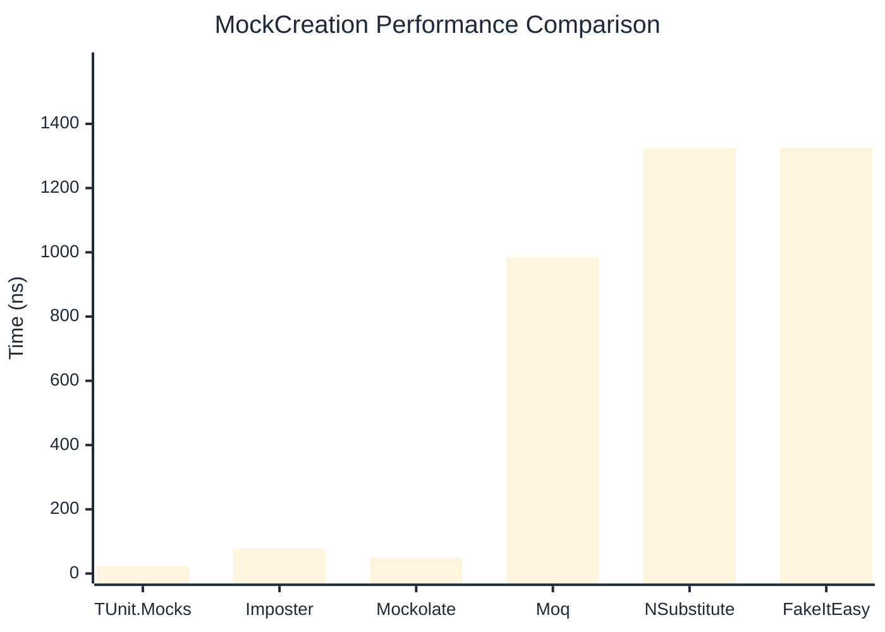
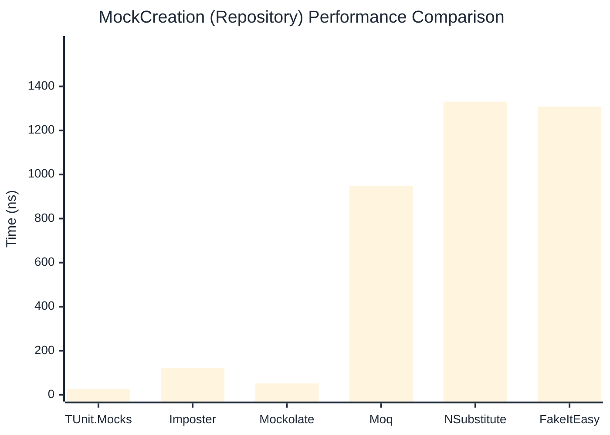

# MockCreation Benchmark

> Mock instance creation performance — comparing **TUnit.Mocks** (source-generated) against runtime proxy-based mocking libraries.

:::info Last Updated
This benchmark was automatically generated on **2026-06-14** from the latest CI run.

**Environment:** Ubuntu Latest • .NET SDK 10.0.301
:::

## 📊 Results

Mock instance creation performance:

| Library | Mean | Error | StdDev | Allocated |
|---------|------|-------|--------|-----------|
| **TUnit.Mocks** | 23.13 ns | 0.155 ns | 0.137 ns | 200 B |
| Imposter | 77.65 ns | 0.378 ns | 0.335 ns | 440 B |
| Mockolate | 48.86 ns | 0.142 ns | 0.126 ns | 424 B |
| Moq | 985.35 ns | 12.672 ns | 11.234 ns | 2048 B |
| NSubstitute | 1,324.67 ns | 5.141 ns | 4.557 ns | 5000 B |
| FakeItEasy | 1,325.42 ns | 10.214 ns | 9.554 ns | 2715 B |

---

### Repository

| Library | Mean | Error | StdDev | Allocated |
|---------|------|-------|--------|-----------|
| **TUnit.Mocks** | 25.41 ns | 0.159 ns | 0.148 ns | 200 B |
| Imposter | 121.40 ns | 0.364 ns | 0.323 ns | 696 B |
| Mockolate | 51.50 ns | 0.746 ns | 0.697 ns | 456 B |
| Moq | 949.04 ns | 5.664 ns | 5.021 ns | 1912 B |
| NSubstitute | 1,330.80 ns | 6.107 ns | 5.712 ns | 5000 B |
| FakeItEasy | 1,308.82 ns | 15.546 ns | 13.781 ns | 2715 B |

## 🎯 Key Insights

This benchmark compares **TUnit.Mocks** (source-generated) against runtime proxy-based mocking libraries for mock instance creation performance.

---

:::note Methodology
View the [mock benchmarks overview](/docs/benchmarks/mocks) for methodology details and environment information.
:::

*Last generated: 2026-06-14T03:35:08.044Z*
