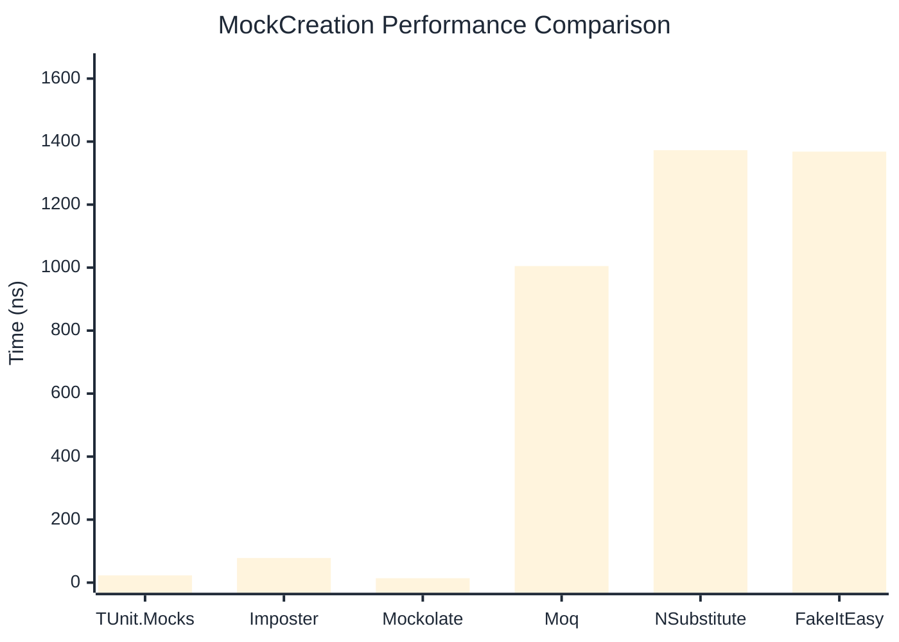
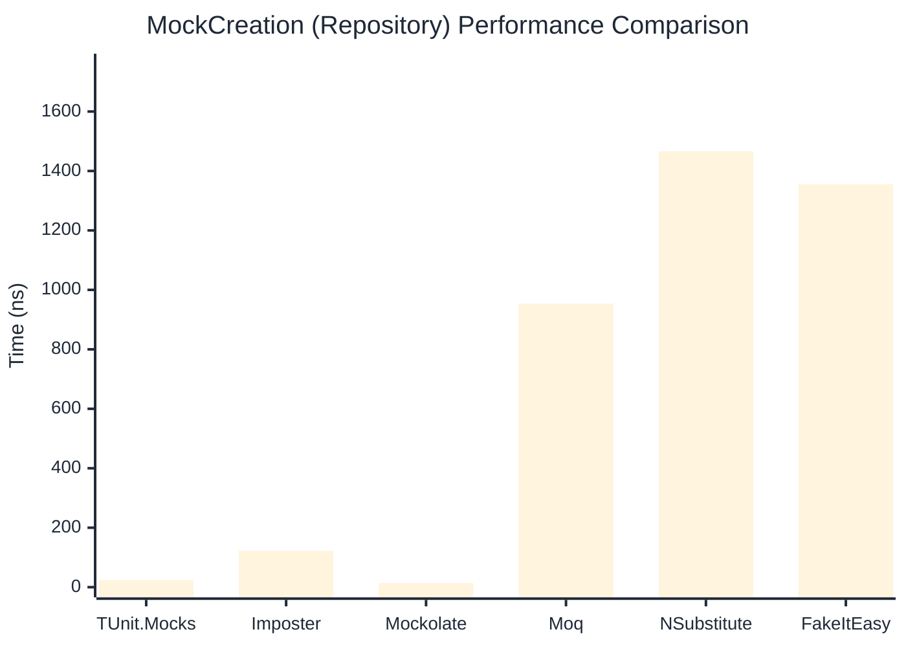

# MockCreation Benchmark

> Mock instance creation performance — comparing **TUnit.Mocks** (source-generated) against runtime proxy-based mocking libraries.

:::info Last Updated
This benchmark was automatically generated on **2026-07-21** from the latest CI run.

**Environment:** Ubuntu Latest • .NET SDK 10.0.302
:::

## 📊 Results

Mock instance creation performance:

| Library | Mean | Error | StdDev | Allocated |
|---------|------|-------|--------|-----------|
| **TUnit.Mocks** | 22.96 ns | 0.206 ns | 0.183 ns | 200 B |
| Imposter | 78.09 ns | 0.413 ns | 0.345 ns | 440 B |
| Mockolate | 14.05 ns | 0.320 ns | 0.314 ns | 160 B |
| Moq | 1,004.87 ns | 8.843 ns | 8.272 ns | 2048 B |
| NSubstitute | 1,372.68 ns | 26.761 ns | 39.226 ns | 5000 B |
| FakeItEasy | 1,368.10 ns | 26.991 ns | 27.717 ns | 2715 B |

---

### Repository

| Library | Mean | Error | StdDev | Allocated |
|---------|------|-------|--------|-----------|
| **TUnit.Mocks** | 23.43 ns | 0.233 ns | 0.218 ns | 200 B |
| Imposter | 122.21 ns | 0.284 ns | 0.237 ns | 696 B |
| Mockolate | 13.93 ns | 0.121 ns | 0.108 ns | 176 B |
| Moq | 953.66 ns | 13.720 ns | 12.834 ns | 1912 B |
| NSubstitute | 1,466.01 ns | 29.115 ns | 39.852 ns | 5000 B |
| FakeItEasy | 1,355.37 ns | 26.958 ns | 28.845 ns | 2715 B |

## 🎯 Key Insights

This benchmark compares **TUnit.Mocks** (source-generated) against runtime proxy-based mocking libraries for mock instance creation performance.

---

:::note Methodology
View the [mock benchmarks overview](/docs/benchmarks/mocks) for methodology details and environment information.
:::

*Last generated: 2026-07-21T03:22:31.280Z*
