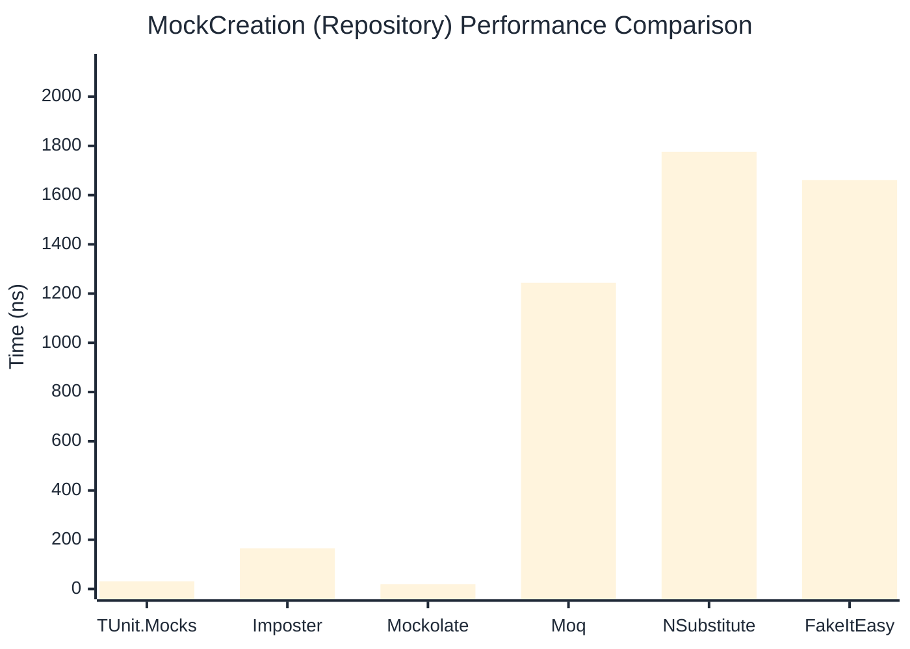

# MockCreation Benchmark

> Mock instance creation performance — comparing **TUnit.Mocks** (source-generated) against runtime proxy-based mocking libraries.

:::info Last Updated
This benchmark was automatically generated on **2026-07-05** from the latest CI run.

**Environment:** Ubuntu Latest • .NET SDK 10.0.301
:::

## 📊 Results

Mock instance creation performance:

| Library | Mean | Error | StdDev | Allocated |
|---------|------|-------|--------|-----------|
| **TUnit.Mocks** | 31.48 ns | 0.683 ns | 0.730 ns | 200 B |
| Imposter | 115.40 ns | 1.525 ns | 1.274 ns | 440 B |
| Mockolate | 18.98 ns | 0.438 ns | 0.469 ns | 160 B |
| Moq | 1,310.22 ns | 25.906 ns | 27.719 ns | 2048 B |
| NSubstitute | 1,908.59 ns | 37.708 ns | 79.540 ns | 5000 B |
| FakeItEasy | 1,877.12 ns | 37.531 ns | 89.198 ns | 2715 B |

---

### Repository

| Library | Mean | Error | StdDev | Allocated |
|---------|------|-------|--------|-----------|
| **TUnit.Mocks** | 31.33 ns | 0.589 ns | 0.551 ns | 200 B |
| Imposter | 165.00 ns | 3.347 ns | 3.131 ns | 696 B |
| Mockolate | 19.18 ns | 0.418 ns | 0.411 ns | 176 B |
| Moq | 1,243.83 ns | 24.849 ns | 26.588 ns | 1912 B |
| NSubstitute | 1,776.11 ns | 35.199 ns | 69.480 ns | 5000 B |
| FakeItEasy | 1,661.37 ns | 29.205 ns | 24.388 ns | 2715 B |

## 🎯 Key Insights

This benchmark compares **TUnit.Mocks** (source-generated) against runtime proxy-based mocking libraries for mock instance creation performance.

---

:::note Methodology
View the [mock benchmarks overview](/docs/benchmarks/mocks) for methodology details and environment information.
:::

*Last generated: 2026-07-05T03:32:29.901Z*
