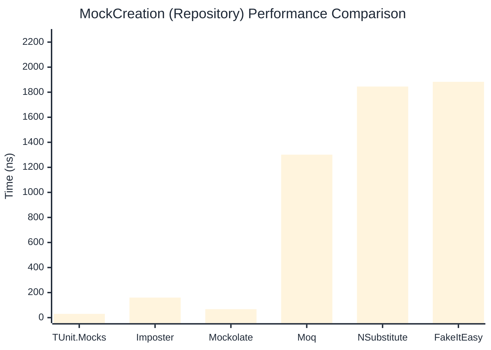

# MockCreation Benchmark

> Mock instance creation performance — comparing **TUnit.Mocks** (source-generated) against runtime proxy-based mocking libraries.

:::info Last Updated
This benchmark was automatically generated on **2026-06-19** from the latest CI run.

**Environment:** Ubuntu Latest • .NET SDK 10.0.301
:::

## 📊 Results

Mock instance creation performance:

| Library | Mean | Error | StdDev | Allocated |
|---------|------|-------|--------|-----------|
| **TUnit.Mocks** | 33.12 ns | 0.454 ns | 0.402 ns | 200 B |
| Imposter | 115.83 ns | 0.661 ns | 0.586 ns | 440 B |
| Mockolate | 70.04 ns | 0.702 ns | 0.657 ns | 424 B |
| Moq | 1,268.78 ns | 22.540 ns | 21.084 ns | 2048 B |
| NSubstitute | 1,792.73 ns | 25.311 ns | 23.676 ns | 5000 B |
| FakeItEasy | 1,809.35 ns | 31.879 ns | 36.712 ns | 2715 B |

---

### Repository

| Library | Mean | Error | StdDev | Allocated |
|---------|------|-------|--------|-----------|
| **TUnit.Mocks** | 29.92 ns | 0.148 ns | 0.124 ns | 200 B |
| Imposter | 160.02 ns | 0.871 ns | 0.815 ns | 696 B |
| Mockolate | 67.56 ns | 0.729 ns | 0.646 ns | 456 B |
| Moq | 1,301.47 ns | 10.068 ns | 9.417 ns | 1912 B |
| NSubstitute | 1,845.32 ns | 28.797 ns | 26.936 ns | 5000 B |
| FakeItEasy | 1,883.04 ns | 33.726 ns | 43.853 ns | 2715 B |

## 🎯 Key Insights

This benchmark compares **TUnit.Mocks** (source-generated) against runtime proxy-based mocking libraries for mock instance creation performance.

---

:::note Methodology
View the [mock benchmarks overview](/docs/benchmarks/mocks) for methodology details and environment information.
:::

*Last generated: 2026-06-19T03:29:43.427Z*
