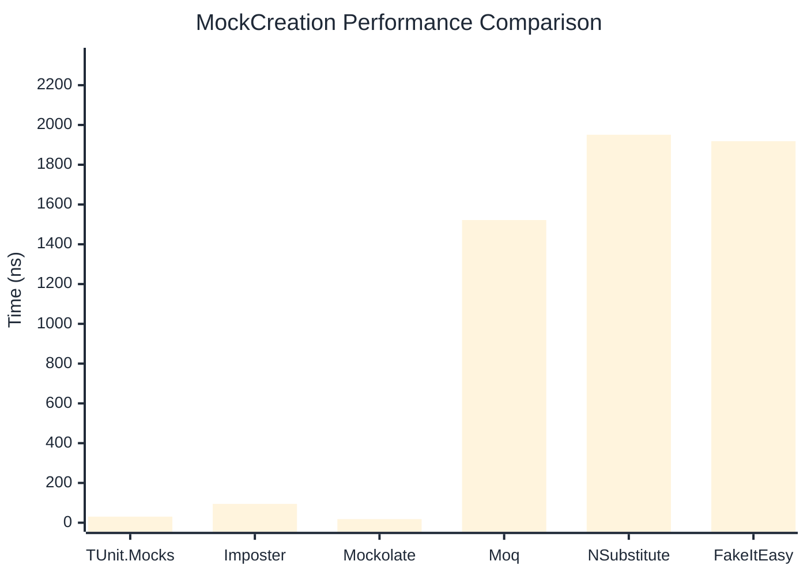

# MockCreation Benchmark

> Mock instance creation performance — comparing **TUnit.Mocks** (source-generated) against runtime proxy-based mocking libraries.

:::info Last Updated
This benchmark was automatically generated on **2026-06-25** from the latest CI run.

**Environment:** Ubuntu Latest • .NET SDK 10.0.301
:::

## 📊 Results

Mock instance creation performance:

| Library | Mean | Error | StdDev | Allocated |
|---------|------|-------|--------|-----------|
| **TUnit.Mocks** | 30.73 ns | 0.678 ns | 1.650 ns | 200 B |
| Imposter | 94.68 ns | 1.918 ns | 2.689 ns | 440 B |
| Mockolate | 18.14 ns | 0.427 ns | 0.492 ns | 160 B |
| Moq | 1,521.98 ns | 12.554 ns | 11.743 ns | 2048 B |
| NSubstitute | 1,950.90 ns | 23.763 ns | 21.065 ns | 5000 B |
| FakeItEasy | 1,918.35 ns | 16.656 ns | 14.765 ns | 2715 B |

---

### Repository

| Library | Mean | Error | StdDev | Allocated |
|---------|------|-------|--------|-----------|
| **TUnit.Mocks** | 29.48 ns | 0.650 ns | 1.104 ns | 200 B |
| Imposter | 155.22 ns | 1.922 ns | 1.798 ns | 696 B |
| Mockolate | 18.27 ns | 0.425 ns | 0.839 ns | 176 B |
| Moq | 1,377.57 ns | 12.683 ns | 11.864 ns | 1912 B |
| NSubstitute | 1,910.17 ns | 19.273 ns | 18.028 ns | 5000 B |
| FakeItEasy | 1,875.47 ns | 30.111 ns | 26.693 ns | 2715 B |

## 🎯 Key Insights

This benchmark compares **TUnit.Mocks** (source-generated) against runtime proxy-based mocking libraries for mock instance creation performance.

---

:::note Methodology
View the [mock benchmarks overview](/docs/benchmarks/mocks) for methodology details and environment information.
:::

*Last generated: 2026-06-25T03:27:42.911Z*
