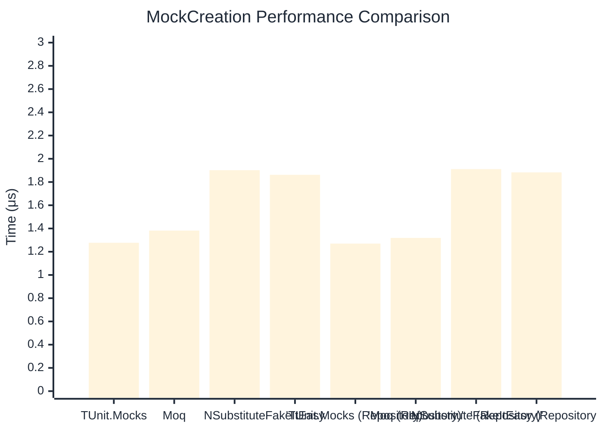

# MockCreation Benchmark

:::info Last Updated
This benchmark was automatically generated on **2026-03-29** from the latest CI run.

**Environment:** Ubuntu Latest • .NET SDK 10.0.201
:::

## 📊 Results

Mock instance creation performance:

| Method | Mean | Error | StdDev | Allocated |
|--------|------|-------|--------|-----------|
| **TUnit.Mocks** | 1.277 μs | 0.0104 μs | 0.0097 μs | 1.12 KB |
| Moq | 1.382 μs | 0.0143 μs | 0.0134 μs | 2 KB |
| NSubstitute | 1.902 μs | 0.0084 μs | 0.0078 μs | 4.88 KB |
| FakeItEasy | 1.862 μs | 0.0114 μs | 0.0101 μs | 2.65 KB |
| **'TUnit.Mocks (Repository)'** | 1.270 μs | 0.0072 μs | 0.0067 μs | 1.12 KB |
| 'Moq (Repository)' | 1.319 μs | 0.0048 μs | 0.0043 μs | 1.87 KB |
| 'NSubstitute (Repository)' | 1.911 μs | 0.0093 μs | 0.0087 μs | 4.88 KB |
| 'FakeItEasy (Repository)' | 1.883 μs | 0.0136 μs | 0.0114 μs | 2.65 KB |

## 📈 Visual Comparison

## 🎯 Key Insights

This benchmark compares **TUnit.Mocks** (source-generated) against runtime proxy-based mocking libraries for mock instance creation performance.

---

:::note Methodology
View the [mock benchmarks overview](/docs/benchmarks/mocks) for methodology details and environment information.
:::

*Last generated: 2026-03-29T03:29:47.877Z*
