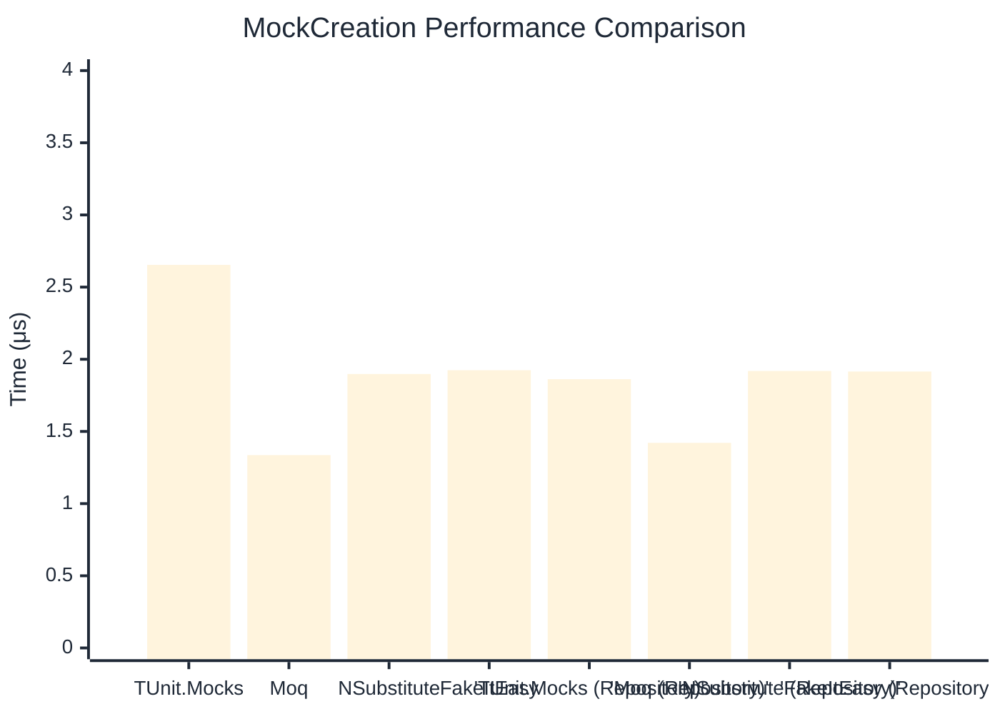

# MockCreation Benchmark

:::info Last Updated
This benchmark was automatically generated on **2026-03-28** from the latest CI run.

**Environment:** Ubuntu Latest • .NET SDK 10.0.201
:::

## 📊 Results

Mock instance creation performance:

| Method | Mean | Error | StdDev | Allocated |
|--------|------|-------|--------|-----------|
| **TUnit.Mocks** | 2.654 μs | 0.0524 μs | 0.0583 μs | 4.47 KB |
| Moq | 1.336 μs | 0.0232 μs | 0.0217 μs | 2 KB |
| NSubstitute | 1.898 μs | 0.0184 μs | 0.0172 μs | 4.88 KB |
| FakeItEasy | 1.924 μs | 0.0203 μs | 0.0190 μs | 2.65 KB |
| **'TUnit.Mocks (Repository)'** | 1.862 μs | 0.0370 μs | 0.0363 μs | 4.47 KB |
| 'Moq (Repository)' | 1.421 μs | 0.0053 μs | 0.0047 μs | 1.87 KB |
| 'NSubstitute (Repository)' | 1.919 μs | 0.0201 μs | 0.0188 μs | 4.88 KB |
| 'FakeItEasy (Repository)' | 1.915 μs | 0.0176 μs | 0.0164 μs | 2.65 KB |

## 📈 Visual Comparison

## 🎯 Key Insights

This benchmark compares **TUnit.Mocks** (source-generated) against runtime proxy-based mocking libraries for mock instance creation performance.

---

:::note Methodology
View the [mock benchmarks overview](/docs/benchmarks/mocks) for methodology details and environment information.
:::

*Last generated: 2026-03-28T22:34:52.303Z*
