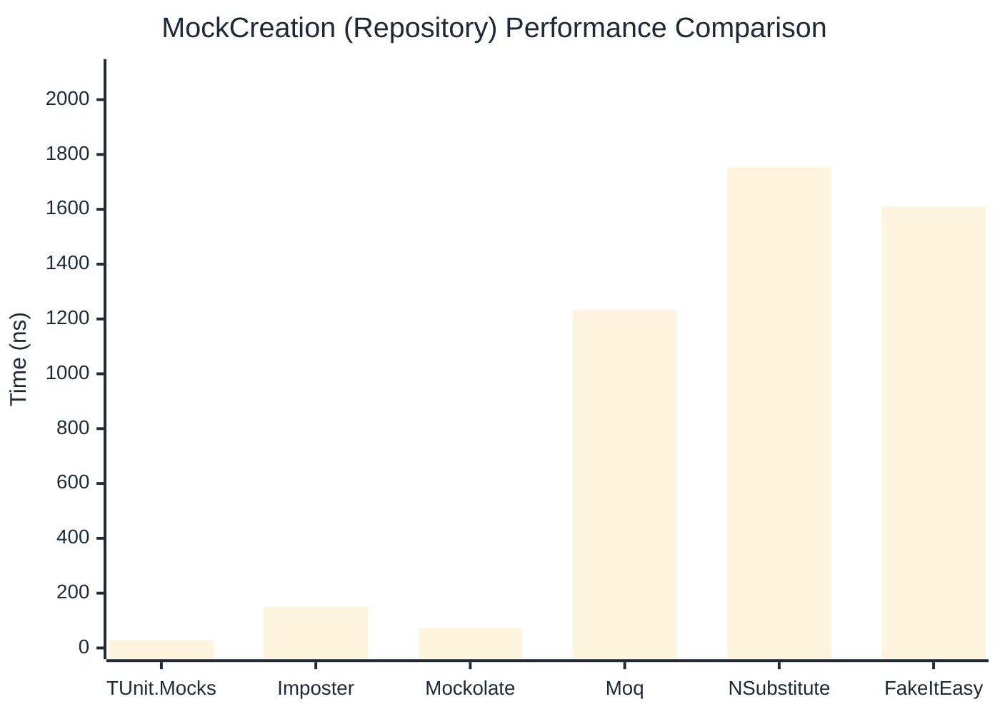

# MockCreation Benchmark

:::info Last Updated
This benchmark was automatically generated on **2026-05-17** from the latest CI run.

**Environment:** Ubuntu Latest • .NET SDK 10.0.300
:::

## 📊 Results

Mock instance creation performance:

| Library | Mean | Error | StdDev | Allocated |
|---------|------|-------|--------|-----------|
| **TUnit.Mocks** | 26.01 ns | 0.270 ns | 0.240 ns | 192 B |
| Imposter | 95.42 ns | 0.137 ns | 0.122 ns | 440 B |
| Mockolate | 62.16 ns | 0.124 ns | 0.110 ns | 424 B |
| Moq | 1,242.67 ns | 24.043 ns | 22.490 ns | 2048 B |
| NSubstitute | 1,749.29 ns | 24.154 ns | 22.594 ns | 5000 B |
| FakeItEasy | 1,695.60 ns | 17.650 ns | 15.646 ns | 2715 B |

---

### Repository

| Library | Mean | Error | StdDev | Allocated |
|---------|------|-------|--------|-----------|
| **TUnit.Mocks** | 26.92 ns | 0.109 ns | 0.102 ns | 192 B |
| Imposter | 151.22 ns | 0.513 ns | 0.455 ns | 696 B |
| Mockolate | 72.19 ns | 0.664 ns | 0.621 ns | 456 B |
| Moq | 1,232.55 ns | 8.611 ns | 8.055 ns | 1912 B |
| NSubstitute | 1,754.32 ns | 34.262 ns | 38.082 ns | 5000 B |
| FakeItEasy | 1,609.69 ns | 3.742 ns | 3.317 ns | 2715 B |

## 🎯 Key Insights

This benchmark compares **TUnit.Mocks** (source-generated) against runtime proxy-based mocking libraries for mock instance creation performance.

---

:::note Methodology
View the [mock benchmarks overview](/docs/benchmarks/mocks) for methodology details and environment information.
:::

*Last generated: 2026-05-17T03:31:33.295Z*
