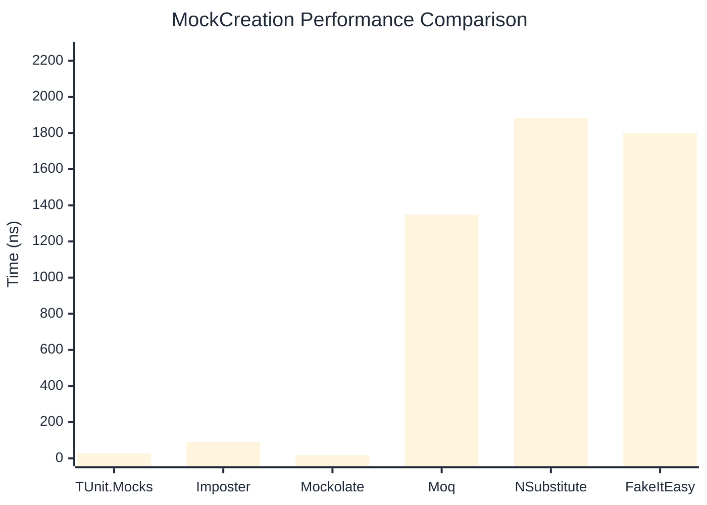

# MockCreation Benchmark

> Mock instance creation performance — comparing **TUnit.Mocks** (source-generated) against runtime proxy-based mocking libraries.

:::info Last Updated
This benchmark was automatically generated on **2026-06-23** from the latest CI run.

**Environment:** Ubuntu Latest • .NET SDK 10.0.301
:::

## 📊 Results

Mock instance creation performance:

| Library | Mean | Error | StdDev | Allocated |
|---------|------|-------|--------|-----------|
| **TUnit.Mocks** | 27.97 ns | 0.224 ns | 0.198 ns | 200 B |
| Imposter | 90.33 ns | 1.233 ns | 1.153 ns | 440 B |
| Mockolate | 16.96 ns | 0.130 ns | 0.121 ns | 160 B |
| Moq | 1,348.85 ns | 26.457 ns | 27.169 ns | 2048 B |
| NSubstitute | 1,882.69 ns | 4.820 ns | 3.763 ns | 5000 B |
| FakeItEasy | 1,798.86 ns | 14.610 ns | 12.951 ns | 2715 B |

---

### Repository

| Library | Mean | Error | StdDev | Allocated |
|---------|------|-------|--------|-----------|
| **TUnit.Mocks** | 27.23 ns | 0.156 ns | 0.138 ns | 200 B |
| Imposter | 140.33 ns | 0.800 ns | 0.709 ns | 696 B |
| Mockolate | 16.89 ns | 0.089 ns | 0.079 ns | 176 B |
| Moq | 1,264.54 ns | 17.604 ns | 15.605 ns | 1912 B |
| NSubstitute | 1,789.44 ns | 7.172 ns | 6.358 ns | 5000 B |
| FakeItEasy | 1,776.71 ns | 12.920 ns | 11.454 ns | 2715 B |

## 🎯 Key Insights

This benchmark compares **TUnit.Mocks** (source-generated) against runtime proxy-based mocking libraries for mock instance creation performance.

---

:::note Methodology
View the [mock benchmarks overview](/docs/benchmarks/mocks) for methodology details and environment information.
:::

*Last generated: 2026-06-23T03:26:30.646Z*
