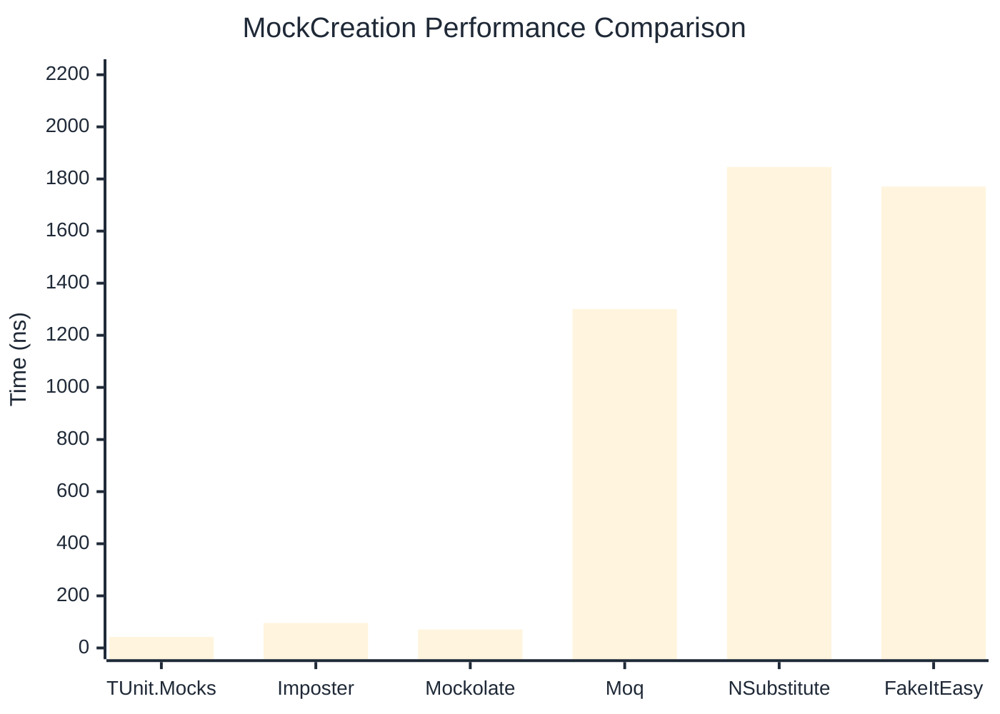

# MockCreation Benchmark

:::info Last Updated
This benchmark was automatically generated on **2026-03-30** from the latest CI run.

**Environment:** Ubuntu Latest • .NET SDK 10.0.201
:::

## 📊 Results

Mock instance creation performance:

| Library | Mean | Error | StdDev | Allocated |
|---------|------|-------|--------|-----------|
| **TUnit.Mocks** | 42.43 ns | 0.751 ns | 0.702 ns | 224 B |
| Imposter | 96.00 ns | 1.599 ns | 1.418 ns | 440 B |
| Mockolate | 70.83 ns | 1.176 ns | 1.100 ns | 360 B |
| Moq | 1,300.61 ns | 19.189 ns | 17.950 ns | 2048 B |
| NSubstitute | 1,845.95 ns | 13.428 ns | 12.561 ns | 5000 B |
| FakeItEasy | 1,770.65 ns | 29.769 ns | 27.846 ns | 2715 B |

---

### Repository

| Library | Mean | Error | StdDev | Allocated |
|---------|------|-------|--------|-----------|
| **TUnit.Mocks** | 43.09 ns | 0.884 ns | 1.117 ns | 224 B |
| Imposter | 149.02 ns | 2.287 ns | 2.027 ns | 696 B |
| Mockolate | 67.16 ns | 1.390 ns | 1.994 ns | 360 B |
| Moq | 1,354.15 ns | 22.690 ns | 21.224 ns | 1912 B |
| NSubstitute | 1,845.34 ns | 16.311 ns | 14.460 ns | 5000 B |
| FakeItEasy | 1,902.44 ns | 35.380 ns | 31.363 ns | 2715 B |

## 🎯 Key Insights

This benchmark compares **TUnit.Mocks** (source-generated) against runtime proxy-based mocking libraries for mock instance creation performance.

---

:::note Methodology
View the [mock benchmarks overview](/docs/benchmarks/mocks) for methodology details and environment information.
:::

*Last generated: 2026-03-30T03:24:56.545Z*
