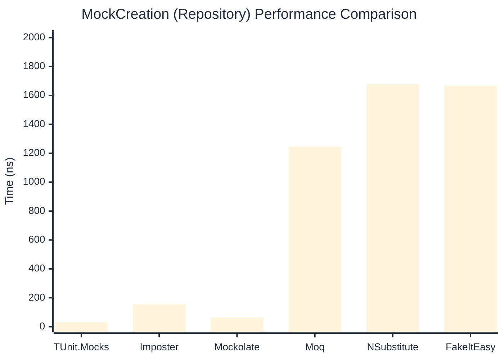

# MockCreation Benchmark

> Mock instance creation performance — comparing **TUnit.Mocks** (source-generated) against runtime proxy-based mocking libraries.

:::info Last Updated
This benchmark was automatically generated on **2026-06-16** from the latest CI run.

**Environment:** Ubuntu Latest • .NET SDK 10.0.301
:::

## 📊 Results

Mock instance creation performance:

| Library | Mean | Error | StdDev | Allocated |
|---------|------|-------|--------|-----------|
| **TUnit.Mocks** | 28.56 ns | 0.522 ns | 0.489 ns | 200 B |
| Imposter | 99.99 ns | 0.202 ns | 0.179 ns | 440 B |
| Mockolate | 71.95 ns | 0.479 ns | 0.425 ns | 424 B |
| Moq | 1,277.80 ns | 23.311 ns | 21.805 ns | 2048 B |
| NSubstitute | 1,716.98 ns | 10.866 ns | 10.164 ns | 5000 B |
| FakeItEasy | 1,668.96 ns | 8.804 ns | 8.236 ns | 2715 B |

---

### Repository

| Library | Mean | Error | StdDev | Allocated |
|---------|------|-------|--------|-----------|
| **TUnit.Mocks** | 31.71 ns | 0.541 ns | 0.506 ns | 200 B |
| Imposter | 156.40 ns | 0.222 ns | 0.197 ns | 696 B |
| Mockolate | 65.35 ns | 0.135 ns | 0.126 ns | 456 B |
| Moq | 1,245.66 ns | 2.345 ns | 2.078 ns | 1912 B |
| NSubstitute | 1,677.65 ns | 5.402 ns | 5.053 ns | 5000 B |
| FakeItEasy | 1,667.61 ns | 3.818 ns | 3.384 ns | 2715 B |

## 🎯 Key Insights

This benchmark compares **TUnit.Mocks** (source-generated) against runtime proxy-based mocking libraries for mock instance creation performance.

---

:::note Methodology
View the [mock benchmarks overview](/docs/benchmarks/mocks) for methodology details and environment information.
:::

*Last generated: 2026-06-16T03:29:20.737Z*
