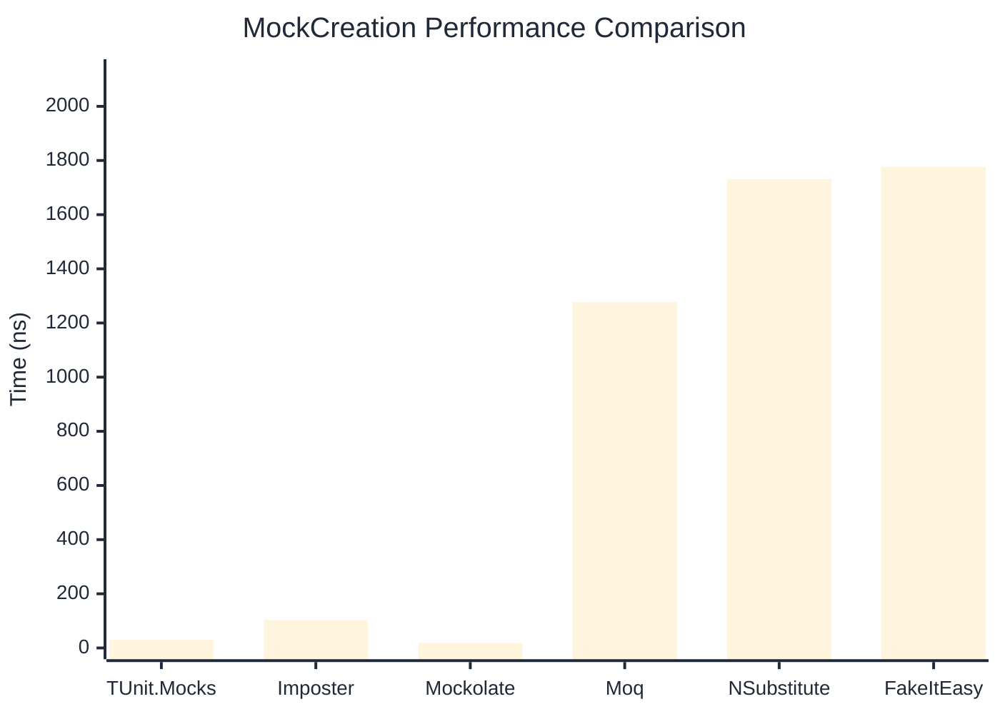

# MockCreation Benchmark

> Mock instance creation performance — comparing **TUnit.Mocks** (source-generated) against runtime proxy-based mocking libraries.

:::info Last Updated
This benchmark was automatically generated on **2026-07-16** from the latest CI run.

**Environment:** Ubuntu Latest • .NET SDK 10.0.302
:::

## 📊 Results

Mock instance creation performance:

| Library | Mean | Error | StdDev | Allocated |
|---------|------|-------|--------|-----------|
| **TUnit.Mocks** | 29.70 ns | 0.452 ns | 0.400 ns | 200 B |
| Imposter | 102.82 ns | 0.692 ns | 0.613 ns | 440 B |
| Mockolate | 18.30 ns | 0.178 ns | 0.149 ns | 160 B |
| Moq | 1,277.23 ns | 21.202 ns | 19.832 ns | 2048 B |
| NSubstitute | 1,731.47 ns | 21.570 ns | 20.176 ns | 5000 B |
| FakeItEasy | 1,776.40 ns | 34.686 ns | 43.867 ns | 2715 B |

---

### Repository

| Library | Mean | Error | StdDev | Allocated |
|---------|------|-------|--------|-----------|
| **TUnit.Mocks** | 29.95 ns | 0.312 ns | 0.277 ns | 200 B |
| Imposter | 158.48 ns | 1.580 ns | 1.401 ns | 696 B |
| Mockolate | 17.91 ns | 0.124 ns | 0.104 ns | 176 B |
| Moq | 1,287.34 ns | 15.628 ns | 12.201 ns | 1912 B |
| NSubstitute | 1,772.55 ns | 34.348 ns | 40.889 ns | 5000 B |
| FakeItEasy | 1,814.17 ns | 35.390 ns | 37.867 ns | 2715 B |

## 🎯 Key Insights

This benchmark compares **TUnit.Mocks** (source-generated) against runtime proxy-based mocking libraries for mock instance creation performance.

---

:::note Methodology
View the [mock benchmarks overview](/docs/benchmarks/mocks) for methodology details and environment information.
:::

*Last generated: 2026-07-16T03:22:07.543Z*
