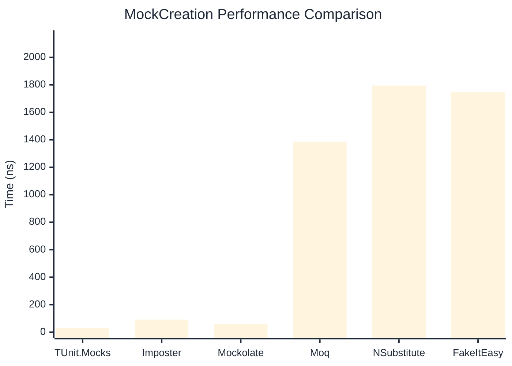

# MockCreation Benchmark

> Mock instance creation performance — comparing **TUnit.Mocks** (source-generated) against runtime proxy-based mocking libraries.

:::info Last Updated
This benchmark was automatically generated on **2026-06-21** from the latest CI run.

**Environment:** Ubuntu Latest • .NET SDK 10.0.301
:::

## 📊 Results

Mock instance creation performance:

| Library | Mean | Error | StdDev | Allocated |
|---------|------|-------|--------|-----------|
| **TUnit.Mocks** | 28.20 ns | 0.474 ns | 0.443 ns | 200 B |
| Imposter | 90.87 ns | 0.488 ns | 0.432 ns | 440 B |
| Mockolate | 60.38 ns | 0.606 ns | 0.537 ns | 424 B |
| Moq | 1,385.96 ns | 19.748 ns | 18.472 ns | 2048 B |
| NSubstitute | 1,794.82 ns | 7.317 ns | 6.486 ns | 5000 B |
| FakeItEasy | 1,746.75 ns | 22.933 ns | 21.451 ns | 2715 B |

---

### Repository

| Library | Mean | Error | StdDev | Allocated |
|---------|------|-------|--------|-----------|
| **TUnit.Mocks** | 28.04 ns | 0.578 ns | 0.540 ns | 200 B |
| Imposter | 142.32 ns | 1.958 ns | 1.832 ns | 696 B |
| Mockolate | 61.60 ns | 0.729 ns | 0.646 ns | 456 B |
| Moq | 1,302.25 ns | 12.806 ns | 11.978 ns | 1912 B |
| NSubstitute | 1,953.62 ns | 16.181 ns | 15.135 ns | 5000 B |
| FakeItEasy | 1,747.36 ns | 12.709 ns | 11.266 ns | 2715 B |

## 🎯 Key Insights

This benchmark compares **TUnit.Mocks** (source-generated) against runtime proxy-based mocking libraries for mock instance creation performance.

---

:::note Methodology
View the [mock benchmarks overview](/docs/benchmarks/mocks) for methodology details and environment information.
:::

*Last generated: 2026-06-21T03:36:43.702Z*
