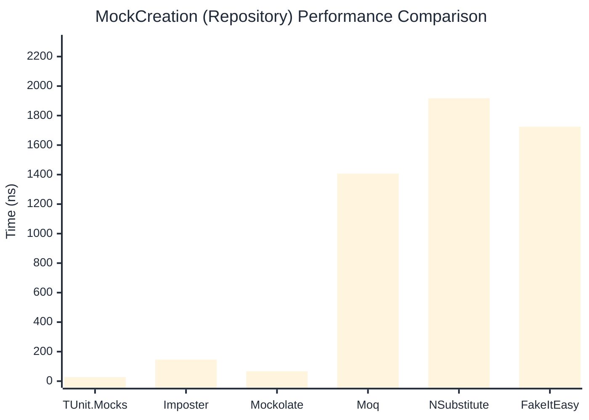

# MockCreation Benchmark

:::info Last Updated
This benchmark was automatically generated on **2026-04-26** from the latest CI run.

**Environment:** Ubuntu Latest • .NET SDK 10.0.203
:::

## 📊 Results

Mock instance creation performance:

| Library | Mean | Error | StdDev | Allocated |
|---------|------|-------|--------|-----------|
| **TUnit.Mocks** | 25.72 ns | 0.564 ns | 0.579 ns | 192 B |
| Imposter | 92.17 ns | 1.035 ns | 0.864 ns | 440 B |
| Mockolate | 67.65 ns | 1.400 ns | 2.221 ns | 384 B |
| Moq | 1,352.52 ns | 24.600 ns | 23.011 ns | 2048 B |
| NSubstitute | 1,795.70 ns | 35.235 ns | 32.959 ns | 5000 B |
| FakeItEasy | 1,761.56 ns | 34.970 ns | 41.629 ns | 2715 B |

---

### Repository

| Library | Mean | Error | StdDev | Allocated |
|---------|------|-------|--------|-----------|
| **TUnit.Mocks** | 27.34 ns | 0.610 ns | 1.176 ns | 192 B |
| Imposter | 146.08 ns | 2.950 ns | 3.836 ns | 696 B |
| Mockolate | 66.96 ns | 1.379 ns | 2.304 ns | 384 B |
| Moq | 1,406.71 ns | 14.476 ns | 13.541 ns | 1912 B |
| NSubstitute | 1,917.56 ns | 31.800 ns | 29.746 ns | 5000 B |
| FakeItEasy | 1,724.61 ns | 34.491 ns | 35.420 ns | 2715 B |

## 🎯 Key Insights

This benchmark compares **TUnit.Mocks** (source-generated) against runtime proxy-based mocking libraries for mock instance creation performance.

---

:::note Methodology
View the [mock benchmarks overview](/docs/benchmarks/mocks) for methodology details and environment information.
:::

*Last generated: 2026-04-26T03:29:14.435Z*
