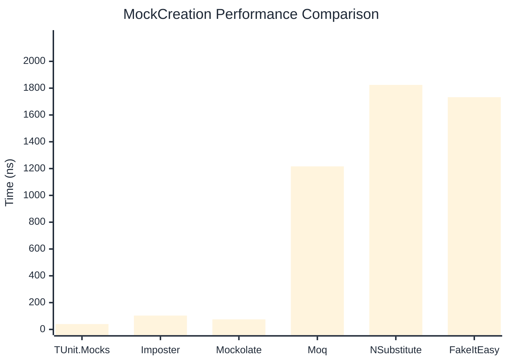

# MockCreation Benchmark

:::info Last Updated
This benchmark was automatically generated on **2026-04-13** from the latest CI run.

**Environment:** Ubuntu Latest • .NET SDK 10.0.201
:::

## 📊 Results

Mock instance creation performance:

| Library | Mean | Error | StdDev | Allocated |
|---------|------|-------|--------|-----------|
| **TUnit.Mocks** | 40.14 ns | 0.838 ns | 0.784 ns | 192 B |
| Imposter | 103.32 ns | 2.143 ns | 2.201 ns | 440 B |
| Mockolate | 75.18 ns | 1.220 ns | 1.141 ns | 384 B |
| Moq | 1,216.44 ns | 11.075 ns | 10.359 ns | 2048 B |
| NSubstitute | 1,824.22 ns | 21.681 ns | 20.280 ns | 5000 B |
| FakeItEasy | 1,732.69 ns | 6.458 ns | 5.724 ns | 2723 B |

---

### Repository

| Library | Mean | Error | StdDev | Allocated |
|---------|------|-------|--------|-----------|
| **TUnit.Mocks** | 37.85 ns | 0.789 ns | 0.738 ns | 192 B |
| Imposter | 164.57 ns | 3.201 ns | 3.687 ns | 696 B |
| Mockolate | 78.38 ns | 1.396 ns | 1.305 ns | 384 B |
| Moq | 1,273.79 ns | 5.984 ns | 5.305 ns | 1912 B |
| NSubstitute | 1,762.02 ns | 9.564 ns | 8.946 ns | 5000 B |
| FakeItEasy | 1,815.85 ns | 27.643 ns | 25.858 ns | 2723 B |

## 🎯 Key Insights

This benchmark compares **TUnit.Mocks** (source-generated) against runtime proxy-based mocking libraries for mock instance creation performance.

---

:::note Methodology
View the [mock benchmarks overview](/docs/benchmarks/mocks) for methodology details and environment information.
:::

*Last generated: 2026-04-13T03:23:34.678Z*
