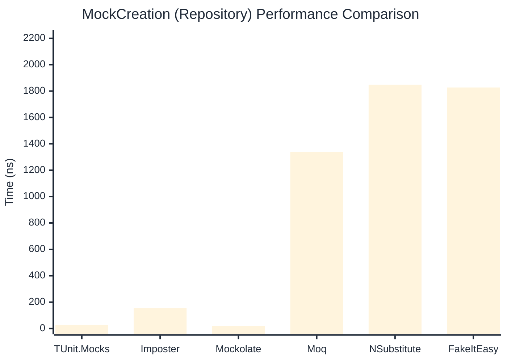

# MockCreation Benchmark

> Mock instance creation performance — comparing **TUnit.Mocks** (source-generated) against runtime proxy-based mocking libraries.

:::info Last Updated
This benchmark was automatically generated on **2026-07-15** from the latest CI run.

**Environment:** Ubuntu Latest • .NET SDK 10.0.302
:::

## 📊 Results

Mock instance creation performance:

| Library | Mean | Error | StdDev | Allocated |
|---------|------|-------|--------|-----------|
| **TUnit.Mocks** | 30.21 ns | 0.648 ns | 0.720 ns | 200 B |
| Imposter | 97.69 ns | 1.286 ns | 1.203 ns | 440 B |
| Mockolate | 18.09 ns | 0.440 ns | 1.296 ns | 160 B |
| Moq | 1,365.28 ns | 26.685 ns | 24.961 ns | 2048 B |
| NSubstitute | 1,799.43 ns | 25.706 ns | 24.046 ns | 5000 B |
| FakeItEasy | 1,851.43 ns | 36.340 ns | 50.944 ns | 2715 B |

---

### Repository

| Library | Mean | Error | StdDev | Allocated |
|---------|------|-------|--------|-----------|
| **TUnit.Mocks** | 28.93 ns | 0.643 ns | 1.207 ns | 200 B |
| Imposter | 154.65 ns | 2.984 ns | 2.930 ns | 696 B |
| Mockolate | 18.70 ns | 0.433 ns | 0.405 ns | 176 B |
| Moq | 1,339.90 ns | 8.178 ns | 7.650 ns | 1912 B |
| NSubstitute | 1,848.47 ns | 34.546 ns | 32.314 ns | 5000 B |
| FakeItEasy | 1,827.21 ns | 23.597 ns | 22.073 ns | 2715 B |

## 🎯 Key Insights

This benchmark compares **TUnit.Mocks** (source-generated) against runtime proxy-based mocking libraries for mock instance creation performance.

---

:::note Methodology
View the [mock benchmarks overview](/docs/benchmarks/mocks) for methodology details and environment information.
:::

*Last generated: 2026-07-15T03:20:35.055Z*
