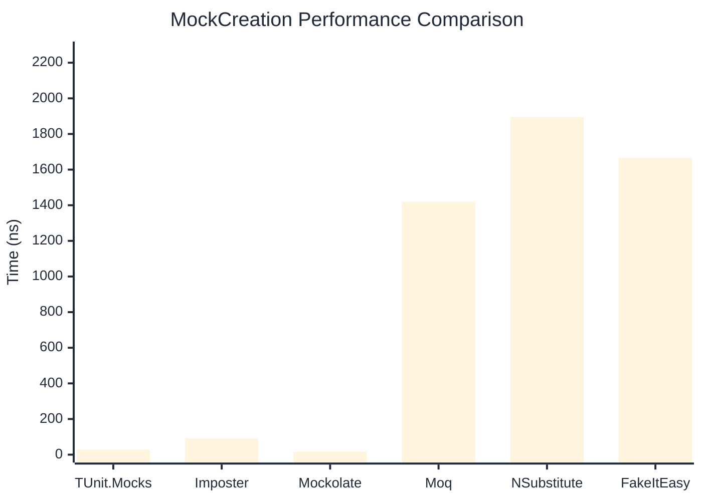
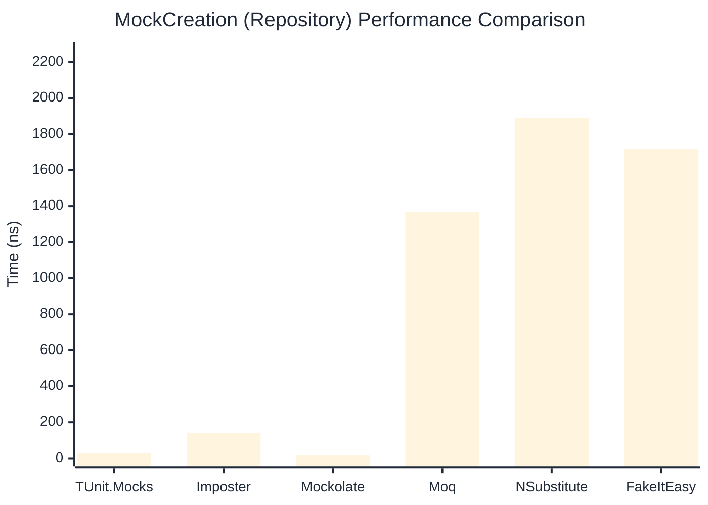

# MockCreation Benchmark

> Mock instance creation performance — comparing **TUnit.Mocks** (source-generated) against runtime proxy-based mocking libraries.

:::info Last Updated
This benchmark was automatically generated on **2026-07-04** from the latest CI run.

**Environment:** Ubuntu Latest • .NET SDK 10.0.301
:::

## 📊 Results

Mock instance creation performance:

| Library | Mean | Error | StdDev | Allocated |
|---------|------|-------|--------|-----------|
| **TUnit.Mocks** | 27.45 ns | 0.405 ns | 0.379 ns | 200 B |
| Imposter | 90.99 ns | 0.518 ns | 0.459 ns | 440 B |
| Mockolate | 16.87 ns | 0.110 ns | 0.092 ns | 160 B |
| Moq | 1,419.53 ns | 27.339 ns | 25.573 ns | 2048 B |
| NSubstitute | 1,894.70 ns | 11.444 ns | 10.145 ns | 5000 B |
| FakeItEasy | 1,665.65 ns | 16.031 ns | 14.211 ns | 2715 B |

---

### Repository

| Library | Mean | Error | StdDev | Allocated |
|---------|------|-------|--------|-----------|
| **TUnit.Mocks** | 27.10 ns | 0.197 ns | 0.184 ns | 200 B |
| Imposter | 140.30 ns | 1.382 ns | 1.293 ns | 696 B |
| Mockolate | 17.60 ns | 0.130 ns | 0.122 ns | 176 B |
| Moq | 1,368.28 ns | 5.917 ns | 5.245 ns | 1912 B |
| NSubstitute | 1,888.80 ns | 12.404 ns | 10.996 ns | 5000 B |
| FakeItEasy | 1,714.20 ns | 7.769 ns | 6.488 ns | 2715 B |

## 🎯 Key Insights

This benchmark compares **TUnit.Mocks** (source-generated) against runtime proxy-based mocking libraries for mock instance creation performance.

---

:::note Methodology
View the [mock benchmarks overview](/docs/benchmarks/mocks) for methodology details and environment information.
:::

*Last generated: 2026-07-04T03:22:20.303Z*
