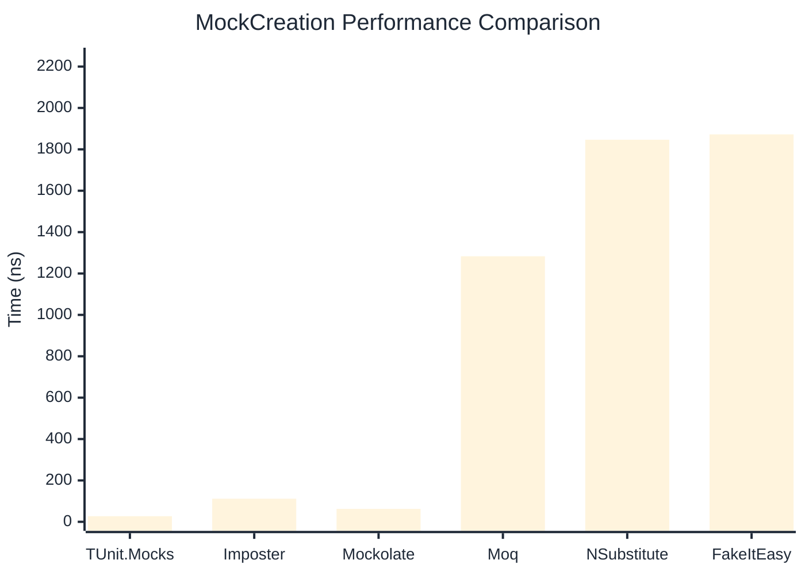

# MockCreation Benchmark

:::info Last Updated
This benchmark was automatically generated on **2026-06-01** from the latest CI run.

**Environment:** Ubuntu Latest • .NET SDK 10.0.300
:::

## 📊 Results

Mock instance creation performance:

| Library | Mean | Error | StdDev | Allocated |
|---------|------|-------|--------|-----------|
| **TUnit.Mocks** | 27.21 ns | 0.456 ns | 0.404 ns | 192 B |
| Imposter | 111.72 ns | 0.811 ns | 0.719 ns | 440 B |
| Mockolate | 62.36 ns | 1.167 ns | 1.092 ns | 424 B |
| Moq | 1,283.25 ns | 24.755 ns | 29.469 ns | 2048 B |
| NSubstitute | 1,846.29 ns | 36.667 ns | 36.012 ns | 5000 B |
| FakeItEasy | 1,872.38 ns | 36.714 ns | 70.736 ns | 2715 B |

---

### Repository

| Library | Mean | Error | StdDev | Allocated |
|---------|------|-------|--------|-----------|
| **TUnit.Mocks** | 25.78 ns | 0.111 ns | 0.104 ns | 192 B |
| Imposter | 149.81 ns | 1.019 ns | 0.953 ns | 696 B |
| Mockolate | 63.44 ns | 0.573 ns | 0.536 ns | 456 B |
| Moq | 1,242.78 ns | 11.093 ns | 10.376 ns | 1912 B |
| NSubstitute | 1,776.87 ns | 33.437 ns | 32.840 ns | 5000 B |
| FakeItEasy | 1,674.16 ns | 17.888 ns | 13.966 ns | 2715 B |

## 🎯 Key Insights

This benchmark compares **TUnit.Mocks** (source-generated) against runtime proxy-based mocking libraries for mock instance creation performance.

---

:::note Methodology
View the [mock benchmarks overview](/docs/benchmarks/mocks) for methodology details and environment information.
:::

*Last generated: 2026-06-01T03:31:09.013Z*
