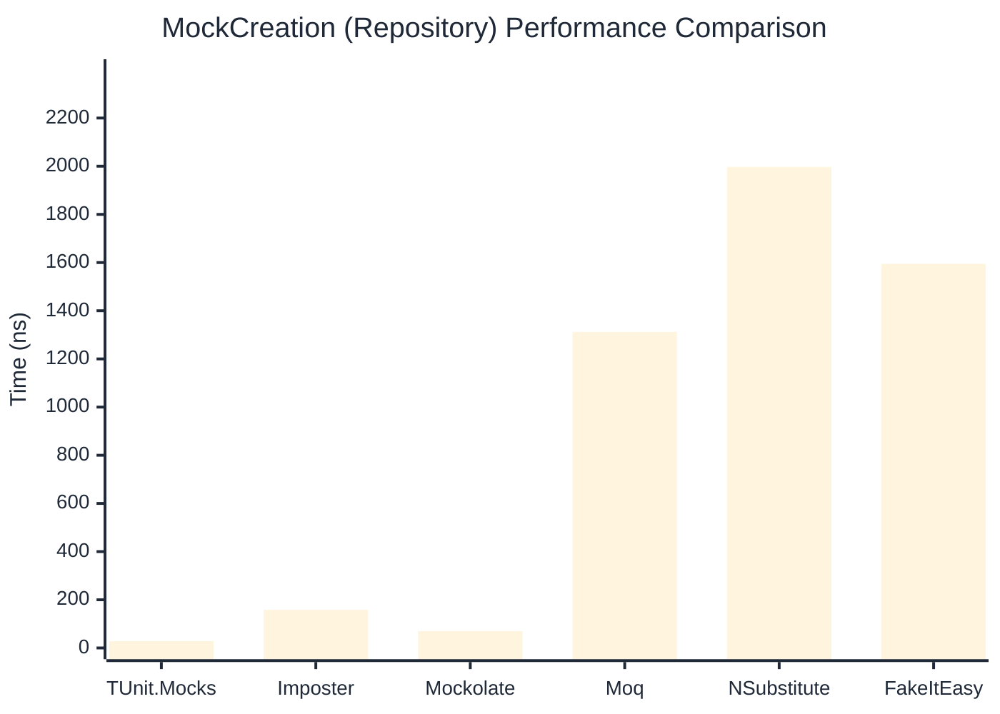

# MockCreation Benchmark

:::info Last Updated
This benchmark was automatically generated on **2026-05-24** from the latest CI run.

**Environment:** Ubuntu Latest • .NET SDK 10.0.300
:::

## 📊 Results

Mock instance creation performance:

| Library | Mean | Error | StdDev | Allocated |
|---------|------|-------|--------|-----------|
| **TUnit.Mocks** | 27.86 ns | 0.627 ns | 0.671 ns | 192 B |
| Imposter | 99.60 ns | 1.970 ns | 1.935 ns | 440 B |
| Mockolate | 66.16 ns | 1.357 ns | 2.482 ns | 424 B |
| Moq | 1,259.41 ns | 25.169 ns | 37.672 ns | 2048 B |
| NSubstitute | 1,665.13 ns | 11.360 ns | 10.626 ns | 5000 B |
| FakeItEasy | 1,676.09 ns | 22.320 ns | 20.878 ns | 2723 B |

---

### Repository

| Library | Mean | Error | StdDev | Allocated |
|---------|------|-------|--------|-----------|
| **TUnit.Mocks** | 28.28 ns | 0.624 ns | 0.613 ns | 192 B |
| Imposter | 158.23 ns | 3.265 ns | 3.207 ns | 696 B |
| Mockolate | 69.77 ns | 1.462 ns | 3.179 ns | 456 B |
| Moq | 1,311.94 ns | 5.691 ns | 5.323 ns | 1912 B |
| NSubstitute | 1,997.01 ns | 21.249 ns | 18.837 ns | 5000 B |
| FakeItEasy | 1,594.46 ns | 16.828 ns | 15.741 ns | 2723 B |

## 🎯 Key Insights

This benchmark compares **TUnit.Mocks** (source-generated) against runtime proxy-based mocking libraries for mock instance creation performance.

---

:::note Methodology
View the [mock benchmarks overview](/docs/benchmarks/mocks) for methodology details and environment information.
:::

*Last generated: 2026-05-24T03:32:03.972Z*
