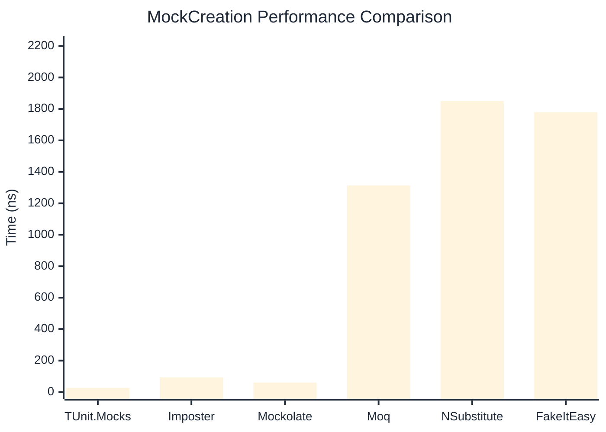

# MockCreation Benchmark

:::info Last Updated
This benchmark was automatically generated on **2026-05-27** from the latest CI run.

**Environment:** Ubuntu Latest • .NET SDK 10.0.300
:::

## 📊 Results

Mock instance creation performance:

| Library | Mean | Error | StdDev | Allocated |
|---------|------|-------|--------|-----------|
| **TUnit.Mocks** | 26.42 ns | 0.590 ns | 0.724 ns | 192 B |
| Imposter | 93.27 ns | 1.856 ns | 2.137 ns | 440 B |
| Mockolate | 60.05 ns | 1.265 ns | 2.881 ns | 424 B |
| Moq | 1,313.15 ns | 17.484 ns | 16.355 ns | 2048 B |
| NSubstitute | 1,850.64 ns | 33.942 ns | 31.750 ns | 5000 B |
| FakeItEasy | 1,779.77 ns | 34.314 ns | 40.849 ns | 2715 B |

---

### Repository

| Library | Mean | Error | StdDev | Allocated |
|---------|------|-------|--------|-----------|
| **TUnit.Mocks** | 26.17 ns | 0.589 ns | 1.120 ns | 192 B |
| Imposter | 138.16 ns | 2.846 ns | 4.755 ns | 696 B |
| Mockolate | 68.07 ns | 1.405 ns | 2.060 ns | 456 B |
| Moq | 1,326.76 ns | 10.767 ns | 10.072 ns | 1912 B |
| NSubstitute | 1,933.82 ns | 34.247 ns | 32.035 ns | 5000 B |
| FakeItEasy | 1,800.68 ns | 34.680 ns | 37.108 ns | 2715 B |

## 🎯 Key Insights

This benchmark compares **TUnit.Mocks** (source-generated) against runtime proxy-based mocking libraries for mock instance creation performance.

---

:::note Methodology
View the [mock benchmarks overview](/docs/benchmarks/mocks) for methodology details and environment information.
:::

*Last generated: 2026-05-27T03:29:35.677Z*
