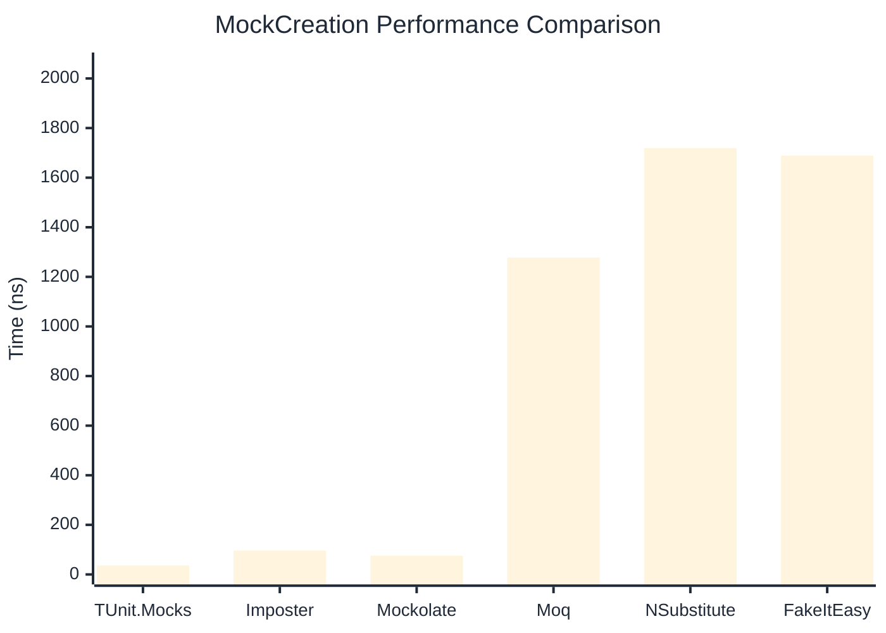

# MockCreation Benchmark

:::info Last Updated
This benchmark was automatically generated on **2026-04-11** from the latest CI run.

**Environment:** Ubuntu Latest • .NET SDK 10.0.201
:::

## 📊 Results

Mock instance creation performance:

| Library | Mean | Error | StdDev | Allocated |
|---------|------|-------|--------|-----------|
| **TUnit.Mocks** | 36.46 ns | 0.158 ns | 0.132 ns | 192 B |
| Imposter | 96.31 ns | 0.379 ns | 0.336 ns | 440 B |
| Mockolate | 75.73 ns | 1.245 ns | 1.165 ns | 384 B |
| Moq | 1,277.80 ns | 20.499 ns | 18.172 ns | 2048 B |
| NSubstitute | 1,719.20 ns | 7.385 ns | 6.167 ns | 5000 B |
| FakeItEasy | 1,688.31 ns | 18.777 ns | 15.680 ns | 2715 B |

---

### Repository

| Library | Mean | Error | StdDev | Allocated |
|---------|------|-------|--------|-----------|
| **TUnit.Mocks** | 36.43 ns | 0.250 ns | 0.222 ns | 192 B |
| Imposter | 148.73 ns | 0.259 ns | 0.242 ns | 696 B |
| Mockolate | 79.19 ns | 0.229 ns | 0.215 ns | 384 B |
| Moq | 1,231.42 ns | 14.186 ns | 12.576 ns | 1912 B |
| NSubstitute | 1,735.22 ns | 27.761 ns | 24.610 ns | 5000 B |
| FakeItEasy | 1,748.26 ns | 26.365 ns | 24.662 ns | 2715 B |

## 🎯 Key Insights

This benchmark compares **TUnit.Mocks** (source-generated) against runtime proxy-based mocking libraries for mock instance creation performance.

---

:::note Methodology
View the [mock benchmarks overview](/docs/benchmarks/mocks) for methodology details and environment information.
:::

*Last generated: 2026-04-11T03:20:45.459Z*
