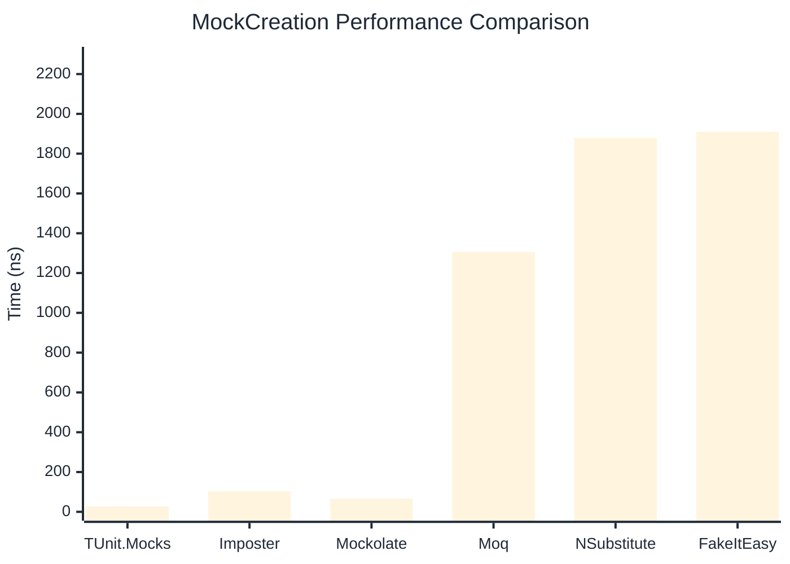

# MockCreation Benchmark

:::info Last Updated
This benchmark was automatically generated on **2026-05-06** from the latest CI run.

**Environment:** Ubuntu Latest • .NET SDK 10.0.203
:::

## 📊 Results

Mock instance creation performance:

| Library | Mean | Error | StdDev | Allocated |
|---------|------|-------|--------|-----------|
| **TUnit.Mocks** | 27.66 ns | 0.617 ns | 1.175 ns | 192 B |
| Imposter | 103.11 ns | 1.050 ns | 0.931 ns | 440 B |
| Mockolate | 65.91 ns | 0.488 ns | 0.456 ns | 424 B |
| Moq | 1,305.63 ns | 25.930 ns | 24.255 ns | 2048 B |
| NSubstitute | 1,879.29 ns | 11.555 ns | 10.243 ns | 5000 B |
| FakeItEasy | 1,909.70 ns | 29.814 ns | 27.888 ns | 2715 B |

---

### Repository

| Library | Mean | Error | StdDev | Allocated |
|---------|------|-------|--------|-----------|
| **TUnit.Mocks** | 27.86 ns | 0.096 ns | 0.080 ns | 192 B |
| Imposter | 162.90 ns | 0.636 ns | 0.595 ns | 696 B |
| Mockolate | 68.79 ns | 0.312 ns | 0.292 ns | 456 B |
| Moq | 1,326.69 ns | 19.780 ns | 18.502 ns | 1912 B |
| NSubstitute | 1,863.52 ns | 15.441 ns | 14.443 ns | 5000 B |
| FakeItEasy | 1,811.12 ns | 12.890 ns | 10.764 ns | 2715 B |

## 🎯 Key Insights

This benchmark compares **TUnit.Mocks** (source-generated) against runtime proxy-based mocking libraries for mock instance creation performance.

---

:::note Methodology
View the [mock benchmarks overview](/docs/benchmarks/mocks) for methodology details and environment information.
:::

*Last generated: 2026-05-06T03:25:44.139Z*
