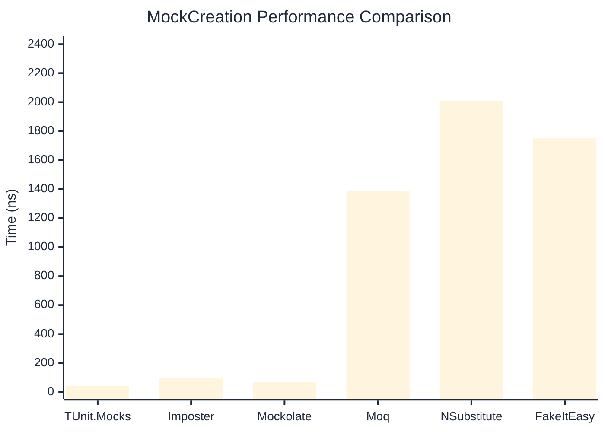
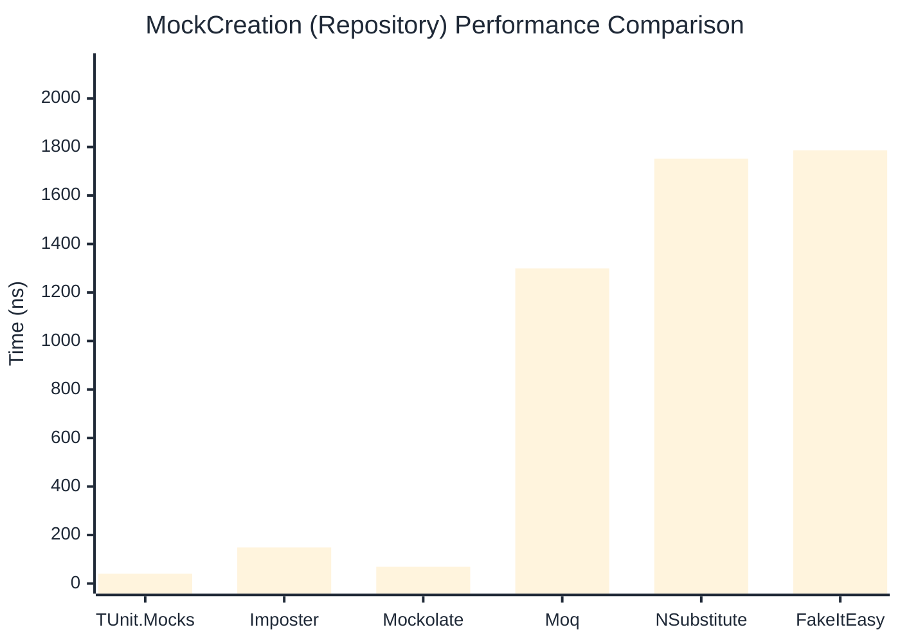

# MockCreation Benchmark

:::info Last Updated
This benchmark was automatically generated on **2026-04-12** from the latest CI run.

**Environment:** Ubuntu Latest • .NET SDK 10.0.201
:::

## 📊 Results

Mock instance creation performance:

| Library | Mean | Error | StdDev | Allocated |
|---------|------|-------|--------|-----------|
| **TUnit.Mocks** | 41.52 ns | 0.851 ns | 0.874 ns | 192 B |
| Imposter | 94.90 ns | 0.934 ns | 0.780 ns | 440 B |
| Mockolate | 66.68 ns | 1.312 ns | 1.347 ns | 384 B |
| Moq | 1,387.51 ns | 17.074 ns | 15.971 ns | 2048 B |
| NSubstitute | 2,008.29 ns | 35.320 ns | 31.310 ns | 5000 B |
| FakeItEasy | 1,750.15 ns | 25.557 ns | 23.906 ns | 2715 B |

---

### Repository

| Library | Mean | Error | StdDev | Allocated |
|---------|------|-------|--------|-----------|
| **TUnit.Mocks** | 40.53 ns | 0.858 ns | 1.116 ns | 192 B |
| Imposter | 148.69 ns | 2.328 ns | 2.178 ns | 696 B |
| Mockolate | 68.94 ns | 1.432 ns | 1.340 ns | 384 B |
| Moq | 1,299.41 ns | 5.240 ns | 4.645 ns | 1912 B |
| NSubstitute | 1,752.02 ns | 24.034 ns | 22.482 ns | 5000 B |
| FakeItEasy | 1,786.36 ns | 35.557 ns | 70.186 ns | 2715 B |

## 🎯 Key Insights

This benchmark compares **TUnit.Mocks** (source-generated) against runtime proxy-based mocking libraries for mock instance creation performance.

---

:::note Methodology
View the [mock benchmarks overview](/docs/benchmarks/mocks) for methodology details and environment information.
:::

*Last generated: 2026-04-12T03:28:39.462Z*
