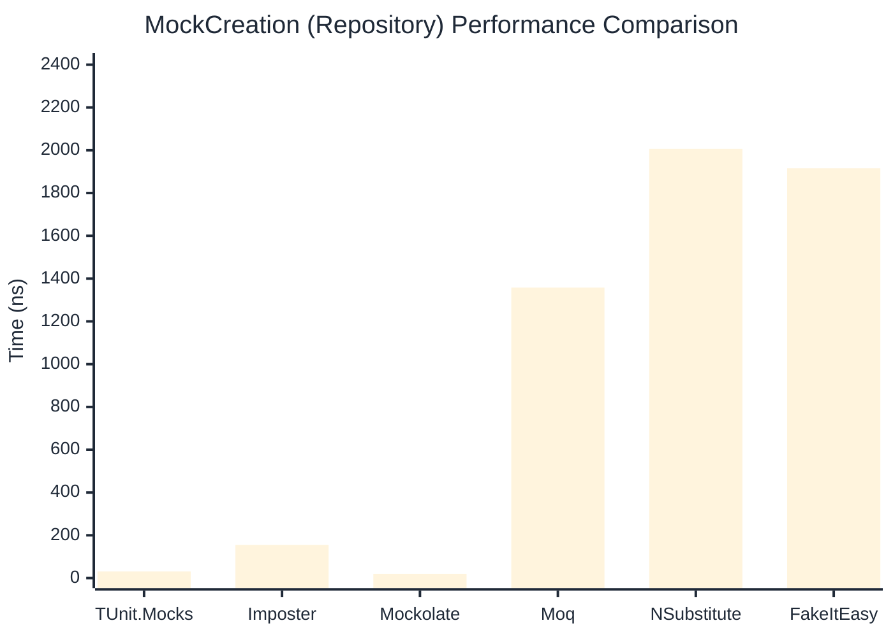

# MockCreation Benchmark

> Mock instance creation performance — comparing **TUnit.Mocks** (source-generated) against runtime proxy-based mocking libraries.

:::info Last Updated
This benchmark was automatically generated on **2026-07-03** from the latest CI run.

**Environment:** Ubuntu Latest • .NET SDK 10.0.301
:::

## 📊 Results

Mock instance creation performance:

| Library | Mean | Error | StdDev | Allocated |
|---------|------|-------|--------|-----------|
| **TUnit.Mocks** | 30.72 ns | 0.389 ns | 0.364 ns | 200 B |
| Imposter | 99.27 ns | 0.466 ns | 0.413 ns | 440 B |
| Mockolate | 19.46 ns | 0.390 ns | 0.365 ns | 160 B |
| Moq | 1,349.08 ns | 15.158 ns | 14.178 ns | 2048 B |
| NSubstitute | 1,972.21 ns | 21.558 ns | 20.165 ns | 5000 B |
| FakeItEasy | 1,860.23 ns | 19.713 ns | 17.475 ns | 2715 B |

---

### Repository

| Library | Mean | Error | StdDev | Allocated |
|---------|------|-------|--------|-----------|
| **TUnit.Mocks** | 30.81 ns | 0.313 ns | 0.292 ns | 200 B |
| Imposter | 154.82 ns | 1.449 ns | 1.355 ns | 696 B |
| Mockolate | 19.57 ns | 0.291 ns | 0.272 ns | 176 B |
| Moq | 1,357.99 ns | 6.021 ns | 5.337 ns | 1912 B |
| NSubstitute | 2,006.26 ns | 14.398 ns | 13.468 ns | 5000 B |
| FakeItEasy | 1,915.62 ns | 36.727 ns | 34.354 ns | 2715 B |

## 🎯 Key Insights

This benchmark compares **TUnit.Mocks** (source-generated) against runtime proxy-based mocking libraries for mock instance creation performance.

---

:::note Methodology
View the [mock benchmarks overview](/docs/benchmarks/mocks) for methodology details and environment information.
:::

*Last generated: 2026-07-03T04:04:39.541Z*
