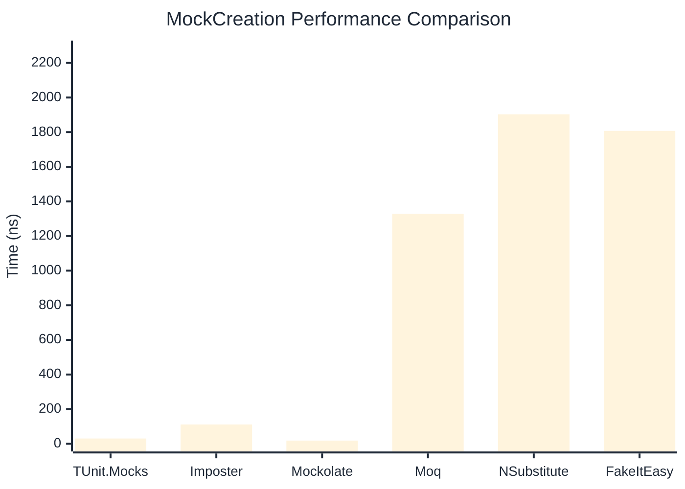

# MockCreation Benchmark

> Mock instance creation performance — comparing **TUnit.Mocks** (source-generated) against runtime proxy-based mocking libraries.

:::info Last Updated
This benchmark was automatically generated on **2026-06-29** from the latest CI run.

**Environment:** Ubuntu Latest • .NET SDK 10.0.301
:::

## 📊 Results

Mock instance creation performance:

| Library | Mean | Error | StdDev | Allocated |
|---------|------|-------|--------|-----------|
| **TUnit.Mocks** | 30.49 ns | 0.568 ns | 0.531 ns | 200 B |
| Imposter | 111.17 ns | 1.673 ns | 1.484 ns | 440 B |
| Mockolate | 18.40 ns | 0.273 ns | 0.256 ns | 160 B |
| Moq | 1,328.63 ns | 25.800 ns | 36.169 ns | 2048 B |
| NSubstitute | 1,902.74 ns | 28.605 ns | 26.757 ns | 5000 B |
| FakeItEasy | 1,807.12 ns | 35.943 ns | 60.053 ns | 2715 B |

---

### Repository

| Library | Mean | Error | StdDev | Allocated |
|---------|------|-------|--------|-----------|
| **TUnit.Mocks** | 29.68 ns | 0.515 ns | 0.430 ns | 200 B |
| Imposter | 184.65 ns | 1.193 ns | 1.116 ns | 696 B |
| Mockolate | 19.23 ns | 0.285 ns | 0.267 ns | 176 B |
| Moq | 1,302.65 ns | 10.511 ns | 8.777 ns | 1912 B |
| NSubstitute | 1,848.72 ns | 36.069 ns | 40.090 ns | 5000 B |
| FakeItEasy | 1,856.44 ns | 34.050 ns | 46.608 ns | 2715 B |

## 🎯 Key Insights

This benchmark compares **TUnit.Mocks** (source-generated) against runtime proxy-based mocking libraries for mock instance creation performance.

---

:::note Methodology
View the [mock benchmarks overview](/docs/benchmarks/mocks) for methodology details and environment information.
:::

*Last generated: 2026-06-29T03:30:39.957Z*
