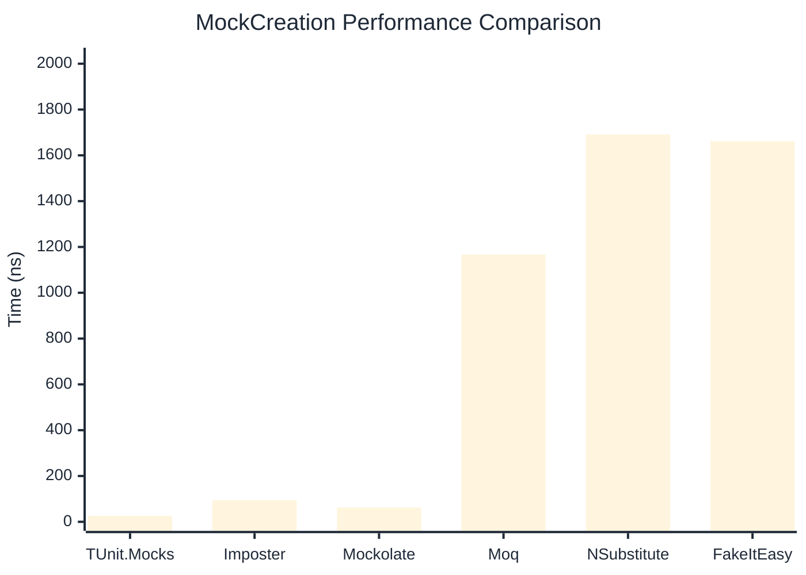

# MockCreation Benchmark

:::info Last Updated
This benchmark was automatically generated on **2026-05-21** from the latest CI run.

**Environment:** Ubuntu Latest • .NET SDK 10.0.300
:::

## 📊 Results

Mock instance creation performance:

| Library | Mean | Error | StdDev | Allocated |
|---------|------|-------|--------|-----------|
| **TUnit.Mocks** | 26.21 ns | 0.590 ns | 0.702 ns | 192 B |
| Imposter | 93.60 ns | 1.921 ns | 3.155 ns | 440 B |
| Mockolate | 62.50 ns | 1.326 ns | 1.241 ns | 424 B |
| Moq | 1,166.83 ns | 17.378 ns | 16.255 ns | 2048 B |
| NSubstitute | 1,691.38 ns | 20.708 ns | 19.370 ns | 5000 B |
| FakeItEasy | 1,662.16 ns | 8.916 ns | 8.340 ns | 2723 B |

---

### Repository

| Library | Mean | Error | StdDev | Allocated |
|---------|------|-------|--------|-----------|
| **TUnit.Mocks** | 27.98 ns | 0.628 ns | 0.939 ns | 192 B |
| Imposter | 158.55 ns | 3.259 ns | 4.002 ns | 696 B |
| Mockolate | 65.58 ns | 1.385 ns | 3.317 ns | 456 B |
| Moq | 1,249.02 ns | 14.887 ns | 13.925 ns | 1912 B |
| NSubstitute | 1,739.42 ns | 33.313 ns | 38.364 ns | 5000 B |
| FakeItEasy | 1,631.99 ns | 18.734 ns | 17.524 ns | 2723 B |

## 🎯 Key Insights

This benchmark compares **TUnit.Mocks** (source-generated) against runtime proxy-based mocking libraries for mock instance creation performance.

---

:::note Methodology
View the [mock benchmarks overview](/docs/benchmarks/mocks) for methodology details and environment information.
:::

*Last generated: 2026-05-21T03:28:27.059Z*
