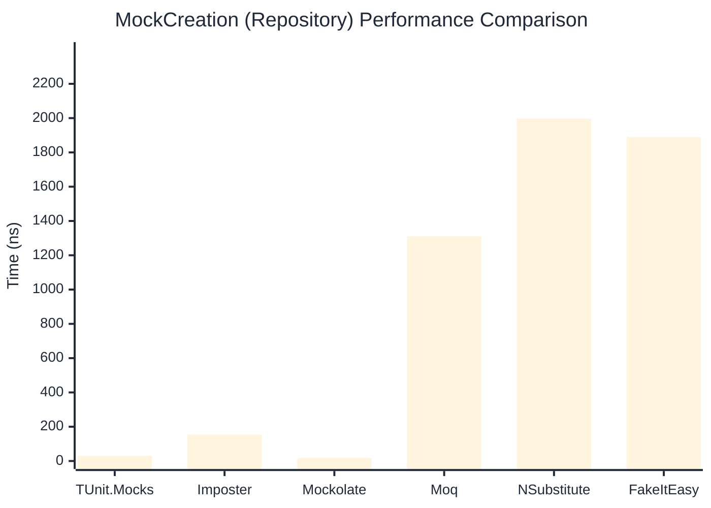

# MockCreation Benchmark

> Mock instance creation performance — comparing **TUnit.Mocks** (source-generated) against runtime proxy-based mocking libraries.

:::info Last Updated
This benchmark was automatically generated on **2026-06-30** from the latest CI run.

**Environment:** Ubuntu Latest • .NET SDK 10.0.301
:::

## 📊 Results

Mock instance creation performance:

| Library | Mean | Error | StdDev | Allocated |
|---------|------|-------|--------|-----------|
| **TUnit.Mocks** | 32.47 ns | 0.395 ns | 0.350 ns | 200 B |
| Imposter | 99.45 ns | 1.218 ns | 1.017 ns | 440 B |
| Mockolate | 19.67 ns | 0.434 ns | 0.445 ns | 160 B |
| Moq | 1,443.47 ns | 23.754 ns | 22.219 ns | 2048 B |
| NSubstitute | 1,948.93 ns | 22.381 ns | 19.840 ns | 5000 B |
| FakeItEasy | 1,942.38 ns | 32.523 ns | 30.422 ns | 2715 B |

---

### Repository

| Library | Mean | Error | StdDev | Allocated |
|---------|------|-------|--------|-----------|
| **TUnit.Mocks** | 29.36 ns | 0.604 ns | 1.164 ns | 200 B |
| Imposter | 154.67 ns | 2.374 ns | 2.221 ns | 696 B |
| Mockolate | 17.79 ns | 0.231 ns | 0.216 ns | 176 B |
| Moq | 1,310.81 ns | 9.032 ns | 8.449 ns | 1912 B |
| NSubstitute | 1,996.43 ns | 18.207 ns | 17.030 ns | 5000 B |
| FakeItEasy | 1,889.18 ns | 33.947 ns | 31.754 ns | 2715 B |

## 🎯 Key Insights

This benchmark compares **TUnit.Mocks** (source-generated) against runtime proxy-based mocking libraries for mock instance creation performance.

---

:::note Methodology
View the [mock benchmarks overview](/docs/benchmarks/mocks) for methodology details and environment information.
:::

*Last generated: 2026-06-30T03:28:32.223Z*
