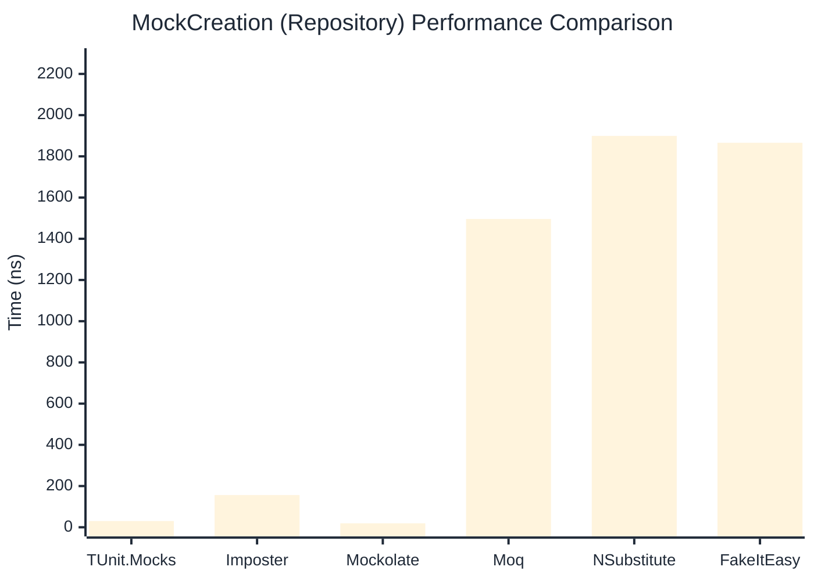

# MockCreation Benchmark

> Mock instance creation performance — comparing **TUnit.Mocks** (source-generated) against runtime proxy-based mocking libraries.

:::info Last Updated
This benchmark was automatically generated on **2026-06-27** from the latest CI run.

**Environment:** Ubuntu Latest • .NET SDK 10.0.301
:::

## 📊 Results

Mock instance creation performance:

| Library | Mean | Error | StdDev | Allocated |
|---------|------|-------|--------|-----------|
| **TUnit.Mocks** | 30.28 ns | 0.458 ns | 0.383 ns | 200 B |
| Imposter | 99.81 ns | 1.960 ns | 1.925 ns | 440 B |
| Mockolate | 19.36 ns | 0.434 ns | 0.446 ns | 160 B |
| Moq | 1,347.30 ns | 10.095 ns | 8.949 ns | 2048 B |
| NSubstitute | 2,022.81 ns | 21.685 ns | 20.284 ns | 5000 B |
| FakeItEasy | 1,928.10 ns | 35.625 ns | 34.988 ns | 2715 B |

---

### Repository

| Library | Mean | Error | StdDev | Allocated |
|---------|------|-------|--------|-----------|
| **TUnit.Mocks** | 30.25 ns | 0.589 ns | 0.522 ns | 200 B |
| Imposter | 156.20 ns | 3.113 ns | 2.912 ns | 696 B |
| Mockolate | 19.24 ns | 0.434 ns | 0.464 ns | 176 B |
| Moq | 1,496.07 ns | 10.637 ns | 9.430 ns | 1912 B |
| NSubstitute | 1,899.24 ns | 30.087 ns | 28.144 ns | 5000 B |
| FakeItEasy | 1,865.93 ns | 26.111 ns | 23.146 ns | 2715 B |

## 🎯 Key Insights

This benchmark compares **TUnit.Mocks** (source-generated) against runtime proxy-based mocking libraries for mock instance creation performance.

---

:::note Methodology
View the [mock benchmarks overview](/docs/benchmarks/mocks) for methodology details and environment information.
:::

*Last generated: 2026-06-27T03:27:29.619Z*
