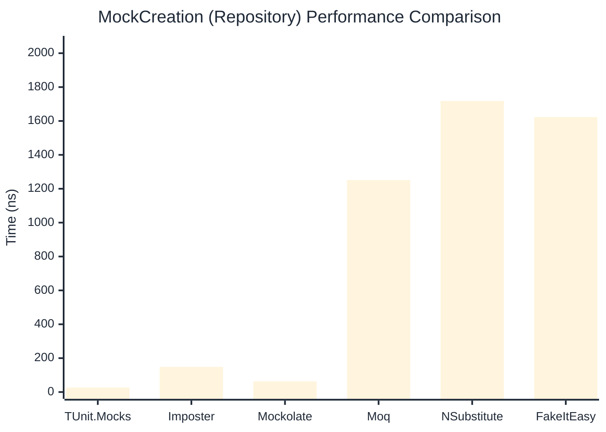

# MockCreation Benchmark

:::info Last Updated
This benchmark was automatically generated on **2026-05-26** from the latest CI run.

**Environment:** Ubuntu Latest • .NET SDK 10.0.300
:::

## 📊 Results

Mock instance creation performance:

| Library | Mean | Error | StdDev | Allocated |
|---------|------|-------|--------|-----------|
| **TUnit.Mocks** | 26.13 ns | 0.204 ns | 0.191 ns | 192 B |
| Imposter | 106.90 ns | 2.106 ns | 2.069 ns | 440 B |
| Mockolate | 61.44 ns | 0.312 ns | 0.277 ns | 424 B |
| Moq | 1,244.49 ns | 14.417 ns | 13.485 ns | 2048 B |
| NSubstitute | 1,674.31 ns | 6.676 ns | 5.575 ns | 5000 B |
| FakeItEasy | 1,580.04 ns | 5.243 ns | 4.648 ns | 2715 B |

---

### Repository

| Library | Mean | Error | StdDev | Allocated |
|---------|------|-------|--------|-----------|
| **TUnit.Mocks** | 26.30 ns | 0.183 ns | 0.163 ns | 192 B |
| Imposter | 148.78 ns | 0.500 ns | 0.443 ns | 696 B |
| Mockolate | 63.25 ns | 0.430 ns | 0.381 ns | 456 B |
| Moq | 1,250.84 ns | 19.706 ns | 16.455 ns | 1912 B |
| NSubstitute | 1,717.91 ns | 4.914 ns | 4.104 ns | 5000 B |
| FakeItEasy | 1,622.80 ns | 32.448 ns | 31.869 ns | 2715 B |

## 🎯 Key Insights

This benchmark compares **TUnit.Mocks** (source-generated) against runtime proxy-based mocking libraries for mock instance creation performance.

---

:::note Methodology
View the [mock benchmarks overview](/docs/benchmarks/mocks) for methodology details and environment information.
:::

*Last generated: 2026-05-26T03:27:58.119Z*
