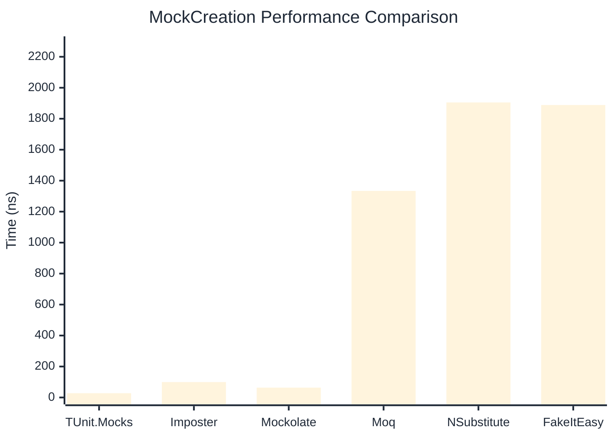
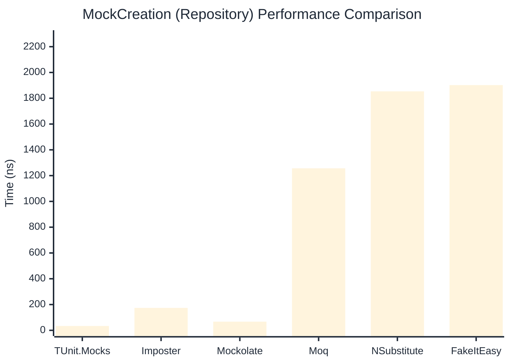

# MockCreation Benchmark

> Mock instance creation performance — comparing **TUnit.Mocks** (source-generated) against runtime proxy-based mocking libraries.

:::info Last Updated
This benchmark was automatically generated on **2026-06-02** from the latest CI run.

**Environment:** Ubuntu Latest • .NET SDK 10.0.300
:::

## 📊 Results

Mock instance creation performance:

| Library | Mean | Error | StdDev | Allocated |
|---------|------|-------|--------|-----------|
| **TUnit.Mocks** | 27.70 ns | 0.328 ns | 0.291 ns | 192 B |
| Imposter | 99.53 ns | 0.536 ns | 0.447 ns | 440 B |
| Mockolate | 63.75 ns | 0.562 ns | 0.526 ns | 424 B |
| Moq | 1,333.88 ns | 18.073 ns | 16.021 ns | 2048 B |
| NSubstitute | 1,905.17 ns | 10.055 ns | 8.913 ns | 5000 B |
| FakeItEasy | 1,888.64 ns | 28.315 ns | 26.486 ns | 2715 B |

---

### Repository

| Library | Mean | Error | StdDev | Allocated |
|---------|------|-------|--------|-----------|
| **TUnit.Mocks** | 33.79 ns | 0.197 ns | 0.175 ns | 192 B |
| Imposter | 174.11 ns | 1.405 ns | 1.246 ns | 696 B |
| Mockolate | 67.32 ns | 0.768 ns | 0.680 ns | 456 B |
| Moq | 1,256.75 ns | 4.899 ns | 4.342 ns | 1912 B |
| NSubstitute | 1,853.52 ns | 16.663 ns | 14.771 ns | 5000 B |
| FakeItEasy | 1,902.13 ns | 37.201 ns | 44.285 ns | 2715 B |

## 🎯 Key Insights

This benchmark compares **TUnit.Mocks** (source-generated) against runtime proxy-based mocking libraries for mock instance creation performance.

---

:::note Methodology
View the [mock benchmarks overview](/docs/benchmarks/mocks) for methodology details and environment information.
:::

*Last generated: 2026-06-02T03:30:24.417Z*
