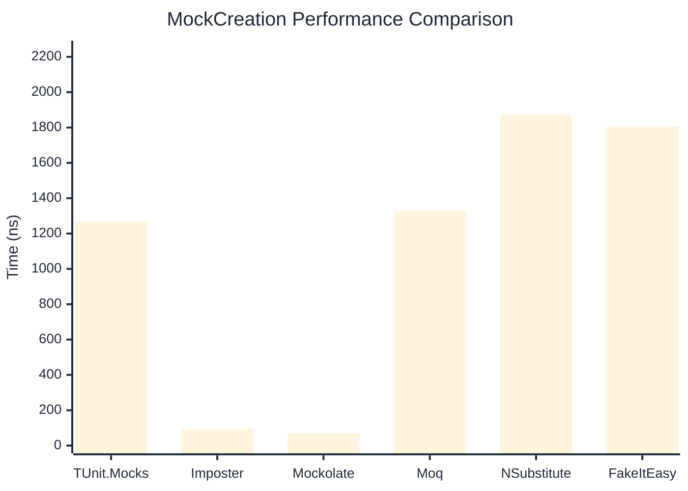
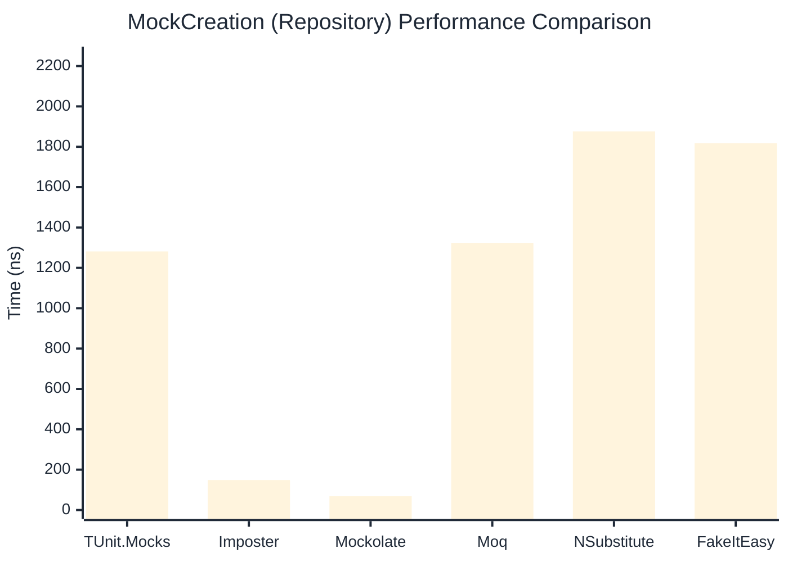

# MockCreation Benchmark

:::info Last Updated
This benchmark was automatically generated on **2026-03-29** from the latest CI run.

**Environment:** Ubuntu Latest • .NET SDK 10.0.201
:::

## 📊 Results

Mock instance creation performance:

| Library | Mean | Error | StdDev | Allocated |
|---------|------|-------|--------|-----------|
| **TUnit.Mocks** | 1,265.81 ns | 15.427 ns | 13.675 ns | 1150 B |
| Imposter | 94.97 ns | 1.083 ns | 0.960 ns | 440 B |
| Mockolate | 69.43 ns | 0.864 ns | 0.766 ns | 360 B |
| Moq | 1,327.09 ns | 22.068 ns | 20.642 ns | 2048 B |
| NSubstitute | 1,871.77 ns | 17.320 ns | 14.463 ns | 5000 B |
| FakeItEasy | 1,803.68 ns | 12.784 ns | 9.981 ns | 2715 B |

---

### Repository

| Library | Mean | Error | StdDev | Allocated |
|---------|------|-------|--------|-----------|
| **TUnit.Mocks** | 1,281.28 ns | 16.995 ns | 15.065 ns | 1150 B |
| Imposter | 148.43 ns | 1.394 ns | 1.236 ns | 696 B |
| Mockolate | 68.41 ns | 0.744 ns | 0.659 ns | 360 B |
| Moq | 1,323.71 ns | 6.873 ns | 6.429 ns | 1912 B |
| NSubstitute | 1,876.42 ns | 17.404 ns | 16.280 ns | 5000 B |
| FakeItEasy | 1,817.65 ns | 23.030 ns | 20.415 ns | 2715 B |

## 🎯 Key Insights

This benchmark compares **TUnit.Mocks** (source-generated) against runtime proxy-based mocking libraries for mock instance creation performance.

---

:::note Methodology
View the [mock benchmarks overview](/docs/benchmarks/mocks) for methodology details and environment information.
:::

*Last generated: 2026-03-29T22:20:59.126Z*
