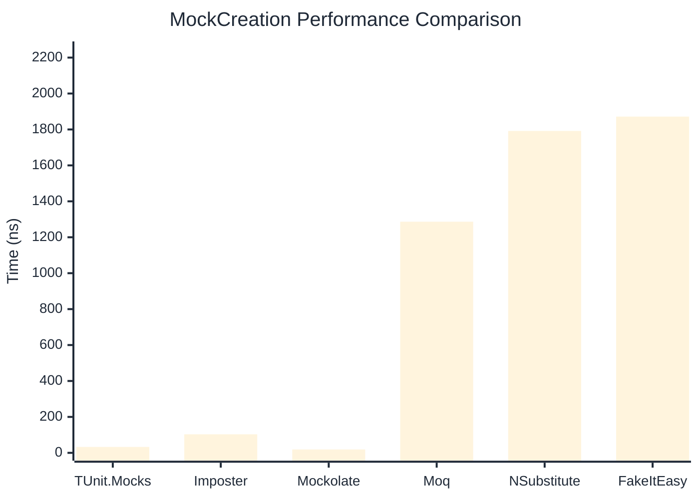

# MockCreation Benchmark

> Mock instance creation performance — comparing **TUnit.Mocks** (source-generated) against runtime proxy-based mocking libraries.

:::info Last Updated
This benchmark was automatically generated on **2026-06-24** from the latest CI run.

**Environment:** Ubuntu Latest • .NET SDK 10.0.301
:::

## 📊 Results

Mock instance creation performance:

| Library | Mean | Error | StdDev | Allocated |
|---------|------|-------|--------|-----------|
| **TUnit.Mocks** | 32.87 ns | 0.585 ns | 0.547 ns | 200 B |
| Imposter | 103.16 ns | 0.759 ns | 0.634 ns | 440 B |
| Mockolate | 18.85 ns | 0.174 ns | 0.162 ns | 160 B |
| Moq | 1,286.59 ns | 24.562 ns | 25.224 ns | 2048 B |
| NSubstitute | 1,791.70 ns | 11.119 ns | 9.284 ns | 5000 B |
| FakeItEasy | 1,871.52 ns | 36.733 ns | 47.763 ns | 2715 B |

---

### Repository

| Library | Mean | Error | StdDev | Allocated |
|---------|------|-------|--------|-----------|
| **TUnit.Mocks** | 33.46 ns | 0.139 ns | 0.123 ns | 200 B |
| Imposter | 159.79 ns | 0.528 ns | 0.494 ns | 696 B |
| Mockolate | 19.44 ns | 0.263 ns | 0.233 ns | 176 B |
| Moq | 1,250.46 ns | 16.985 ns | 15.056 ns | 1912 B |
| NSubstitute | 1,833.54 ns | 14.666 ns | 13.001 ns | 5000 B |
| FakeItEasy | 1,824.89 ns | 36.410 ns | 47.343 ns | 2715 B |

## 🎯 Key Insights

This benchmark compares **TUnit.Mocks** (source-generated) against runtime proxy-based mocking libraries for mock instance creation performance.

---

:::note Methodology
View the [mock benchmarks overview](/docs/benchmarks/mocks) for methodology details and environment information.
:::

*Last generated: 2026-06-24T03:28:17.466Z*
