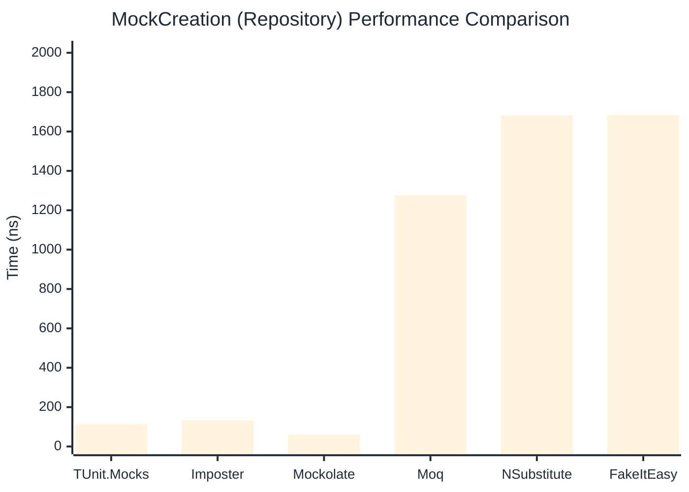

# MockCreation Benchmark

:::info Last Updated
This benchmark was automatically generated on **2026-03-30** from the latest CI run.

**Environment:** Ubuntu Latest • .NET SDK 10.0.201
:::

## 📊 Results

Mock instance creation performance:

| Library | Mean | Error | StdDev | Allocated |
|---------|------|-------|--------|-----------|
| **TUnit.Mocks** | 112.73 ns | 0.366 ns | 0.325 ns | 1064 B |
| Imposter | 85.80 ns | 0.141 ns | 0.118 ns | 440 B |
| Mockolate | 60.44 ns | 0.130 ns | 0.116 ns | 360 B |
| Moq | 1,259.29 ns | 13.479 ns | 12.608 ns | 2048 B |
| NSubstitute | 1,761.86 ns | 2.260 ns | 1.887 ns | 5000 B |
| FakeItEasy | 1,647.55 ns | 3.841 ns | 3.208 ns | 2715 B |

---

### Repository

| Library | Mean | Error | StdDev | Allocated |
|---------|------|-------|--------|-----------|
| **TUnit.Mocks** | 112.37 ns | 1.191 ns | 1.114 ns | 1064 B |
| Imposter | 132.86 ns | 0.730 ns | 0.683 ns | 696 B |
| Mockolate | 60.49 ns | 0.147 ns | 0.130 ns | 360 B |
| Moq | 1,275.84 ns | 6.972 ns | 6.180 ns | 1912 B |
| NSubstitute | 1,681.90 ns | 5.990 ns | 5.002 ns | 5000 B |
| FakeItEasy | 1,683.37 ns | 12.133 ns | 11.349 ns | 2715 B |

## 🎯 Key Insights

This benchmark compares **TUnit.Mocks** (source-generated) against runtime proxy-based mocking libraries for mock instance creation performance.

---

:::note Methodology
View the [mock benchmarks overview](/docs/benchmarks/mocks) for methodology details and environment information.
:::

*Last generated: 2026-03-30T21:56:59.028Z*
