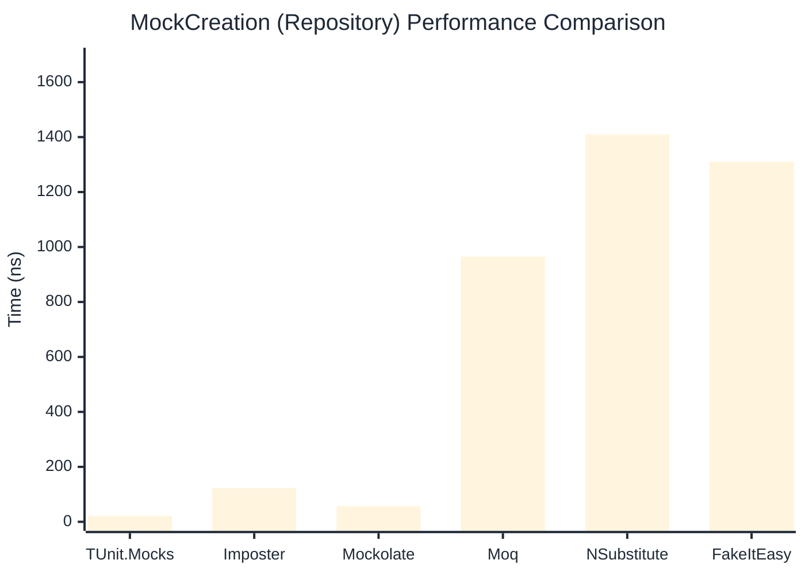

# MockCreation Benchmark

:::info Last Updated
This benchmark was automatically generated on **2026-04-22** from the latest CI run.

**Environment:** Ubuntu Latest • .NET SDK 10.0.203
:::

## 📊 Results

Mock instance creation performance:

| Library | Mean | Error | StdDev | Allocated |
|---------|------|-------|--------|-----------|
| **TUnit.Mocks** | 21.07 ns | 0.070 ns | 0.062 ns | 192 B |
| Imposter | 85.09 ns | 1.224 ns | 1.145 ns | 440 B |
| Mockolate | 56.15 ns | 0.142 ns | 0.126 ns | 384 B |
| Moq | 964.10 ns | 4.457 ns | 3.951 ns | 2048 B |
| NSubstitute | 1,369.29 ns | 18.758 ns | 17.546 ns | 5000 B |
| FakeItEasy | 1,304.66 ns | 20.734 ns | 31.664 ns | 2715 B |

---

### Repository

| Library | Mean | Error | StdDev | Allocated |
|---------|------|-------|--------|-----------|
| **TUnit.Mocks** | 21.36 ns | 0.062 ns | 0.058 ns | 192 B |
| Imposter | 122.35 ns | 0.464 ns | 0.411 ns | 696 B |
| Mockolate | 57.11 ns | 0.428 ns | 0.400 ns | 384 B |
| Moq | 964.91 ns | 7.993 ns | 7.477 ns | 1912 B |
| NSubstitute | 1,409.80 ns | 15.343 ns | 14.352 ns | 5000 B |
| FakeItEasy | 1,310.27 ns | 26.033 ns | 49.531 ns | 2715 B |

## 🎯 Key Insights

This benchmark compares **TUnit.Mocks** (source-generated) against runtime proxy-based mocking libraries for mock instance creation performance.

---

:::note Methodology
View the [mock benchmarks overview](/docs/benchmarks/mocks) for methodology details and environment information.
:::

*Last generated: 2026-04-22T03:22:46.937Z*
