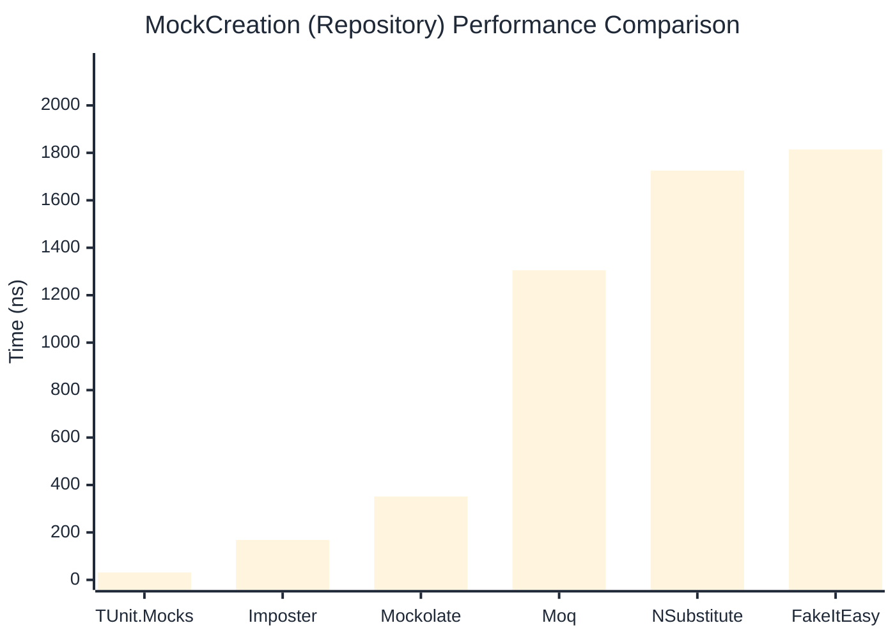

# MockCreation Benchmark

:::info Last Updated
This benchmark was automatically generated on **2026-05-02** from the latest CI run.

**Environment:** Ubuntu Latest • .NET SDK 10.0.203
:::

## 📊 Results

Mock instance creation performance:

| Library | Mean | Error | StdDev | Allocated |
|---------|------|-------|--------|-----------|
| **TUnit.Mocks** | 32.18 ns | 0.700 ns | 0.687 ns | 192 B |
| Imposter | 105.02 ns | 2.128 ns | 3.052 ns | 440 B |
| Mockolate | 242.21 ns | 4.399 ns | 4.114 ns | 1176 B |
| Moq | 1,390.17 ns | 14.161 ns | 13.246 ns | 2048 B |
| NSubstitute | 1,930.86 ns | 36.892 ns | 32.704 ns | 5000 B |
| FakeItEasy | 1,865.52 ns | 22.573 ns | 21.115 ns | 2715 B |

---

### Repository

| Library | Mean | Error | StdDev | Allocated |
|---------|------|-------|--------|-----------|
| **TUnit.Mocks** | 31.44 ns | 0.340 ns | 0.318 ns | 192 B |
| Imposter | 168.51 ns | 0.901 ns | 0.799 ns | 696 B |
| Mockolate | 351.62 ns | 1.585 ns | 1.324 ns | 1576 B |
| Moq | 1,305.02 ns | 7.609 ns | 7.117 ns | 1912 B |
| NSubstitute | 1,725.00 ns | 28.107 ns | 24.916 ns | 5000 B |
| FakeItEasy | 1,814.41 ns | 36.017 ns | 41.477 ns | 2715 B |

## 🎯 Key Insights

This benchmark compares **TUnit.Mocks** (source-generated) against runtime proxy-based mocking libraries for mock instance creation performance.

---

:::note Methodology
View the [mock benchmarks overview](/docs/benchmarks/mocks) for methodology details and environment information.
:::

*Last generated: 2026-05-02T03:24:38.193Z*
