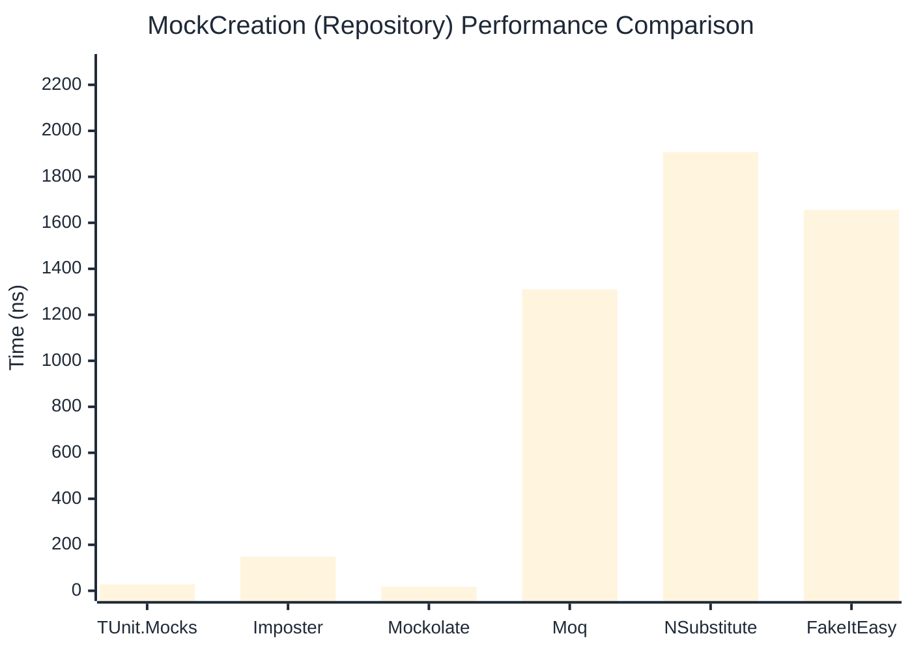

# MockCreation Benchmark

> Mock instance creation performance — comparing **TUnit.Mocks** (source-generated) against runtime proxy-based mocking libraries.

:::info Last Updated
This benchmark was automatically generated on **2026-06-22** from the latest CI run.

**Environment:** Ubuntu Latest • .NET SDK 10.0.301
:::

## 📊 Results

Mock instance creation performance:

| Library | Mean | Error | StdDev | Allocated |
|---------|------|-------|--------|-----------|
| **TUnit.Mocks** | 27.60 ns | 0.241 ns | 0.225 ns | 200 B |
| Imposter | 89.56 ns | 0.461 ns | 0.385 ns | 440 B |
| Mockolate | 17.16 ns | 0.171 ns | 0.151 ns | 160 B |
| Moq | 1,304.49 ns | 16.084 ns | 15.045 ns | 2048 B |
| NSubstitute | 1,771.72 ns | 6.378 ns | 5.966 ns | 5000 B |
| FakeItEasy | 1,673.87 ns | 9.612 ns | 8.521 ns | 2715 B |

---

### Repository

| Library | Mean | Error | StdDev | Allocated |
|---------|------|-------|--------|-----------|
| **TUnit.Mocks** | 27.60 ns | 0.082 ns | 0.068 ns | 200 B |
| Imposter | 148.32 ns | 1.864 ns | 1.455 ns | 696 B |
| Mockolate | 17.06 ns | 0.149 ns | 0.140 ns | 176 B |
| Moq | 1,310.44 ns | 7.805 ns | 7.301 ns | 1912 B |
| NSubstitute | 1,907.43 ns | 7.531 ns | 7.044 ns | 5000 B |
| FakeItEasy | 1,656.25 ns | 13.019 ns | 12.178 ns | 2715 B |

## 🎯 Key Insights

This benchmark compares **TUnit.Mocks** (source-generated) against runtime proxy-based mocking libraries for mock instance creation performance.

---

:::note Methodology
View the [mock benchmarks overview](/docs/benchmarks/mocks) for methodology details and environment information.
:::

*Last generated: 2026-06-22T03:30:58.892Z*
