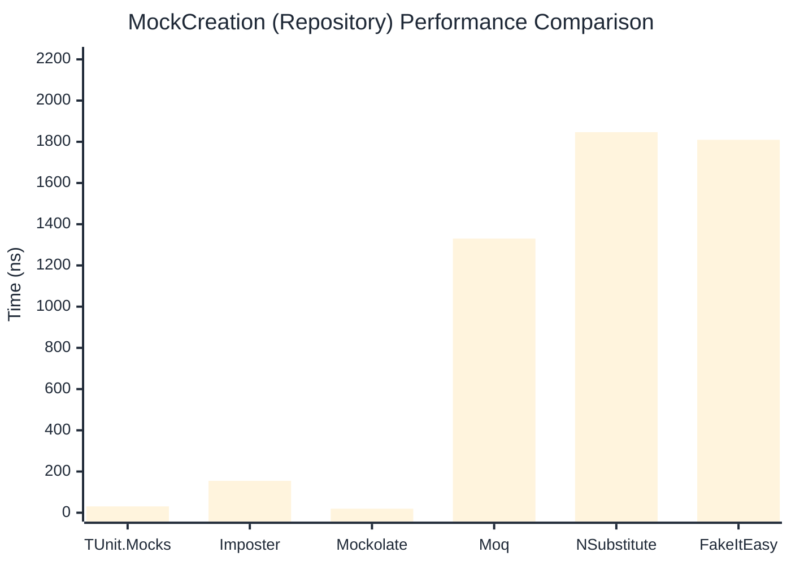

# MockCreation Benchmark

> Mock instance creation performance — comparing **TUnit.Mocks** (source-generated) against runtime proxy-based mocking libraries.

:::info Last Updated
This benchmark was automatically generated on **2026-07-20** from the latest CI run.

**Environment:** Ubuntu Latest • .NET SDK 10.0.302
:::

## 📊 Results

Mock instance creation performance:

| Library | Mean | Error | StdDev | Allocated |
|---------|------|-------|--------|-----------|
| **TUnit.Mocks** | 31.48 ns | 0.676 ns | 0.724 ns | 200 B |
| Imposter | 99.82 ns | 2.025 ns | 1.894 ns | 440 B |
| Mockolate | 19.51 ns | 0.439 ns | 0.522 ns | 160 B |
| Moq | 1,329.55 ns | 16.438 ns | 15.376 ns | 2048 B |
| NSubstitute | 1,945.17 ns | 36.176 ns | 33.839 ns | 5000 B |
| FakeItEasy | 1,840.64 ns | 36.145 ns | 45.711 ns | 2715 B |

---

### Repository

| Library | Mean | Error | StdDev | Allocated |
|---------|------|-------|--------|-----------|
| **TUnit.Mocks** | 30.81 ns | 0.589 ns | 0.522 ns | 200 B |
| Imposter | 154.92 ns | 3.045 ns | 3.385 ns | 696 B |
| Mockolate | 19.49 ns | 0.434 ns | 0.533 ns | 176 B |
| Moq | 1,330.23 ns | 17.529 ns | 16.397 ns | 1912 B |
| NSubstitute | 1,846.78 ns | 24.519 ns | 22.935 ns | 5000 B |
| FakeItEasy | 1,809.61 ns | 35.154 ns | 49.281 ns | 2715 B |

## 🎯 Key Insights

This benchmark compares **TUnit.Mocks** (source-generated) against runtime proxy-based mocking libraries for mock instance creation performance.

---

:::note Methodology
View the [mock benchmarks overview](/docs/benchmarks/mocks) for methodology details and environment information.
:::

*Last generated: 2026-07-20T03:22:58.159Z*
