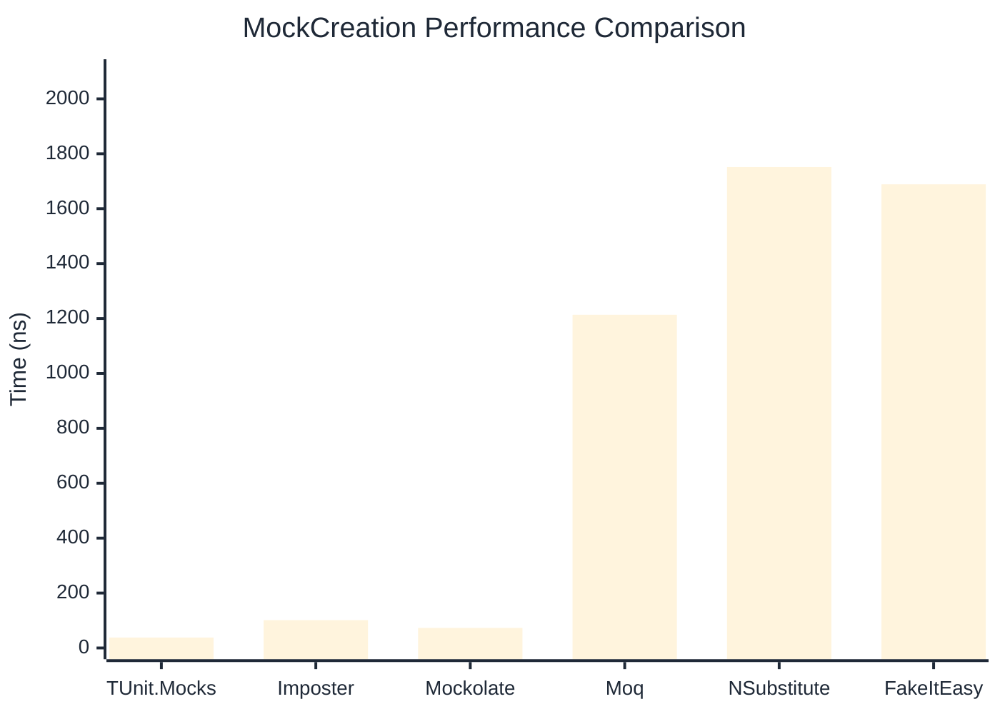
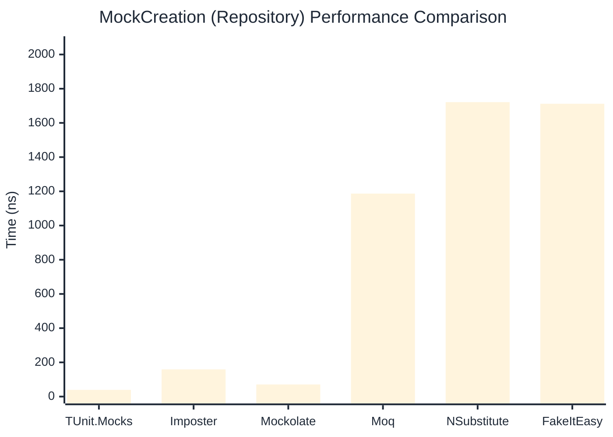

# MockCreation Benchmark

:::info Last Updated
This benchmark was automatically generated on **2026-04-01** from the latest CI run.

**Environment:** Ubuntu Latest • .NET SDK 10.0.201
:::

## 📊 Results

Mock instance creation performance:

| Library | Mean | Error | StdDev | Allocated |
|---------|------|-------|--------|-----------|
| **TUnit.Mocks** | 37.98 ns | 0.804 ns | 1.074 ns | 208 B |
| Imposter | 101.38 ns | 2.032 ns | 2.642 ns | 440 B |
| Mockolate | 72.98 ns | 1.535 ns | 1.706 ns | 360 B |
| Moq | 1,213.65 ns | 15.084 ns | 14.110 ns | 2048 B |
| NSubstitute | 1,751.72 ns | 34.976 ns | 47.875 ns | 5000 B |
| FakeItEasy | 1,688.72 ns | 15.581 ns | 13.812 ns | 2723 B |

---

### Repository

| Library | Mean | Error | StdDev | Allocated |
|---------|------|-------|--------|-----------|
| **TUnit.Mocks** | 39.18 ns | 0.840 ns | 1.031 ns | 208 B |
| Imposter | 158.92 ns | 3.243 ns | 5.049 ns | 696 B |
| Mockolate | 70.78 ns | 0.912 ns | 0.712 ns | 360 B |
| Moq | 1,186.80 ns | 6.798 ns | 6.026 ns | 1912 B |
| NSubstitute | 1,721.49 ns | 26.186 ns | 24.495 ns | 5000 B |
| FakeItEasy | 1,711.91 ns | 32.625 ns | 37.571 ns | 2723 B |

## 🎯 Key Insights

This benchmark compares **TUnit.Mocks** (source-generated) against runtime proxy-based mocking libraries for mock instance creation performance.

---

:::note Methodology
View the [mock benchmarks overview](/docs/benchmarks/mocks) for methodology details and environment information.
:::

*Last generated: 2026-04-01T03:22:34.139Z*
