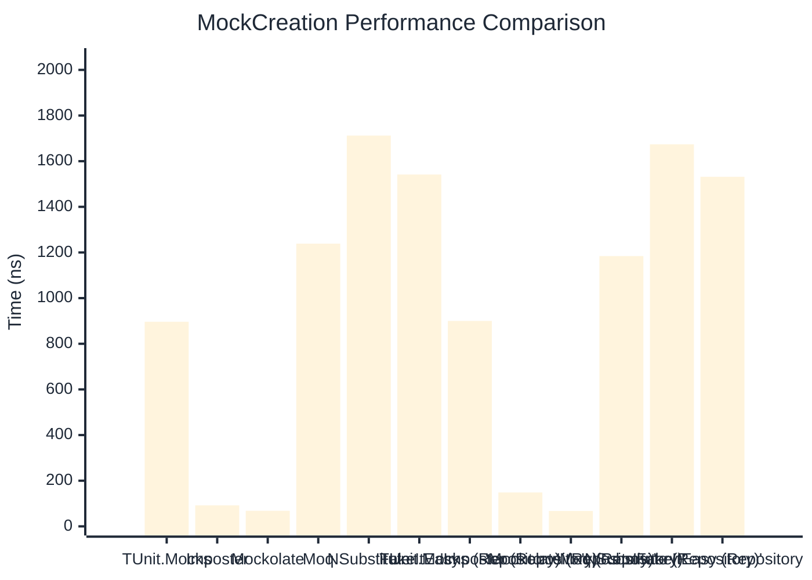

# MockCreation Benchmark

:::info Last Updated
This benchmark was automatically generated on **2026-03-29** from the latest CI run.

**Environment:** Ubuntu Latest • .NET SDK 10.0.201
:::

## 📊 Results

Mock instance creation performance:

| Method | Mean | Error | StdDev | Allocated |
|--------|------|-------|--------|-----------|
| **TUnit.Mocks** | 896.52 ns | 7.712 ns | 6.440 ns | 1157 B |
| Imposter | 92.05 ns | 1.137 ns | 1.064 ns | 440 B |
| Mockolate | 68.21 ns | 1.038 ns | 0.971 ns | 360 B |
| Moq | 1,238.69 ns | 23.915 ns | 25.589 ns | 2048 B |
| NSubstitute | 1,712.34 ns | 14.155 ns | 13.240 ns | 5000 B |
| FakeItEasy | 1,541.71 ns | 14.183 ns | 13.267 ns | 2723 B |
| **'TUnit.Mocks (Repository)'** | 900.00 ns | 6.735 ns | 6.300 ns | 1157 B |
| 'Imposter (Repository)' | 148.53 ns | 1.299 ns | 1.151 ns | 696 B |
| 'Mockolate (Repository)' | 67.44 ns | 1.021 ns | 0.955 ns | 360 B |
| 'Moq (Repository)' | 1,184.33 ns | 5.376 ns | 4.766 ns | 1912 B |
| 'NSubstitute (Repository)' | 1,674.00 ns | 13.613 ns | 12.734 ns | 5000 B |
| 'FakeItEasy (Repository)' | 1,531.62 ns | 12.941 ns | 12.105 ns | 2723 B |

## 📈 Visual Comparison

## 🎯 Key Insights

This benchmark compares **TUnit.Mocks** (source-generated) against runtime proxy-based mocking libraries for mock instance creation performance.

---

:::note Methodology
View the [mock benchmarks overview](/docs/benchmarks/mocks) for methodology details and environment information.
:::

*Last generated: 2026-03-29T21:50:09.524Z*
