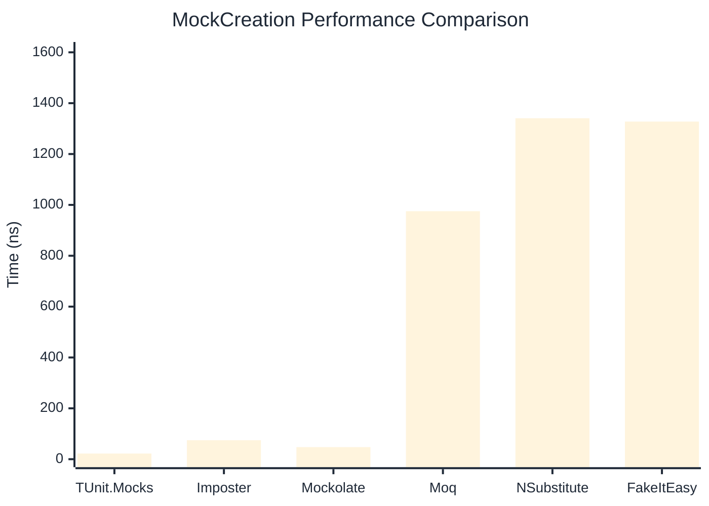

# MockCreation Benchmark

> Mock instance creation performance — comparing **TUnit.Mocks** (source-generated) against runtime proxy-based mocking libraries.

:::info Last Updated
This benchmark was automatically generated on **2026-06-06** from the latest CI run.

**Environment:** Ubuntu Latest • .NET SDK 10.0.300
:::

## 📊 Results

Mock instance creation performance:

| Library | Mean | Error | StdDev | Allocated |
|---------|------|-------|--------|-----------|
| **TUnit.Mocks** | 22.19 ns | 0.140 ns | 0.131 ns | 192 B |
| Imposter | 74.63 ns | 0.309 ns | 0.289 ns | 440 B |
| Mockolate | 47.49 ns | 0.134 ns | 0.119 ns | 424 B |
| Moq | 975.18 ns | 12.495 ns | 11.077 ns | 2048 B |
| NSubstitute | 1,340.74 ns | 9.949 ns | 9.306 ns | 5000 B |
| FakeItEasy | 1,327.57 ns | 12.949 ns | 12.113 ns | 2715 B |

---

### Repository

| Library | Mean | Error | StdDev | Allocated |
|---------|------|-------|--------|-----------|
| **TUnit.Mocks** | 22.07 ns | 0.077 ns | 0.068 ns | 192 B |
| Imposter | 117.35 ns | 0.549 ns | 0.513 ns | 696 B |
| Mockolate | 54.88 ns | 1.110 ns | 1.090 ns | 456 B |
| Moq | 961.66 ns | 17.056 ns | 15.955 ns | 1912 B |
| NSubstitute | 1,400.03 ns | 27.631 ns | 31.820 ns | 5000 B |
| FakeItEasy | 1,404.84 ns | 33.651 ns | 99.220 ns | 2715 B |

## 🎯 Key Insights

This benchmark compares **TUnit.Mocks** (source-generated) against runtime proxy-based mocking libraries for mock instance creation performance.

---

:::note Methodology
View the [mock benchmarks overview](/docs/benchmarks/mocks) for methodology details and environment information.
:::

*Last generated: 2026-06-06T03:26:59.455Z*
