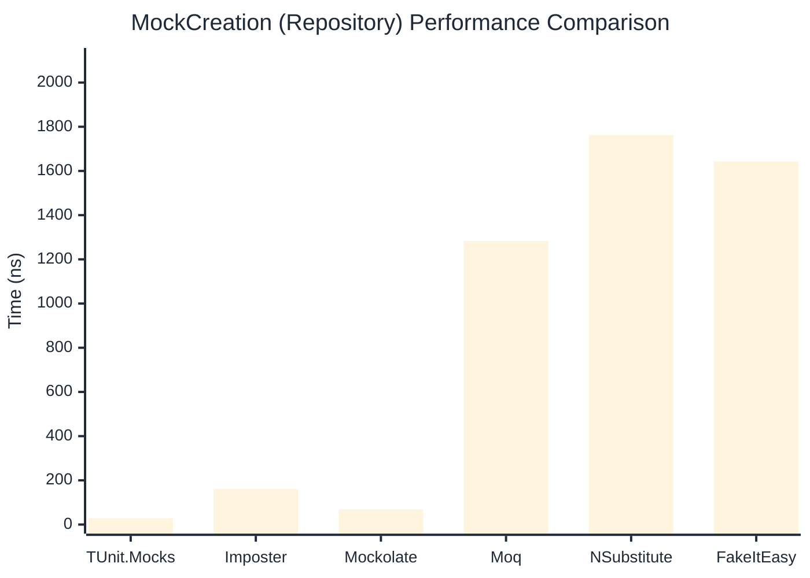

# MockCreation Benchmark

:::info Last Updated
This benchmark was automatically generated on **2026-05-22** from the latest CI run.

**Environment:** Ubuntu Latest • .NET SDK 10.0.300
:::

## 📊 Results

Mock instance creation performance:

| Library | Mean | Error | StdDev | Allocated |
|---------|------|-------|--------|-----------|
| **TUnit.Mocks** | 28.46 ns | 0.651 ns | 1.070 ns | 192 B |
| Imposter | 99.82 ns | 2.043 ns | 3.058 ns | 440 B |
| Mockolate | 67.32 ns | 1.379 ns | 1.290 ns | 424 B |
| Moq | 1,202.58 ns | 10.247 ns | 9.084 ns | 2048 B |
| NSubstitute | 1,722.05 ns | 22.250 ns | 19.724 ns | 5000 B |
| FakeItEasy | 1,635.95 ns | 19.640 ns | 18.371 ns | 2723 B |

---

### Repository

| Library | Mean | Error | StdDev | Allocated |
|---------|------|-------|--------|-----------|
| **TUnit.Mocks** | 28.43 ns | 0.647 ns | 1.044 ns | 192 B |
| Imposter | 161.19 ns | 2.742 ns | 2.431 ns | 696 B |
| Mockolate | 68.49 ns | 1.445 ns | 2.749 ns | 456 B |
| Moq | 1,283.00 ns | 16.156 ns | 15.112 ns | 1912 B |
| NSubstitute | 1,762.48 ns | 9.046 ns | 8.462 ns | 5000 B |
| FakeItEasy | 1,642.78 ns | 17.518 ns | 15.529 ns | 2723 B |

## 🎯 Key Insights

This benchmark compares **TUnit.Mocks** (source-generated) against runtime proxy-based mocking libraries for mock instance creation performance.

---

:::note Methodology
View the [mock benchmarks overview](/docs/benchmarks/mocks) for methodology details and environment information.
:::

*Last generated: 2026-05-22T03:28:55.311Z*
